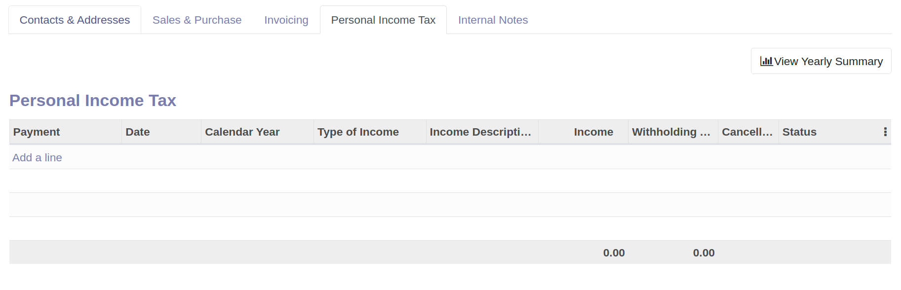
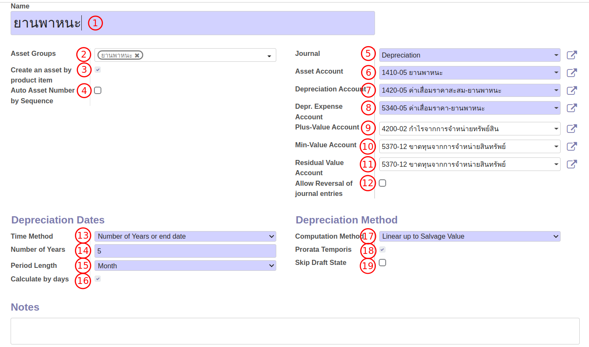
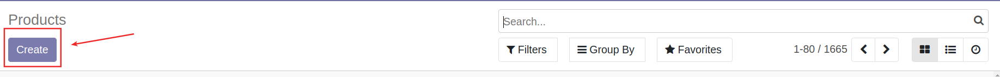

# การสร้างข้อมูลหลัก (Master Data)

## การสร้างรายชื่อคู่ค้า

**Menu ::** Contacts > Contacts

1. กดปุ่ม Create เพื่อสร้างคู่ค้า
2. ระบบจะพาไปที่หน้าต่างของการสร้างคู่ค้า ให้กรอกข้อมูลส่วนบนดังนี้
    * (1) กรณีเป็นบุคคลทั่วไป (Individual) ให้กรอกข้อมูลดังนี้
        * (1) First name: ชื่อ
        * (2) Last name: นามสกุล
        

    * (2) กรณีเป็นบริษัทหรือสำนักงาน (Company) ที่ไม่ใช้บุคคลทั่วไปให้กรอกข้อมูลดังนี้
        * (1) Name: ชื่อบริษัท
        

3. เมื่อกรอกชื่อของคู่ค้าเรียบร้อยแล้วให้ใส่รายละเอียดดังนี้
    * (1) Street: ที่อยู่
    * (2) Streer2: เขต
    * (3) City: จังหวัด
    * (4) State: ไม่ต้องกรอก
    * (5) ZIP: รหัสไปรษณีย์
    * (6) Country: ประเทศ
    * (7) Tax ID: เลขประจำตัวผู้เสียภาษี
    * (8) Tax Branch: สาขา 
    * (9) Phone: เบอร์โทรศัพท์ (ถ้ามี)
    * (10) Mobile: เบอร์โทรศัพท์ (ถ้ามี)
    * (11) Email: อีเมล (ถ้ามี)
    * (12) Website Link: เว็บไซต์ (ถ้ามี)
    * (13) Legal Form: คำนำหน้า
    * (14) Tags: ไม่ต้องกรอก
    

4. หากต้องการกรอกข้อมูลเพิ่มเติมเกี่ยวกับคู่ค้าสามารถกรอกได้ตาม Tab ต่างๆ ดังนี้
    * (1) Sales & Purchase ใช้สำหรับบันทึกข้อมูลเกี่ยวกับฝ่ายซื้อและขาย
               
    * (2) Invoicing ใช้สำหรับบันทึกข้อมูลเกี่ยวกับทางบัญชี
        * (1) Bank: ธนาคารของคู่ค้า
        * (2) Account Number: เลขที่บัญชีธนาคารของคู่ค้า
        * (3) Account Receivable: เลขที่บัญชีที่ต้องการใช้บันทึกบัญชีฝั่งลูกหนี้
        * (4) Account Payable: เลขที่บัญชีที่ต้องการใช้บันทึกบัญชีฝั่งเจ้าหนี้
         
    * (3) Personal Income Tax ใช้สำหรับบันทึกข้อมูลในกรณีจัดเก็บภาษีแบบ PIT
         
    * (4) Internal Notes ใช้สำหรับบันทึกข้อมูลอื่น
    

5.  เมื่อตรวจสอบข้อมูลเรียบร้อยแล้วให้กด Save

----------------------------------------------------------

## การสร้างเลขที่บัญชี

**Menu ::** Invoicing > Configuration > Chart of Accounts

1. กดปุ่ม Create เพื่อสร้างเลขที่บัญชี และกรอกข้อมูลดังนี้
    * (1) Code: เลขที่บัญชีที่ต้องการเพิ่มข้อมูล
    * (2) Account Name: ชื่อเลขที่บัญชี
    * (3) Type: ประเภทของเลขที่บัญชี
    * (4) Allow Reconciliation: ใช้สำหรับต้องการกระทบยอดเลขที่บัญชี
    

2. หากที่ต้องการกรอกข้อมูลของเลขที่บัญชีเพิ่มเติมให้กด "Set Up" 
3. ระบบจะแสดงหน้าต่างสำหรับการตั้งค่าเกี่ยวกับเลขที่บัญชีเพิ่มเติมดังนี้
    * (1) Asset Profile: ใช้สำหรับเลขที่บัญชีที่ต้องการผูกกับหมวดหมู่สินทรัพย์
    * (2) WHT Account: เลขที่บัญชีที่เกี่ยวข้องกับการบันทึกหัก ณ ที่จ่าย
    * (3) Deprecated: ติ๊กเมื่อไม่ต้องการใช้งานเลขที่บัญชีนั้นแล้ว
    * (4) Centralized: ติ๊กเมื่อไม่ต้องการให้บัญชีแยกประเภทไม่แสดงรายละเอียด
    * (5) Default Taxes: ตั้งค่าให้ภาษีมูลค่าเพิ่มแสดงขึ้นเมื่อมีการใช้งานเลขที่บัญชี
    * (6) Tags: ใช้สำหรับการผูกกับงบกระแสเงินสด (กรณีของสสน.ไม่ต้องใช้)
    * (7)  Allowed Journals: หากต้องการระบุสมุดบัญชีที่ต้องการใช้งาน
    

4. หากตั้งค่าเรียบร้อยแล้วให้กด Save

----------------------------------------------------------

## การสร้างสมุดบัญชีรายวัน

**Menu ::** Invoicing > Configuration > Journals

การสร้างสมุดรายวันเพิ่มเติมนอกเหนือจากสมุดรายวันที่มีอยู่ในระบบ ใช้สำหรับกรณีที่มีการเพิ่มบัญชีธนาคาร ซึ่งฝ่ายบัญชีจะต้องทำการสร้างสมุดรายวันเพิ่มในระบบดังนี้

1. กดปุ่ม Create เพื่อสร้างสมุดรายวัน และกรอกข้อมูลดังนี้
    * (1) Journal Name: ชื่อสมุดรายวัน
    * (2) Type: ให้เลือกเป็น "Bank"
    * (3) Bank Account: ระบุเลขที่บัญชีที่ใช้บันทึกบัญชี
    * (4) Suspense Account: บัญชีพักธนาคาร ใช้สำหรับการบันทึกในกรณีโอนเงินระหว่างธนาคาร
    * (5) Short Code: รหัสของสมุดรายวัน
    

2. กรอกข้อมูลสำหรับบัญชีพักที่เพิ่มเติม Tab "Payments Configuration"
    * (1) Outstanding Receipts Account: ระบุเลขที่บัญชีธนาคารสำหรับการบันทึกฝั่งรับ
    * (2) Outstanding Payments Account:  ระบุเลขที่บัญชีธนาคารสำหรับการบันทึกฝั่งจ่าย
    

3. หากตั้งค่าเรียบร้อยแล้วให้กด Save

!!! Tip "วิธีการสร้าง Bank Account จากหน้าต่าง Journals"
    * (1) พิมพ์ชื่อ เลขบัญชีที่บรรทัด **Bank Account**
        
    * (2) กด Create and Edit
        
    * (3) ระบบจะแสดงหน้าต่างให้กรอกข้อมูลเพิ่ม
        * (1) Code: เลขที่บัญชีที่ต้องการเพิ่มข้อมูล
        * (2) Account Name: ชื่อเลขที่บัญชี
        * (3) Type: ประเภทของเลขที่บัญชี
        
    * (4) กด Save เพื่อบันทึกการสร้างรหัสบัญชี

----------------------------------------------------------

## การสร้างหมวดหมู่สินทรัพย์ 

**Menu ::** Invoicing > Configuration > Asset Profiles

1. กดปุ่ม Create เพื่อสร้างหมวดหมู่สินทรัพย์ และกรอกข้อมูลดังนี้
    * (1) Name: ชื่อของหมวดหมู่สินทรัพย์
    * (2) Asset Groups: กลุ่มของสินทรัพย์ที่ต้องการผูกในหมวดหมู่สินทรัพย์
    * (3) Create an asset by product item: ใช้สำหรับการซื้อสินทรัพย์จำนวนหลายชิ้น ระบบจะแตกบรรทัดตามจำนวน เพื่อนำไปสร้างสินทรัพย์ในทะเบียนสินทรัพย์
    * (4) Auto Asset Number by Sequence: ติ๊กสำหรับการออกเลขที่สินทรัพย์ตามหมวดหมู่
    * (5) Journal: สมุดบัญชีสำหรับการบันทึกบัญชีเกี่ยวกับสินทรัพย์
    * (6) Asset Account: เลขที่บัญชีสำหรับการบันทึกสินทรัพย์
    * (7) Depreciation Account: เลขที่บัญชีสำหรับการบันทึกค่าเสื่อมราคาสะสมสินทรัพย์
    * (8) 10. Depr. Expense Account: เลขที่บัญชีสำหรับการบันทึกค่าเสื่อมราคาสินทรัพย์
    * (9) Plus-Value Account: เลขที่บัญชีสำหรับการบันทึกตัดจำหน่ายสินทรัพย์ 
    * (10) Min-Value Account: เลขที่บัญชีสำหรับการบันทึกตัดจำหน่ายสินทรัพย์
    * (11) Residual Value Account: เลขที่บัญชีสำหรับการบันทึกตัดจำหน่ายสินทรัพย์
    * (12) Allow Reversal of journal entries: ใช้สำหรับกลับรายการค่าเสื่อมราคา
    * (13) Time Method: วิธีการคิดช่วงเวลาของค่าเสื่อม
        * (1) เลือก Number of Years or end date: เป็นการคิดค่าเสื่อมตามจำนวนปีที่เลือก หรือคิดค่าเสื่อมจนถึงวันที่กำหนด (End date) หรือ 
        * (2) เลือก Number of Depreciations: เป็นการคิดค่าเสื่อมตามจำนวนครั้งของการบันทึกค่าเสื่อม
    * (14) Number of years:
        * (1) หมายถึงจำนวนปีในการคิดค่าเสื่อม ถ้าเลือก Time method แบบ Number of years or end date
        * (2) หมายถึงจำนวนครั้งของการบันทึกค่าเสื่อม ถ้าเลือก Time method แบบ Number of depreciations
    * (15) Period Length: ช่วงเวลาในการคิดค่าเสื่อม ให้เลือกเป็น Month เนื่องจากต้องปิดงบการเงินทุกเดือน
    * (16) Calculate by days: ติ๊กเมื่อต้องการคำนวณค่าเสื่อมตามจำนวนวันในเดือน
    * (17) Computation Method: วิธีการคิดค่าเสื่อมราคา เลือกเป็น Linear up to Salvage เพื่อคิดค่าเสื่อมแบบเส้นตรง โดยราคามูลค่าคงเหลือสุดท้ายจะเท่ากับราคาซาก
    * (18) Prorata Temporis: 
        * (1) ติ๊ก หากตั้งการให้เริ่มคิดค่าเสื่อมตั้งแต่วันที่ Asset start date
        * (2) ไม่ติ๊ก หากต้องการให้เริ่มคิดค่าเสื่อมตั้งแต่วันแรกของปี (โดยปกติเราจะไม่เลือกวิธีนี้ เพราะเป็นการคิดค่าเสื่อมย้อนหลัง)
    * (19) Skip Draft State: ติ๊กเมื่อต้องการข้ามสินทรัพย์สถานะ Draft
    

2. หากตั้งค่าเรียบร้อยแล้วให้กด Save

----------------------------------------------------------

## การสร้างกลุ่มสินทรัพย์ 

การสร้างกลุ่มสินทรัพย์ มีวัตถุประสงค์เพื่อนำไปใช้สำหรับการออกรายงานในทะเบียนสินทรัพย์ 
และจะต้องนำไปผูกไว้กับหมวดหมู่สินทรัพย์ (Asset Profile) โดยมีขั้นตอนการสร้างดังนี้

**Menu ::** Invoicing > Configuration > Asset Group

1. กดปุ่ม Create เพื่อสร้างกลุ่มสินทรัพย์  และกรอกข้อมูลดังนี้
    * (1) Name: ชื่อของกลุ่มสินทรัพย์ 
    * (2) Parent Asset Group: ให้เลือกเป็น "All Profile"
    

2. หากตั้งค่าเรียบร้อยแล้วให้กด Save

----------------------------------------------------------

## การสร้างข้อมูลหลักหมวดหมู่สินค้า

ผู้รับผิดชอบ สามารถจัดการข้อมูลหลักหมวดหมู่สินค้า (Product Categories) ได้ 2 ช่องทาง ตามสิทธิ์ของแต่ละผู้ใช้งาน

**Menu:** Purchase > Configuration > Product Categories

**Menu:** Invoicing > Configuration > Product Categories

โดยมีขั้นตอนดังนี้

1. กดปุ่ม Create 

2. กรอกข้อมูล ดังนี้

    * Category Name:
    * Parent Category: เลือก Parent (ถ้ามี)
    * Logistics
        * Force Removal Strategy: เลือกการจัดการสต็อค
            * First In First Out (FIFO)
            * Last In First Out (LIFO)
    * Inventory Valuation: การตีราคาสินค้าคงเหลือ
        * Costing Method: เลือกการคำนวณต้นทุน
            * Standard Price
            * First In First Out (FIFO)
            * Average Cost (AVCO)
        * Inventory Valuation: การตีราคาสินค้าคงเหลือ
            * Manual
            * Automated
        * Account Properties: การบันทึกบัญชี
            * Income Account: เลือกบัญชีบันทึกรายได้
            * Expense Account: เลือกบัญชีบันทึกค่าใช้จ่าย
3. กดปุ่ม Save เพื่อบันทึกข้อมูล สามารถกดปุ่ม Edit ได้หากต้องการแก้ไขข้อมูล

----------------------------------------------------------

## การสร้างข้อมูลหลักสินค้า

ผู้รับผิดชอบ สามารถจัดการข้อมูลหลักสินค้า (Products) ได้ 2 ช่องทาง ตามสิทธิ์ของแต่ละผู้ใช้งาน

**Menu:** Sale > Products > Products

**Menu:** Purchase > Products > Products

โดยมีขั้นตอนดังนี้

1. กดปุ่ม Create 

2. กรอกข้อมูลส่วน Header

    * (1) Product Name: กรอกชื่อสินค้า
    * (2) ทำเครื่องหมาย หาก Product นี้
        * Can be Sold: สามารถขายได้
        * Can be Purchased: สามารถจัดซื้อได้
    * (3) ใส่รูป product (ถ้ามี)

3. ที่แท็บ General Information

    * Product Type: เลือกประเภทของ product
        * Consumable: วัสดุสิ้นเปลือง
        * Storable: product ที่มีการรับเข้าสต็อค
        * Service: product ประเภทการให้บริการ
    * Product Category: เลือกหมวดหมู่ของ product เพื่อเชื่อมโยงกับการบันทึกบัญชี
    * Internal Reference: รหัสภายใน (ถ้ามี)
    * Barcode: บาร์โค้ดสินค้า (ถ้ามี)
    * Sales Price: ตั้งราคาขาย (กรณี product นี้เปิดการขาย ระบบจะดึงราคานี้ไปแสดงเป็นค่าเริ่มต้นในใบเสนอราคา)
    * Customer Taxes: ภาษีมูลค่าเพิ่ม (ถ้ามี)
    * Witholding Tax: ภาษี หัก ณ ที่จ่าย (ถ้ามี)
    * Cost: ราคาต้นทุน (กรณีเลือกบันทึกต้นทุน เป็น Standard price ระบบจะนำราคานี้ไปบันทึกต้นทุน)
    * Unit of Measure: หน่วยนับ
    * Purchase Unit of Measure: หน่วยนับสำหรับการรับเข้าสต็อค 

4. ที่แท็บ Sales (จะแสดงแท็บนี้ เมื่อมีการเลือก Can be Sold)

    * Invocing Policy: เงื่อนไขการออกบิล
        * Ordered quantities: ออกบิลตามจำนวนที่ออเดอร์
        * Delivered quantities: ออกบิลตามจำนวนที่ส่งของ
    * Sales Description: กรอกคำอธิบายหรือรายละเอียดอื่นๆ (ถ้ามี) ซึ่งจะแสดงในเอกสาร Sale Orders และ Invoices

5. ที่แท็บ Purchase (จะแสดงแท็บนี้ เมื่อมีการเลือก Can be Purchased)

    * Vendor Taxes: ภาษีมูลค่าเพิ่ม (ถ้ามี)
    * Vendor Witholding Tax: ภาษี หัก ณ ที่จ่าย (ถ้ามี)
    * Control Policy:
        * On ordered quantities: รับวางบิลตามจำนวนที่ออเดอร์
        * On received quantities: รับวางบิลตามจำนวนที่ได้รับของ
    * Purchase Description: กรอกคำอธิบายหรือรายละเอียดอื่นๆ (ถ้ามี) ซึ่งจะแสดงในเอกสาร Purchase Orders

6. กดปุ่ม Save เพื่อบันทึกข้อมูล สามารถกดปุ่ม Edit ได้หากต้องการแก้ไขข้อมูล

End.

----------------------------------------------------------