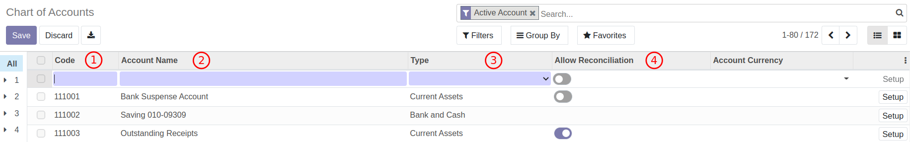

# การสร้างข้อมูลหลัก (Master Data)

## การสร้างรายชื่อคู่ค้า

**Menu ::** Contacts > Contacts > Contacts

1. กดปุ่ม Create เพื่อสร้างคู่ค้า
2. ระบบจะพาไปที่หน้าต่างของการสร้างคู่ค้า ให้กรอกข้อมูลส่วนบนดังนี้
    1. กรณีเป็นบุคคลทั่วไป (Individual) ให้กรอกข้อมูลดังนี้
        1. First name: ชื่อ
        2. Last name: นามสกุล
        

    2. กรณีเป็นบริษัทหรือสำนักงาน (Company) ที่ไม่ใช้บุคคลทั่วไปให้กรอกข้อมูลดังนี้
        1. Name: ชื่อบริษัท
        

3. เมื่อกรอกชื่อของคู่ค้าเรียบร้อยแล้วให้ใส่รายละเอียดดังนี้.
    1. Street: ที่อยู่
    2. Streer2: เขต
    3. Location completion: ไม่ต้องกรอก
    4. City: จังหวัด
    5. State: ไม่ต้องกรอก
    6. ZIP: รหัสไปรษณีย์
    7. Country: ไม่ต้องกรอก 
    8. Tax ID: เลขประจำตัวผู้เสียภาษี
    9. Tax Branch: สาขา ถ้าไม่มีให้ใส่ 00000 
    10. Job Position: ตำแหน่ง (ถ้ามี)
    11. Fax: โทรสาร (ถ้ามี)
    12. Phone: เบอร์โทรศัพท์ (ถ้ามี)
    13. Mobile: เบอร์โทรศัพท์ (ถ้ามี)
    14. Email: อีเมล (ถ้ามี)
    15. Website Link: เว็บไซต์ (ถ้ามี)
    16. Title: คำนำหน้าชื่อ
    17. Language: ภาษา
    18. Tags: ไม่ต้องกรอก
    

4. หากต้องการกรอกข้อมูลเพิ่มเติมเกี่ยวกับคู่ค้าสามารถกรอกได้ตาม Tab ต่างๆ ดังนี้
    1. Contacts & Addresses ใช้ในกรณีที่คู่ค้ามีหลายที่อยู่ และกรณีที่มีคู่ค้าอื่นที่เกี่ยวข้อง เช่น ฝ่ายขายของบริษัทคู่ค้า
        1. Contact: ใช้สำหรับเพิ่มคู่ค้าจากการสร้างบริษัทคู่ค้า เช่น ฝ่ายขาย 
        2. Invoice Address: ที่อยู่อื่นของคู่ค้าที่ต้องการออกใบแจ้งหนี้
        3. Delivery Address: ที่อยู่อื่นของคู่ค้าที่ต้องรับสินค้า
        4. Other Address: ที่อยู่เพิ่มเติมอื่นของคู่ค้า
        5. Private Address: ที่อยู่ส่วนตัวของคู่ค้า
        6. Contact Name: แสดงชื่อและนามสกุลที่กรอก
        7. Last name: นามสกุล
        8. First name: ชื่อ
        9. Street: ที่อยู่
        10. Streer2: เขต
        11. City completion: ไม่ต้องกรอก
        12. City: จังหวัด, State: ไม่ต้องกรอก, ZIP: รหัสไปรษณีย์
        13. Country: ไม่ต้องกรอก  
        14. Notes: บันทึกภายใน
        15. Email: อีเมล (ถ้ามี)
        16. Phone: เบอร์โทรศัพท์ (ถ้ามี)
        17. Mobile: เบอร์โทรศัพท์ (ถ้ามี)
        18. Fax: โทรสาร (ถ้ามี)
             
    2. Sales & Purchase ใช้สำหรับบันทึกข้อมูลเกี่ยวกับฝ่ายซื้อและขาย
        1. Salesperson: ฝ่ายขายฝั่งสสน. (ถ้ามี)
        2. Payment Terms: ระยะการชำระเงินของฝั่งขาย (ถ้ามี)
        3. Fiscal Position: ไม่ต้องกรอก
        4. Payment Terms: ระยะการชำระเงินของฝั่งซื้อ (ถ้ามี)
        5. Payment Method: ไม่ต้องกรอก
        6. Receipt Reminder:  ไม่ต้องติ๊ก
        7. Reference: อ้างอิง (ถ้ามี)
        8. Industry: ไม่ต้องกรอก
               
    3. Invoicing ใช้สำหรับบันทึกข้อมูลเกี่ยวกับทางบัญชี
        1. Bank: ธนาคารของคู่ค้า
        2. Account Number: เลขที่บัญชีธนาคารของคู่ค้า
        3. Account Receivable: เลขที่บัญชีที่ต้องการใช้บันทึกบัญชีฝั่งลูกหนี้
        4. Account Payable: เลขที่บัญชีที่ต้องการใช้บันทึกบัญชีฝั่งเจ้าหนี้
         
    
            !!! Note
                - กรณีที่ไม่มีข้อมูลสาขาของธนาคาร ให้คลิกที่ Search More
                    
                - กดปุ่ม create เพื่อสร้างข้อมูลสาขาธนาคารใหม่
                    
                - ระบบจะแสดงหน้าสำหรับสร้างสาขาธนาคาร
                    1. Name: ชื่อธนาคารและสาขา
                    2. Bank Code: รหัสธนาคาร (สามารถดูได้จากธนาคารสำนักงานใหญ่)
                    3. Bank Identifier Code: รหัสระบุตัวตนของธนาคาร (สามารถดูได้จากธนาคารสำนักงานใหญ่)
                    4. Bank Branch Code: รหัสสาขา
                    

    4. Personal Income Tax ใช้สำหรับบันทึกข้อมูลในกรณีจัดเก็บภาษีแบบ PIT
         
    5. Internal Notes ใช้สำหรับบันทึกข้อมูลอื่น
    

5.  เมื่อตรวจสอบข้อมูลเรียบร้อยแล้วให้กด Save

----------------------------------------------------------

## การสร้างสาขาของคู่ค้า

**Menu ::** Contacts > Contacts > Contacts

1. ค้นหาชื่อบริษัทสำนักใหญ่ โดยใช้การ Search 

2. คลิกที่สำนักงานใหญ่เพื่อสร้างสาขาเพิ่มเติม

3. กดปุ่ม Edit 

4. กดปุ่ม Add ใน Tab Contacts & Address เพิ่มกรอกข้อมูลของสาขา

5. ระบบจะแสดงหน้าต่างให้กรอกที่อยู่ของสาขา
    1. ติ๊กเลือก "Other Address" 
    2. กรอกที่ข้อมูลที่อยู่ของสาขา
    3. เมื่อบันทึกข้อมูลเสร็จเรียบร้อยแล้วให้กด Save&Close 
        

6. กดปุ่ม Save

7. กดปุ่ม link Contacts & Address ที่สร้างเพื่อใส่ชื่อบริษัท และสาขา
  

8. ระบบจะพาไปยังหน้าต่างของการแก้ไขข้อมูลสาขา ให้แก้ไขข้อมูลดังนี้
    1. Company Type: เปลี่ยนประเภทเป็น **Company**
    2. Name: ระบุชื่อของสาขาย่อย
    3. Tax Branch: รหัสสาขา
    
9. เมื่อกรอกข้อมูลเสร็จให้กดปุ่ม Save

!!! Note
    - เมื่อกลับยังหน้า Contact ของสำนักงานใหญ่จะเห็นสาขาย่อยที่สร้าง
        

----------------------------------------------------------

## การสร้างเลขที่บัญชี (Chart of Accounts)

**Menu ::** Invoicing > Configuration > Chart of Accounts

1. กดปุ่ม Create เพื่อสร้างเลขที่บัญชี และกรอกข้อมูลดังนี้
    1. Code: เลขที่บัญชีที่ต้องการเพิ่มข้อมูล
    2. Account Name: ชื่อเลขที่บัญชี
    3. Type: ประเภทของเลขที่บัญชี
    4. Allow Reconciliation: ใช้สำหรับต้องการกระทบยอดเลขที่บัญชี
    

2. หากที่ต้องการกรอกข้อมูลของเลขที่บัญชีเพิ่มเติมให้กด "Set Up" 
    
3. ระบบจะแสดงหน้าต่างสำหรับการตั้งค่าเกี่ยวกับเลขที่บัญชีเพิ่มเติมดังนี้
    1. Asset Profile: ใช้สำหรับเลขที่บัญชีที่ต้องการผูกกับหมวดหมู่ครุภัณฑ์
    2. WHT Account: เลขที่บัญชีที่เกี่ยวข้องกับการบันทึกหัก ณ ที่จ่าย
    3. Deprecated: ติ๊กเมื่อไม่ต้องการใช้งานเลขที่บัญชีนั้นแล้ว
    4. Centralized: ติ๊กเมื่อไม่ต้องการให้บัญชีแยกประเภทไม่แสดงรายละเอียด
    5. Default Taxes: ตั้งค่าให้ภาษีมูลค่าเพิ่มแสดงขึ้นเมื่อมีการใช้งานเลขที่บัญชี
    6. Tags: ใช้สำหรับการผูกกับงบกระแสเงินสด (กรณีของสสน.ไม่ต้องใช้)
    7. Allowed Journals: หากต้องการระบุสมุดบัญชีที่ต้องการใช้งาน
    

4. หากตั้งค่าเรียบร้อยแล้วให้กด Save

End.

----------------------------------------------------------

