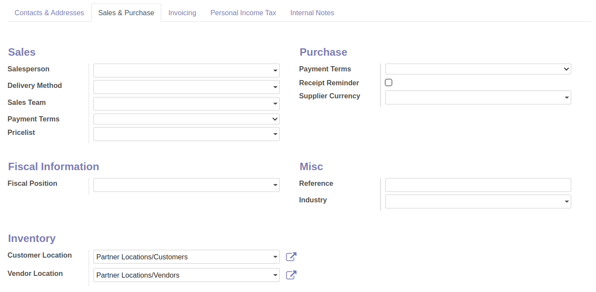
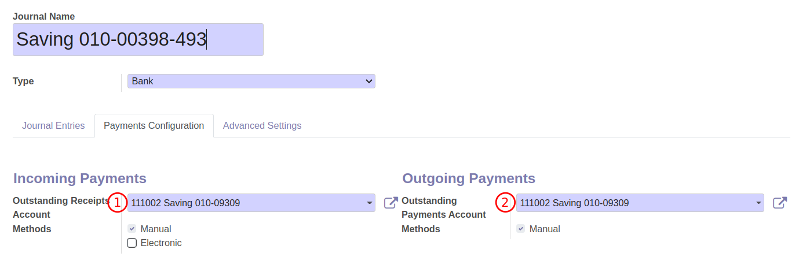

# การสร้างข้อมูลหลัก (Master Data)

## การสร้างรายชื่อคู่ค้า

**Menu ::** Contacts > Contacts > Contacts

1. กดปุ่ม Create เพื่อสร้างคู่ค้า
2. ระบบจะพาไปที่หน้าต่างของการสร้างคู่ค้า ให้กรอกข้อมูลส่วนบนดังนี้
    1. กรณีเป็นบุคคลทั่วไป (Individual) ให้กรอกข้อมูลดังนี้
        1. First name: ชื่อ
        2. Last name: นามสกุล
        

    2. กรณีเป็นบริษัทหรือสำนักงาน (Company) ที่ไม่ใช้บุคคลทั่วไปให้กรอกข้อมูลดังนี้
        1. Name: ชื่อบริษัท
        

3. เมื่อกรอกชื่อของคู่ค้าเรียบร้อยแล้วให้ใส่รายละเอียดดังนี้
    1. Street: ที่อยู่
    2. Streer2: เขต
    3. Location completion: ไม่ต้องกรอก
    4. City: จังหวัด
    5. State: ไม่ต้องกรอก
    6. ZIP: รหัสไปรษณีย์
    7. Country: ไม่ต้องกรอก 
    8. Tax ID: เลขประจำตัวผู้เสียภาษี
    9. Tax Branch: สาขา ถ้าไม่มีให้ใส่ 00000 
    10. Job Position: ตำแหน่ง (ถ้ามี)
    11. Fax: โทรสาร (ถ้ามี)
    12. Phone: เบอร์โทรศัพท์ (ถ้ามี)
    13. Mobile: เบอร์โทรศัพท์ (ถ้ามี)
    14. Email: อีเมล (ถ้ามี)
    15. Website Link: เว็บไซต์ (ถ้ามี)
    16. Title: คำนำหน้าชื่อ
    17. Language: ภาษา
    18. Tags: ไม่ต้องกรอก
    

4. หากต้องการกรอกข้อมูลเพิ่มเติมเกี่ยวกับคู่ค้าสามารถกรอกได้ตาม Tab ต่างๆ ดังนี้
    1. Contacts & Addresses ใช้ในกรณีที่คู่ค้ามีหลายที่อยู่ และกรณีที่มีคู่ค้าอื่นที่เกี่ยวข้อง เช่น ฝ่ายขายของบริษัทคู่ค้า
        1. Contact: ใช้สำหรับเพิ่มคู่ค้าจากการสร้างบริษัทคู่ค้า เช่น ฝ่ายขาย 
        2. Invoice Address: ที่อยู่อื่นของคู่ค้าที่ต้องการออกใบแจ้งหนี้
        3. Delivery Address: ที่อยู่อื่นของคู่ค้าที่ต้องรับสินค้า
        4. Other Address: ที่อยู่เพิ่มเติมอื่นของคู่ค้า
        5. Private Address: ที่อยู่ส่วนตัวของคู่ค้า
        6. Contact Name: แสดงชื่อและนามสกุลที่กรอก
        7. Last name: นามสกุล
        8. First name: ชื่อ
        9. Street: ที่อยู่
        10. Streer2: เขต
        11. City completion: ไม่ต้องกรอก
        12. City: จังหวัด, State: ไม่ต้องกรอก, ZIP: รหัสไปรษณีย์
        13. Country: ไม่ต้องกรอก  
        14. Notes: บันทึกภายใน
        15. Email: อีเมล (ถ้ามี)
        16. Phone: เบอร์โทรศัพท์ (ถ้ามี)
        17. Mobile: เบอร์โทรศัพท์ (ถ้ามี)
        18. Fax: โทรสาร (ถ้ามี)
             
    2. Sales & Purchase ใช้สำหรับบันทึกข้อมูลเกี่ยวกับฝ่ายซื้อและขาย
        1. Salesperson: ฝ่ายขายฝั่งสสน. (ถ้ามี)
        2. Payment Terms: ระยะการชำระเงินของฝั่งขาย (ถ้ามี)
        3. Fiscal Position: ไม่ต้องกรอก
        4. Payment Terms: ระยะการชำระเงินของฝั่งซื้อ (ถ้ามี)
        5. Payment Method: ไม่ต้องกรอก
        6. Receipt Reminder:  ไม่ต้องติ๊ก
        7. Reference: อ้างอิง (ถ้ามี)
        8. Industry: ไม่ต้องกรอก
               
    3. Invoicing ใช้สำหรับบันทึกข้อมูลเกี่ยวกับทางบัญชี
        1. Bank: ธนาคารของคู่ค้า
        2. Account Number: เลขที่บัญชีธนาคารของคู่ค้า
        3. Account Receivable: เลขที่บัญชีที่ต้องการใช้บันทึกบัญชีฝั่งลูกหนี้
        4. Account Payable: เลขที่บัญชีที่ต้องการใช้บันทึกบัญชีฝั่งเจ้าหนี้
         
    
            !!! Note
                - กรณีที่ไม่มีข้อมูลสาขาของธนาคาร ให้คลิกที่ Search More
                    
                - กดปุ่ม create เพื่อสร้างข้อมูลสาขาธนาคารใหม่
                    
                - ระบบจะแสดงหน้าสำหรับสร้างสาขาธนาคาร
                    1. Name: ชื่อธนาคารและสาขา
                    2. Bank Code: รหัสธนาคาร (สามารถดูได้จากธนาคารสำนักงานใหญ่)
                    3. Bank Identifier Code: รหัสระบุตัวตนของธนาคาร (สามารถดูได้จากธนาคารสำนักงานใหญ่)
                    4. Bank Branch Code: รหัสสาขา
                    

    4. Personal Income Tax ใช้สำหรับบันทึกข้อมูลในกรณีจัดเก็บภาษีแบบ PIT
         
    5. Internal Notes ใช้สำหรับบันทึกข้อมูลอื่น
    

5.  เมื่อตรวจสอบข้อมูลเรียบร้อยแล้วให้กด Save

----------------------------------------------------------

## การสร้างเลขที่บัญชี (Chart of Accounts)

**Menu ::** Invoicing > Configuration > Chart of Accounts

1. กดปุ่ม Create เพื่อสร้างเลขที่บัญชี และกรอกข้อมูลดังนี้
    1. Code: เลขที่บัญชีที่ต้องการเพิ่มข้อมูล
    2. Account Name: ชื่อเลขที่บัญชี
    3. Type: ประเภทของเลขที่บัญชี
    4. Allow Reconciliation: ใช้สำหรับต้องการกระทบยอดเลขที่บัญชี
    

2. หากที่ต้องการกรอกข้อมูลของเลขที่บัญชีเพิ่มเติมให้กด "Set Up" 
    
3. ระบบจะแสดงหน้าต่างสำหรับการตั้งค่าเกี่ยวกับเลขที่บัญชีเพิ่มเติมดังนี้
    1. Asset Profile: ใช้สำหรับเลขที่บัญชีที่ต้องการผูกกับหมวดหมู่สินทรัพย์
    2. WHT Account: เลขที่บัญชีที่เกี่ยวข้องกับการบันทึกหัก ณ ที่จ่าย
    3. Deprecated: ติ๊กเมื่อไม่ต้องการใช้งานเลขที่บัญชีนั้นแล้ว
    4. Centralized: ติ๊กเมื่อไม่ต้องการให้บัญชีแยกประเภทไม่แสดงรายละเอียด
    5. Default Taxes: ตั้งค่าให้ภาษีมูลค่าเพิ่มแสดงขึ้นเมื่อมีการใช้งานเลขที่บัญชี
    6. Tags: ใช้สำหรับการผูกกับงบกระแสเงินสด (กรณีของสสน.ไม่ต้องใช้)
    7. Allowed Journals: หากต้องการระบุสมุดบัญชีที่ต้องการใช้งาน
    

4. หากตั้งค่าเรียบร้อยแล้วให้กด Save

End.

----------------------------------------------------------

## การสร้างสมุดบัญชีรายวัน (Journals)

**Menu ::** Invoicing > Configuration > Journals

การสร้างสมุดรายวันเพิ่มเติมนอกเหนือจากสมุดรายวันที่มีอยู่ในระบบ ใช้สำหรับกรณีที่มีการเพิ่มบัญชีธนาคาร ซึ่งฝ่ายบัญชีจะต้องทำการสร้างสมุดรายวันเพิ่มในระบบดังนี้

1. กดปุ่ม Create เพื่อสร้างสมุดรายวัน และกรอกข้อมูลดังนี้
    1. Journal Name: ชื่อสมุดรายวัน
    2. Type: ให้เลือกเป็น "Bank"
    3. Not Affect Budget: ติ๊กเมื่อหากไม่ต้องการให้สมุดรายวันกระทบงบประมาณ
    4. Bank Account: ระบุเลขที่บัญชีที่ใช้บันทึกบัญชี
    5. Suspense Account: บัญชีพักธนาคาร ใช้สำหรับการบันทึกในกรณีโอนเงินระหว่างธนาคาร หรือการนำเข้า Statement
    6. Short Code: รหัสของสมุดรายวัน
    7. Account Number: เลขที่บัญชีธนาคาร
    8. Bank: ธนาคารของเลขที่บัญชีธนาคาร
    9. Bank Feeds: การตั้งค่าสกุลไฟล์ในการนำเข้าให้เลือกเป็น "Import(TXT/CSV/XSLX)"
    

2. กรอกข้อมูลสำหรับบัญชีพักที่เพิ่มเติม Tab "Payments Configuration"
    1. Outstanding Receipts Account: ระบุเลขที่บัญชีบัญชีพักสำหรับการบันทึกฝั่งรับ
    2. Methods: วิธีการบันทึกรับเงินให้เลือกเป็น "Methods"
    3. Outstanding Payments Account:  ระบุเลขที่บัญชีบัญชีพักสำหรับการบันทึกฝั่งจ่าย
    4. Methods: วิธีการบันทึกจ่าย แบ่งได้ตามประเภทของเงินฝากธนาคาร 2 ประเภท ดังนี้
        1. Methods: บัญชีธนาคารออมทรัพย์
        2. Checks: บัญชีธนาคารกระแสทรัพย์รายวัน
    

2. หากตั้งค่าเรียบร้อยแล้วให้กด Save

----------------------------------------------------------

## การสร้างหมวดหมู่สินทรัพย์ (Asset Profiles)

**Menu ::** Invoicing > Configuration > Asset Profiles

1. กดปุ่ม Create เพื่อสร้างหมวดหมู่สินทรัพย์ และกรอกข้อมูลดังนี้
    1. Name: ชื่อของหมวดหมู่สินทรัพย์
    2. Asset Groups: กลุ่มของสินทรัพย์ที่ต้องการผูกในหมวดหมู่สินทรัพย์
    3. Create an asset by product item: ใช้สำหรับการซื้อสินทรัพย์จำนวนหลายชิ้น ระบบจะแตกบรรทัดตามจำนวน เพื่อนำไปสร้างสินทรัพย์ในทะเบียนสินทรัพย์
    4. Transfer Journal: สมุดบัญชีสำหรับการโอนย้ายสินทรัพย์
    5. Auto Asset Number by Sequence: ติ๊กสำหรับการออกเลขที่สินทรัพย์ตามหมวดหมู่
    6. Asset Number Sequence: ระบุเลขที่สินทรัพย์ตามหมวดหมู่
    7. Journal: สมุดบัญชีสำหรับการบันทึกบัญชีเกี่ยวกับสินทรัพย์
    8. Asset Account: เลขที่บัญชีสำหรับการบันทึกสินทรัพย์
    9. Depreciation Account: เลขที่บัญชีสำหรับการบันทึกค่าเสื่อมราคาสะสมสินทรัพย์
    10. Depr. Expense Account: เลขที่บัญชีสำหรับการบันทึกค่าเสื่อมราคาสินทรัพย์
    11. Plus-Value Account: เลขที่บัญชีสำหรับการบันทึกตัดจำหน่ายสินทรัพย์ 
    12. Min-Value Account: เลขที่บัญชีสำหรับการบันทึกตัดจำหน่ายสินทรัพย์
    13. Residual Value Account: เลขที่บัญชีสำหรับการบันทึกตัดจำหน่ายสินทรัพย์
    14. Allow Reversal of journal entries: ใช้สำหรับกลับรายการค่าเสื่อมราคา
    15. Time Method: วิธีการคิดช่วงเวลาของค่าเสื่อม
        1. เลือก Number of Years or end date: เป็นการคิดค่าเสื่อมตามจำนวนปีที่เลือก หรือคิดค่าเสื่อมจนถึงวันที่กำหนด (End date) หรือ 
        2. เลือก Number of Depreciations: เป็นการคิดค่าเสื่อมตามจำนวนครั้งของการบันทึกค่าเสื่อม
    16. Number of years:
        1. จะหมายถึงจำนวนปีในการคิดค่าเสื่อม ถ้าเลือก Time method แบบ Number of years or end date
        2. จะหมายถึงจำนวนครั้งของการบันทึกค่าเสื่อม ถ้าเลือก Time method แบบ Number of depreciations
    17. Period Length: ช่วงเวลาในการคิดค่าเสื่อม ให้เลือกเป็น Month เนื่องจากต้องปิดงบการเงินทุกเดือน
    18. Calculate by days: ติ๊กเมื่อต้องการคำนวณค่าเสื่อมตามจำนวนวันในเดือน
    19. Computation Method: วิธีการคิดค่าเสื่อมราคา เลือกเป็น Linear up to Salvage เพื่อคิดค่าเสื่อมแบบเส้นตรง โดยราคามูลค่าคงเหลือสุดท้ายจะเท่ากับราคาซาก
    20. Prorata Temporis: 
        1. ติ๊ก หากตั้งการให้เริ่มคิดค่าเสื่อมตั้งแต่วันที่ Asset start date
        2. ไม่ติ๊ก หากต้องการให้เริ่มคิดค่าเสื่อมตั้งแต่วันแรกของปี (โดยปกติเราจะไม่เลือกวิธีนี้ เพราะเป็นการคิดค่าเสื่อมย้อนหลัง)
    21. Skip Draft State: ติ๊กเมื่อต้องการข้ามสินทรัพย์สถานะ Draft
    
    

2. หากตั้งค่าเรียบร้อยแล้วให้กด Save

----------------------------------------------------------

## การสร้างกลุ่มสินทรัพย์ (Asset Group)

การสร้างกลุ่มสินทรัพย์ มีวัตถุประสงค์เพื่อนำไปใช้สำหรับการออกรายงานในทะเบียนสินทรัพย์ 
และจะต้องนำไปผูกไว้กับหมวดหมู่สินทรัพย์ (Asset Profile) โดยมีขั้นตอนการสร้างดังนี้

**Menu ::** Invoicing > Configuration > Asset Group

1. กดปุ่ม Create เพื่อสร้างกลุ่มสินทรัพย์  และกรอกข้อมูลดังนี้
    1. Name: ชื่อของกลุ่มสินทรัพย์ 
    2. Parent Asset Group: ให้เลือกเป็น "All Profile"
    

2. หากตั้งค่าเรียบร้อยแล้วให้กด Save

End.

----------------------------------------------------------

