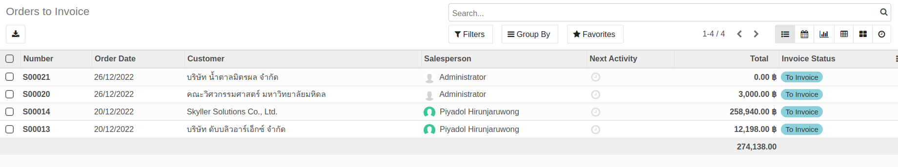
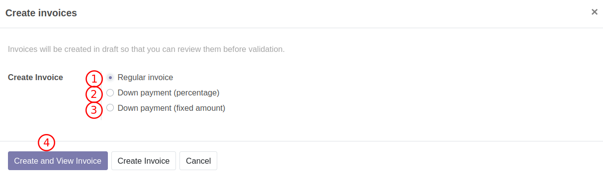
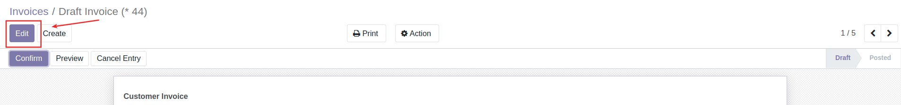
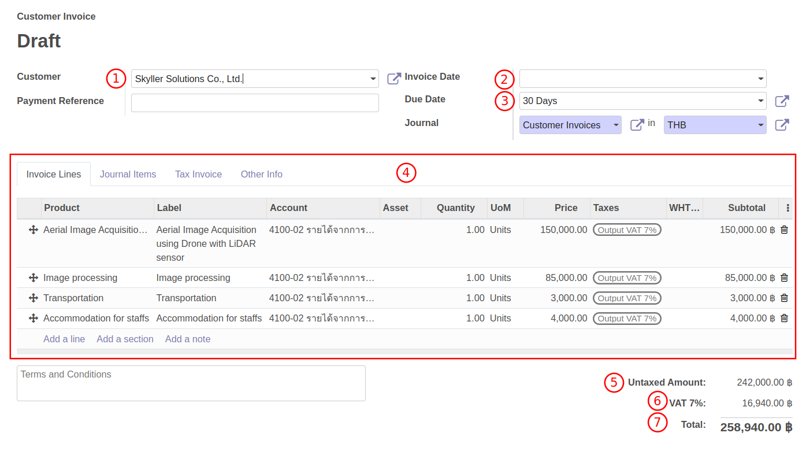
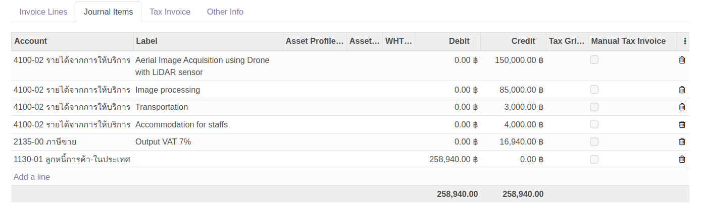
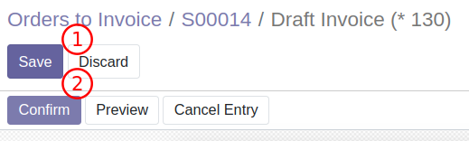
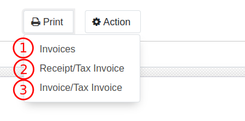

# การบันทึกรายได้และตั้งหนี้ลูกหนี้

เมื่อต้องการตั้งลูกหนี้และออกบิลให้ลูกค้า สามารถดำเนินการได้ดังนี้

**Menu:** Sales > To Invoice > Orders to Invoice

1. ค้นหาและเลือกรายการที่ต้องการตั้งลูกหนี้

2. ตรวจสอบข้อมูลของเอกสาร และกดปุ่ม Create Invoice เพื่อสร้างใบแจ้งหนี้ 

3. ระบบจะแสดงหน้าต่างให้เลือกวิธีการออกใบแจ้งหนี้
    * (1) Regular invoice: ออกใบแจ้งหนี้ทั้งจำนวน
    * (2) Down Payment (percentage): ออกใบแจ้งหนี้เรียกเก็บเงินบางส่วน โดยคำนวณตาม %
    * (3) Down Payment (fixed amount): ออกใบแจ้งหนี้เรียกเก็บเงินบางส่วน โดยกรอกจำนวนที่ต้องการ
    * (4) Create and View Invoice เพื่อสร้างเอกสาร Customer Invoice ฉบับร่างและเรียกดูหน้าเอกสาร
    

4. ที่หน้าเอกสาร Customer Invoice กดปุ่ม Edit 

5. ตรวจสอบข้อมูล เพื่อออกใบแจ้งหนี้และบันทึกบัญชี
    * (1) Customer: ชื่อลูกค้า
    * (2) Invoice Date: เลือกวันที่ออกใบวางบิล
    * (3) Due Date: วันครบกำหนดชำระเงิน
    * (4) Tab Invoice Lines: รายละเอียดของรายการที่ขาย
    * (5) Untaxed Amount: ยอดเงินก่อนภาษีมูลค่าเพิ่ม
    * (6) VAT 7%: ยอดภาษีมูลค่าเพิ่ม
    * (7) Due Date: ยอดรวมทั้งหมด
    

6. ตรวจสอบข้อมูลตัวอย่างการบันทึกบัญชีที่ Tab Journal items 

6. เมื่อกรอกข้อมูลและเรียบร้อยแล้ว ให้กดปุ่ม Save และConfirm เพื่อยืนยันการบันทึกบัญชี สถานะเอกสารจะเปลี่ยนเป็น Posted

7. หากต้องการ Print เอกสาร สามารถเลือกประเภทที่ต้องการได้ดังนี้
    * (1) Invoices: ใบแจ้งหนี้
    * (2) Receipt/Tax Invoice: ใบเสร็จรับเงิน/ใบกำกับภาษี
    * (3) Invoice/Tax Invoice: ใบแจ้งหนี้/ใบกำกับภาษี
    

End.

----------------------------------------------------------
