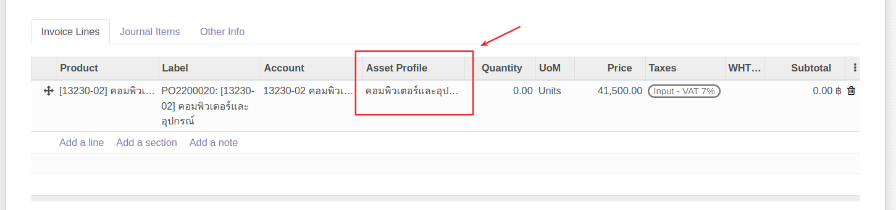

# การบันทึกค่าใช้จ่ายและตั้งหนี้เจ้าหนี้

**Menu:** Invoicing > Vendors > Bills

1. กดปุ่ม Create เพื่อสร้างเอกสาร Vendor Bill สถานะ Draft

2. กรอกข้อมูลที่ Header และตรวจสอบข้อมูลการตั้งเจ้าหนี้

    * Vendor: เลือกคู่ค้าที่ต้องการตั้งหนี้
    * Bill Reference: กรอกเลขที่เอกสารใบแจ้งหนี้จากคู่ค้าเพื่ออ้างอิง (ถ้ามี)
    * Auto-Complete: สามารถเลือกเลขที่ PO ที่เกี่ยวข้อง ระบจะช่วยดึงข้อมูลสินค้าที่จัดซื้อตามใบ PO นั้นๆมากรอกให้ในแท็บ Invoice Lines
    * Bill Date: วันที่ตามใบแจ้งหนี้
    * Accounting Date: วันที่บันทึกบัญชี  ระบบเลือกให้เป็นวันที่ปัจจุบัน
    * Due Date: กำหนดการชำระเงิน สามารถเลือกเป็นระยะเวลาหรือระบุวันที่ได้ (หากมีการตั้งค่า Payment term ไว้ที่ข้อมูลหลัก Contacts ระบบจะช่วยดึงค่ามากรอกให้อัตโนมัติ)
    * ที่แท็บ Invoice Line 
        * กรณีดึงข้อมูลจากใบ PO ตรวจสอบข้อมูล หากมีภาษีหัก ณ ที่จ่าย ให้เลือกประเภทหัก ณ ที่จ่ายในคอลัมน์ WHT
        * กรณีไม่ดึงข้อมูลจาก PO สามารถกรอกข้อมูลในแต่ละคอลัมน์ได้เลย

3. กดปุ่ม Save เพื่อบันทึกข้อมูลและตรวจทานอีกครั้ง หากต้องการแก้ไขสามารถกดปุ่ม Edit ได้

    !!! Note
        กรณีมีภาษีมูลค่าเพิ่ม จะต้องกรอกข้อมูลใบกำกับภาษี (Tax Invoice) โดย

        *   กดปุ่ม Edit อีกครั้ง
        
        *   ไปที่แท็บ Tax Invoice เพื่อกรอกข้อมูลใบกำกับภาษีและกดปุ่ม Save
        

4. กดปุ่ม Confirm เพื่อยืนยันการบันทึกค่าใช้จ่ายและตั้งเจ้าหนี้ สถานะเอกสารจะเปลี่ยนจาก Draft เป็น Posted และเข้าสู่กระบวนการบันทึกจ่ายชำระเงินต่อไป

!!! Note
    หากเอกสาร Vendor Bills ดึงข้อมูลใบ PO ที่มีการจัดซื้อสินทรัพย์ (Asset) 
    ที่แท็บ Invoice Line > คอลัมน์ Asset Profile จะดึงข้อมูลมาแสดง ตรวจสอบความถูกต้องของ Asset Profile หากไม่ถูกต้องสามารถกดที่คอลัมน์เพื่อเปลี่ยนได้ 
    
    และเมื่อทำการตั้งเจ้าหนี้ ระบบจะสร้างข้อมูลสินทรัพย์ สถานะ Draft ให้อัตโนมัติ
    
