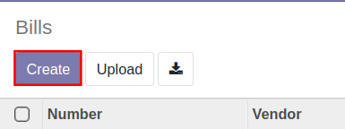
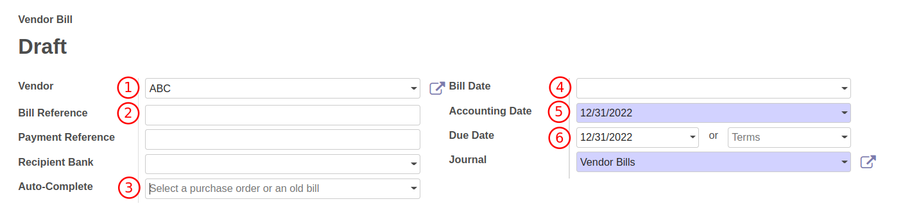

# การบันทึกค่าใช้จ่ายและตั้งหนี้เจ้าหนี้

**Menu:** Invoicing > Vendors > Bills

1. กดปุ่ม Create เพื่อสร้างเอกสาร Vendor Bill สถานะ Draft

2. กรอกข้อมูลที่ Header (ส่วนบนเอกสาร) ดังนี้
    * (1) Vendor: เลือกคู่ค้าที่ต้องการตั้งหนี้
    * (2) Bill Reference: กรอกเลขที่เอกสารใบแจ้งหนี้จากคู่ค้าเพื่ออ้างอิง (ถ้ามี)
    * (3) Auto-Complete: กรณีที่มีการออก PO สามารถเลือกเลขที่ PO นั้นๆ เพื่อให้ระบช่วยดึงข้อมูลมากรอกให้ที่ Tab Invoice Lines
    * (4) Bill Date: วันที่ตามใบแจ้งหนี้
    * (5) Accounting Date: วันที่บันทึกบัญชี
    * (6) Due Date: กำหนดการชำระเงิน
    

3. Tab **Invoice Lines** เป็นหน้าต่างที่ใช้ในการกรอกรายละเอียดที่ใช้ในการบันทึกบัญชี หากเป็นการบันทึกตั้งหนี้ตรงจากค่าใช้จ่ายเกี่ยวกับการขนส่ง ให้กด add a line เพื่อกรอกข้อมูลเพื่อรายการต่างๆ ดังนี้ 
    * (1) Product: สินค้า 
    * (2) Label: คำอธิบายรายการ หากเป็นการบันทึกสินทรัพย์ ระบบจะนำข้อมูลในช่องนี้เป็นชื่อตั้งต้นของสินทรัพย์
    * (3) Account: รหัสบัญชี
    * (4) Asset Profile: ประเภทของสินทรัพย์ (กรณีมีการเลือกรหัสบัญชีที่เกี่ยวข้องกับสินทรัพย์)
    * (5) Quantity: จำนวน
    * (6) Price: ราคาต่อหน่วย
    * (7) Taxes: ประเภท VAT 
    * (8) WHT: ประเภทของภาษีหัก ณ ที่จ่าย
    * (9) Subtotal: ยอดรวมรายบรรทัด
    

4. Tab **Journal Items** ระบบจะแสดงคู่บัญชี ซึ่งดึงมาจาก Product หรือ Account ที่เลือกในแต่ละบรรทัดของ Invoice Line

5. Tab **Tax invoice** จะแสดงเมื่อมีการเลือก Taxes เป็นภาษีซื้อ (Input VAT) ซึ่งจะต้องกรอกข้อมูลดังนี้
    * (1) Partner: ชื่อบริษัทที่อยู่ในใบกำกับภาษี สามารถกดปุ่ม Edit เพื่อแก้ไขชื่อให้ตรงกับใบกำกับภาษี
    * (2) Tax Invoice Number: เลขที่ใบกำกับภาษี
    * (3) Tax Invoice Date: วันที่ในใบกำกับภาษี
    * (4) Tax Base: ยอดเงินก่อนภาษีมูลค่าเพิ่ม
    * (5) Tax Amount: ภาษีมูลค่าเพิ่ม
    * (6) Split: ใช้สำหรับกรณีที่มีใบกำกับภาษีหลายใบ สามารถกด Split เพื่อเพิ่มเอกสาร

6. Terms and Conditions: คำอธิบายการ 
 

7. กดปุ่ม Save เพื่อบันทึกข้อมูลและตรวจทาน หากต้องการแก้ไขข้อมูลอีกครั้ง ให้กดปุ่ม Edit เพื่อแก้ไข

    
    
    

8. กดปุ่ม Confirm เพื่อบันทึกบัญชี สถานะเอกสารจะเปลี่ยนจาก Draft เป็น Posted

!!! Note

    * หากเลือก Auto-Complete ระบบจะดึงข้อมูลรายละเอียดต่างๆ จาก Purchase Order มาแสดง ให้ตรวจสอบความถูกต้องก่อนบันทึกบัญชี 
    * หากเอกสาร Vendor Bills ที่มีการซื้อสินทรัพย์ (Asset) ให้ตรวจสอบคอลัมน์ Asset Profile
    * กรณีเป็นภาษีซื้อนำเข้า ให้เลือก Product เป็น **ภาษีซื้อนำเข้า** เพื่อบันทึกยอดภาษีที่เกิดขึ้น เพื่อจ่ายชำระเงิน
    * กรณีเลือก Product เป็น ภาษีและค่าใช้จ่ายนำเข้า จะสามารถนำไปปันส่วนเข้าต้นทุนขายในลำดับถัดไป

End.

----------------------------------------------------------

