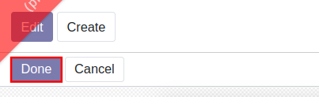

# การบันทึกจ่ายชำระเงิน (Vendor Payment)

## วิธีการบันทึกจ่ายชำระเงิน

เมื่อต้องการบันทึกจ่ายชำระเงิน สามารถดำเนินการได้ดังนี้

**Menu:** Invoicing > Dashboard

1. กล่อง Vendor Bills จะแสดงรายการที่ยังไม่ได้จ่ายชำระเงิน ให้คลิกที่คำว่า **Bill to Pay**

2. ระบบจะเปิดหน้าต่างของเอกสารที่ยังไม่ได้จ่ายเงิน ให้เลือกเอกสารที่ต้องการบันทึก

3. ระบบจะเปิดเอกสารตั้งหนี้ ตรวจสอบข้อมูลให้ถูกต้อง จากนั้นกดปุ่ม Register Payment เพื่อบันทึกรับชำระเงิน
    
    

    !!! note "หากมีการบันทึกตั้งหนี้เป็นสกุลเงินต่างประเทศ ให้ทำการเปลี่ยนสกุลเงินดังนี้"
        (1) คลิก USA (สกุลเงินต่างประเทศ) เพื่อเปลี่ยนเป็นไทยบาท
            
        (2) เลือกเป็น **THB** เพื่อบันทึกค่าธรรมเนียมและผลต่างจากอัตราแลกเปลี่ยน
            

4. ระบบแสดงหน้าต่างให้กรอกข้อมูลบันทึกจ่ายชำระเงิน ดังนี้
    * (1) Journal: เลือกบัญชีธนาคาร ที่จ่ายเงิน
    * (2) Amount: กรอกจำนวนเงินที่จ่ายชำระตามจริง 
    * (3) Payment Date: วันที่ได้จ่ายเงิน
    * (4) Memo: คำอธิบายรายการเพิ่มเติม
    * (5) Keep Open: เลือกในกรณีจ่ายเงินบางส่วน และต้องการเก็บยอดคงค้างไว้
    * (6) Mark as fully paid: เลือกบันทึกบัญชียอดผลต่าง เข้ารหัสบัญชีเดียว
    * (7) Mark as fully paid (multi deduct): ใช้ในกรณีที่มีผลต่าง ให้บันทึกบัญชีมากกว่า 1 บัญชี เช่น ค่าธรรมเนียม และกำไร/ขาดทุนจากอัตราแลกเปลี่ยน
    * (8) กรณีเลือก Mark as fully paid (multi deduct) ให้กดปุ่ม Add a line เพื่อเลือกรหัสบัญชีที่ต้องการบันทึก และเพิ่มคำอธิบานรายการ
    * (9) กดปุ่ม Create Payment เพื่อบันทึกบัญชี
    

5. เมื่อบันทึกบัญชีเรียบร้อยแล้ว สถานะเอกสารจะเปลี่ยนเป็น Paid สามารถเข้าไปดูรายละเอียดการบันทึกบัญชีได้ดังนี้
    * (1) คลิกที่สัญลักษณ์ตัว i เพื่อแสดงหน้าต่างรายละเอียด
    * (2) กดปุ่ม View เพื่อเข้าสู่หน้าต่างของเอกสาร RV
    

6. เมื่อเข้าสู่หน้าต่างของเอกสารรับเงิน หากต้องการดูคู่บัญชี สามารถคลิกที่ **Journal Entry** เพื่อการบันทึกบัญชี

!!! note
    หากลูกค้ารายเดียวกันชำระเงินรวม  สามารถติ๊กถูกหน้าเอกสารที่ต้องการบันทึกรับชำระ เพื่อบันทึกรับเงินหลาย Invoice 
    

---

### การออกใบหัก ณ ที่ จ่าย

หากมีภาษีหัก ณ ที่จ่าย หลังจากทำ Register Payment แล้ว สามารถออกใบหัก ณ ที่จายได้ โดยมีขั้นตอนดังนี้

**Menu:** Invoicing > Vendors > Payments

1. สามารถใช้การกรองเอกสารที่ยังไม่ได้ออกหนังสือรับรองหัก ณ ที่จ่าย โดยเลือกจากเมนู Favorites

2. เลือกรายการ Payment ที่ต้องการออกหนังสือรับรองหัก ณ ที่จ่าย

3. กดปุ่ม Edit เพื่อกรอกข้อมูลดังนี้
    * (1) Type of Income: ประเภทของเงินได้
    * (2) Income Description: คำอธิบายเงินได้ จะนำไปออกในฟอร์ม เมื่อเลือกประเภทเงินได้ ประเภทที่ 6 
    

4. เมื่อกรอกข้อมูลเรียบร้อยให้กด Save และกด **Create witholding tax cert.** เพื่อสร้างใบหัก ณ ที่จ่ายสถานะ Drat 

5. กด Show witholding tax certs เพื่อดูรายการใบหัก ณ ที่จ่าย

6. ระบบจะแสดงหน้าต่าง ให้คลิกเพื่อเข้าสู่หน้าต่างการออกฟอร์มหนังสือรับรอง

7. เมื่อเข้าสู่หน้าต่างฟอร์มหนังรับรอง ให้เลือกกรอกข้อมูลดังนี้ 
    * (1) Vendor: ชื่อคู่ค้า สามารถเปลี่ยนให้ตรงกับชื่อคู่ค้าต้องการหัก ณ ที่จ่าย หากมีการเบิกผ่านเงินทดรองจ่าย เงินสดย่อยและสำรองจ่าย
    * (2) Income Tax Form: ประเภทหนังสือรับรอง

9. กดปุ่ม Print > WHT Certificates (pdf) เพื่อดาวน์โหลดฟอร์มในรูปแบบ pdf

8. หากข้อมูลถูกต้องเรียบร้อยแล้ว ให้กดปุ่ม Done สถานะเอกสารจะเปลี่ยนเป็น Done 

End.

----------------------------------------------------------
