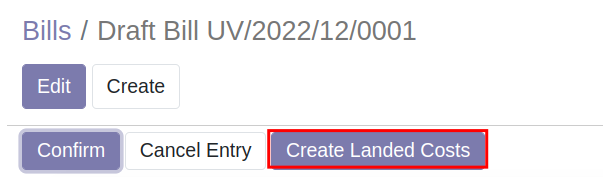

# การโอนค่าใช้จ่ายเข้าสินค้าคงเหลือ (Landed Cost)

## การปันส่วนค่าใช้จ่าย

การปันส่วนค่าใช้จ่ายเข้าสินค้าคงเหลือสามารถทำได้ดังนี้

**Menu ::** Invoices > Vendor > Bill

1. เลือกเอกสารที่ต้องการโอนค่าใช้จ่าย จากนั้นระบบจะเปิดหน้าต่างของเอกสารที่เลือก
2. เอกสารที่สามารถนำไปปันส่วนได้จะมีปุ่ม **Create Landed Cost** กดคลิกที่ปุ่มเพื่อเข้าสู่หน้าต่างการปันส่วน

    

3. เมื่อเข้าสู่หน้าต่างการปันส่วนแล้ว ให้กดปุ่ม Edit

    

4. ตรวจสอบและแก้ไขข้อมูลดังนี้
    * (1) Date: วันที่สำหรับการบันทึกโอนค่าใช้จ่าย
    * (2) Apply On: ประเภทของการโอน ให้เลือกเป็น **Transfer**
    * (3) Transfer: เลือกเอกสารที่รับสินค้าเข้าคลัง เพื่อโอนค่าใช้จ่ายเข้าสินค้าคงเหลือ
    * (4) Journal: สมุดรายวันที่ใช้ในการบันทึกบัญชี
    * (5) Vendor bill: เอกสารอ้างอิงที่บันทึกค่าใช้จ่ายนั้นๆ

    

5. เมื่อกรอกข้อมูลตามข้อ 4 เรียบร้อยแล้ว ให้กดปุ่ม Compute เพื่อคำนวณการปัน
    

6. ระบบจะคำนวณ และแสดงผลการปันส่วนที่ Tab **Valuation Adjustments**
    

7. หากต้องการยอดที่ปันส่วน สามารถกด Edit และกรอกตัวเลขที่ถูกต้องในคอลัมน์ **Additional Landed Cost**
    

8. เมื่อตรวจสอบข้อมูลเรียบร้อยแล้ว ให้กดปุ่ม Validate เพื่อบันทึกบัญชี
    

9. หากต้องการดูคู่บัญชีสามารถคลิกที่ Journal Entry
    

!!! note "การปันส่วนจะขึ้นอยู่กับตั้งค่า Product"

    การตั้งค่าที่ Product สามารถทำได้ที่
    Menu: Invoices > Vendor > Products

    คลิกเลือก Product ที่ต้องการตั้งค่า และคลิกที่ Tab **Purchase**

    1. ติ๊ก Is a Landed Cost
    2. เลือก Default Split Method - By Current Cost
    

End.

----------------------------------------------------------

