# เงินทดรองจ่าย (Advance)

## วิธีการบันทึกลูกหนี้เงินทดรองจ่าย

การบันทึกลูกหนี้เงินทดรองจ่ายสามารถทำได้ดังนี้

**Menu:** Invoicing > Vendors > Bills

1. กดปุ่ม Create เพื่อสร้างเอกสาร Vendor Bill สถานะ Draft
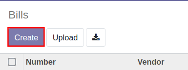

2. กรอกข้อมูลที่ Header (ส่วนบนเอกสาร) ดังนี้
    * (1) Vendor: เลือกชื่อพนักงานที่ต้องการบันทึกตั้งหนี้
    * (2) Bill Reference: กรอกคำอธิบายขึ้นต้นด้วยคำว่า Advance
    * (3) Auto-Complete: ไม่ต้องเลือก
    * (4) Bill Date: วันที่ยืมเงินทดรองจ่าย
    * (5) Accounting Date: วันที่บันทึกบัญชี
    * (6) Due Date: กำหนดการเคลียร์เงินทดรองจ่าย
    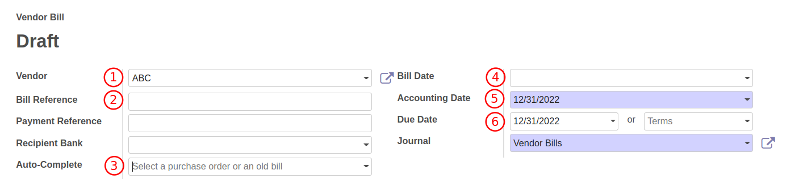

3. Tab **Invoice Lines** กด add a line เพื่อกรอกข้อมูลดังนี้ 
    * (1) Product: เลือกเป็น **Advance** 
    * (2) Label: คำอธิบายรายการรายบรรทัด
    * (3) Account: รหัสบัญชี ระบบจะดึงรหัสบัญชีจาก Product
    * (4) Asset Profile: ประเภทของสินทรัพย์
    * (5) Quantity: จำนวน
    * (6) Price: ราคาต่อหน่วย
    * (7) Taxes: ประเภท VAT (ไม่ต้องกรอก)
    * (8) WHT: ประเภทของภาษีหัก ณ ที่จ่าย (ไม่ต้องกรอก)
    * (9) Subtotal: ยอดรวมรายบรรทัด
    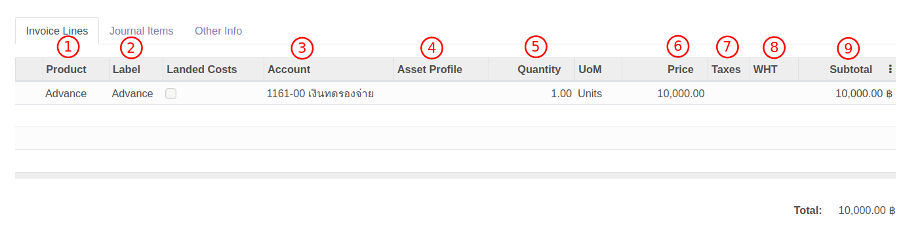

4. Tab **Journal Items** ระบบจะแสดงคู่บัญชี ซึ่งดึงมาจาก Product หรือ Account
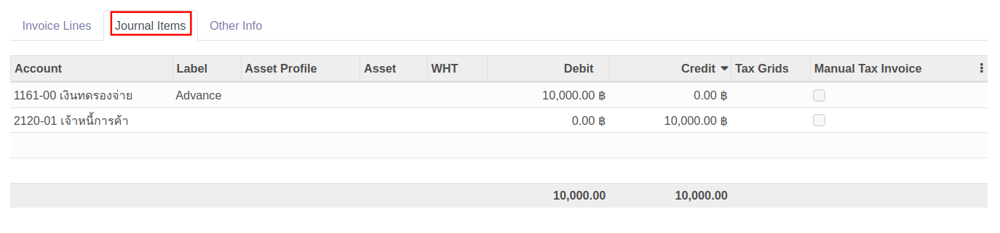

6. Terms and Conditions: คำอธิบายการ 
 

7. กดปุ่ม Save เพื่อบันทึกข้อมูลและตรวจทาน หากต้องการแก้ไขข้อมูลอีกครั้ง ให้กดปุ่ม Edit เพื่อแก้ไข

8. กดปุ่ม Confirm เพื่อบันทึกบัญชี สถานะเอกสารจะเปลี่ยนจาก Draft เป็น Posted

------------------------------------

## วิธีการบันทึกโอนเงินทดรองจ่าย

!!! info 
    สามารถดูวิธีการจ่ายชำระเงินได้ที่หัวข้อ **การบันทึกจ่ายชำระ**

------------------------------------

## วิธีการเคลียร์เงินทดรองจ่าย

การเคลียร์เงินทดรองแบ่งออกเป็น 3 กรณีดังนี้

1. เคลียร์เงินทดรองจ่ายเท่ากับยอดที่ยืม
2. เคลียร์เงินทดรองจ่ายมากกว่ายอดที่ยืม
3. เคลียร์เงินทดรองจ่ายน้อยกว่ายอดที่ยืม

### เคลียร์เงินทดรองจ่ายเท่ากับยอดที่ยืม

**Menu:** Invoicing > Vendors > Bills

1. กดปุ่ม Create เพื่อสร้างเอกสาร Vendor Bill สถานะ Draft

2. กรอกข้อมูลที่ Header (ส่วนบนเอกสาร) ดังนี้
    * (1) Vendor: เลือกชื่อพนักงานที่เคลียร์เงินทดรองจ่าย
    * (2) Bill Reference: กรอกคำอธิบายขึ้นต้นด้วยคำว่า Clear Advance
    * (3) Auto-Complete: เลือก Bill ที่บันทึกตั้งหนี้เงินทดรองจ่ายนั้นๆ เพื่อให้ระบช่วยดึงข้อมูลมากรอกให้ที่ Tab Invoice Lines
    * (4) Bill Date: วันที่เคลียร์เงินทดรองจ่าย
    * (5) Accounting Date: วันที่บันทึกบัญชี
    * (6) Due Date: กำหนดการเคลียร์เงินทดรองจ่าย
    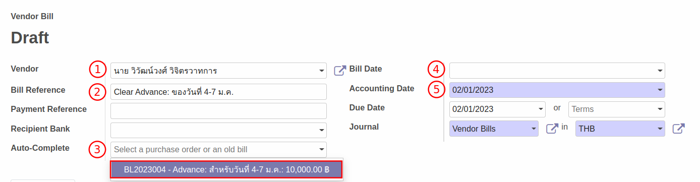

3. Tab **Invoice Lines** ระบบจะดึงข้อมูลของเงินทดรองจ่ายมาแสดง จากนั้นกด add a line เพื่อกรอกรายละเอียดค่าใช้จ่ายที่ใช้ไปดังนี้ 
    * (1) Product: ไม่ต้องเลือก
    * (2) Label: คำอธิบายรายการรายบรรทัด
    * (3) Account: รหัสบัญชีที่ใช้ในการบันทึกค่าใช้จ่าย
    * (4) Asset Profile: ประเภทของสินทรัพย์
    * (5) Quantity: จำนวน
    * (6) Price: ราคาต่อหน่วย
    * (7) Taxes: ประเภท VAT
    * (8) WHT: ประเภทของภาษีหัก ณ ที่จ่าย
    * (9) Subtotal: ยอดรวมรายบรรทัด
    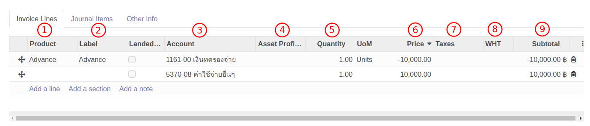

4. Tab **Journal Items** ระบบจะแสดงคู่บัญชี ซึ่งดึงมาจาก Account
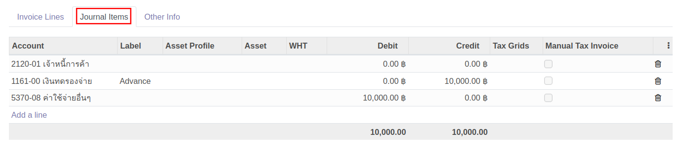

5. Tab **Tax invoice** จะแสดงเมื่อมีการเลือก Taxes เป็นภาษีซื้อ (Input VAT) ซึ่งจะต้องกรอกข้อมูลดังนี้
    * (1) Partner: ให้แก้ไขเป็นชื่อบริษัทที่อยู่ในใบกำกับภาษี กดปุ่ม Edit เพื่อแก้ไข
    * (2) Tax Invoice Number: เลขที่ใบกำกับภาษี
    * (3) Tax Invoice Date: วันที่ในใบกำกับภาษี
    * (4) Tax Base: ยอดเงินก่อนภาษีมูลค่าเพิ่ม
    * (5) Tax Amount: ภาษีมูลค่าเพิ่ม
    * (6) Split: ใช้สำหรับกรณีที่มีใบกำกับภาษีหลายใบ สามารถกด Split เพื่อเพิ่มเอกสาร

6. Terms and Conditions: คำอธิบายการ 
 

7. กดปุ่ม Save เพื่อบันทึกข้อมูลและตรวจทาน หากต้องการแก้ไขข้อมูลอีกครั้ง ให้กดปุ่ม Edit เพื่อแก้ไข

8. กดปุ่ม Confirm เพื่อบันทึกบัญชี สถานะเอกสารจะเปลี่ยนจาก Draft เป็น Posted

!!! Note "เคลียร์เงินทดรองจ่ายเท่ากับยอดที่ยืม"
    * แก้ไขบรรทัดยอดเงินทดรองจ่าย ที่คอลัมน์ **Price** ใส่เครื่องหมายลบและจำนวนเงินที่จ่ายจริง เพื่อระบุการล้างเงินทดรองจ่าย
        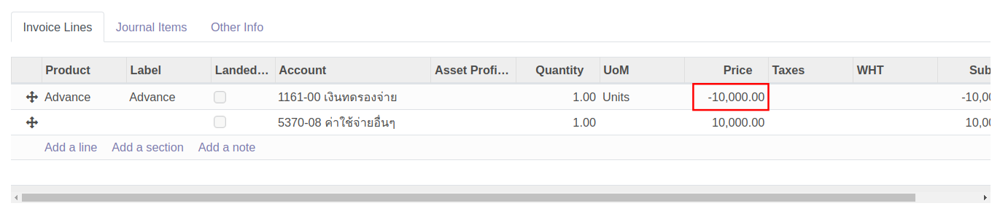

------------------------------------

### เคลียร์เงินทดรองจ่ายมากกว่ายอดที่ยืม

**Menu:** Invoicing > Vendors > Bills

1. กดปุ่ม Create เพื่อสร้างเอกสาร Vendor Bill สถานะ Draft

2. กรอกข้อมูลที่ Header (ส่วนบนเอกสาร) ดังนี้
    * (1) Vendor: เลือกชื่อพนักงานที่เคลียร์เงินทดรองจ่าย
    * (2) Bill Reference: กรอกคำอธิบายขึ้นต้นด้วยคำว่า Clear Advance
    * (3) Auto-Complete: เลือก Bill ที่บันทึกตั้งหนี้เงินทดรองจ่ายนั้นๆ เพื่อให้ระบช่วยดึงข้อมูลมากรอกให้ที่ Tab Invoice Lines
    * (4) Bill Date: วันที่เคลียร์เงินทดรองจ่าย
    * (5) Accounting Date: วันที่บันทึกบัญชี
    * (6) Due Date: กำหนดการเคลียร์เงินทดรองจ่าย
    

3. Tab **Invoice Lines** ระบบจะดึงข้อมูลของเงินทดรองจ่ายมาแสดง จากนั้นกด add a line เพื่อกรอกรายละเอียดค่าใช้จ่ายที่ใช้ไปดังนี้ 
    * (1) Product: ไม่ต้องเลือก
    * (2) Label: คำอธิบายรายการรายบรรทัด
    * (3) Account: รหัสบัญชีที่ใช้ในการบันทึกค่าใช้จ่าย
    * (4) Asset Profile: ประเภทของสินทรัพย์
    * (5) Quantity: จำนวน
    * (6) Price: ราคาต่อหน่วย
    * (7) Taxes: ประเภท VAT
    * (8) WHT: ประเภทของภาษีหัก ณ ที่จ่าย
    * (9) Subtotal: ยอดรวมรายบรรทัด
    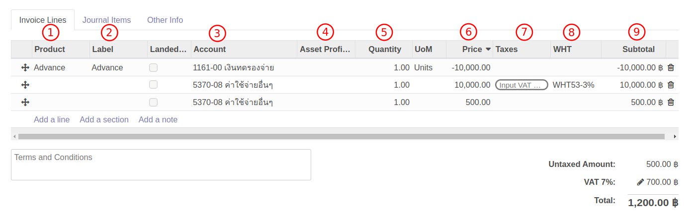

4. Tab **Journal Items** ระบบจะแสดงคู่บัญชี ซึ่งดึงมาจาก Account

5. Tab **Tax invoice** จะแสดงเมื่อมีการเลือก Taxes เป็นภาษีซื้อ (Input VAT) ซึ่งจะต้องกรอกข้อมูลดังนี้
    * (1) Partner: ให้แก้ไขเป็นชื่อบริษัทที่อยู่ในใบกำกับภาษี กดปุ่ม Edit เพื่อแก้ไข
    * (2) Tax Invoice Number: เลขที่ใบกำกับภาษี
    * (3) Tax Invoice Date: วันที่ในใบกำกับภาษี
    * (4) Tax Base: ยอดเงินก่อนภาษีมูลค่าเพิ่ม
    * (5) Tax Amount: ภาษีมูลค่าเพิ่ม
    * (6) Split: ใช้สำหรับกรณีที่มีใบกำกับภาษีหลายใบ สามารถกด Split เพื่อเพิ่มเอกสาร

6. Terms and Conditions: คำอธิบายการ 
 

7. กดปุ่ม Save เพื่อบันทึกข้อมูลและตรวจทาน หากต้องการแก้ไขข้อมูลอีกครั้ง ให้กดปุ่ม Edit เพื่อแก้ไข

8. กดปุ่ม Confirm เพื่อบันทึกบัญชี สถานะเอกสารจะเปลี่ยนจาก Draft เป็น Posted

!!! Note "เคลียร์เงินทดรองจ่ายมากกว่ายอดที่ยืม"
    * แก้ไขบรรทัดยอดเงินทดรองจ่าย ที่คอลัมน์ **Price** ใส่เครื่องหมายลบและจำนวนเงินที่จ่ายจริง เพื่อระบุการล้างเงินทดรองจ่าย
        
    * เมื่อใช้เงินมากกว่าที่ยืม ระบบจะแสดงปุ่ม **Register Payment** เพื่อให้ทำการจ่ายชำระในส่วนที่เกิน ซึ่งสามารถดูวิธีการจ่ายได้ที่หัวข้อ **การบันทึกจ่ายชำระ**

------------------------------------

### เคลียร์เงินทดรองจ่ายน้อยกว่ายอดที่ยืม

กรณีเคลียร์เงินทดรองจ่ายน้อยกว่ายอดที่ยืม มีวิธีปฏิบัติ 3 ขั้นตอนดังนี้

**1. การบันทึกเคลียร์เงินทดรองจ่าย**

**Menu:** Invoicing > Vendors > Bills

1. กดปุ่ม Create เพื่อสร้างเอกสาร Vendor Bill สถานะ Draft

2. กรอกข้อมูลที่ Header (ส่วนบนเอกสาร) ดังนี้
    * (1) Vendor: เลือกชื่อพนักงานที่เคลียร์เงินทดรองจ่าย
    * (2) Bill Reference: กรอกคำอธิบายขึ้นต้นด้วยคำว่า Clear Advance
    * (3) Auto-Complete: เลือก Bill ที่บันทึกตั้งหนี้เงินทดรองจ่ายนั้นๆ เพื่อให้ระบช่วยดึงข้อมูลมากรอกให้ที่ Tab Invoice Lines
    * (4) Bill Date: วันที่เคลียร์เงินทดรองจ่าย
    * (5) Accounting Date: วันที่บันทึกบัญชี
    * (6) Due Date: กำหนดการเคลียร์เงินทดรองจ่าย
    

3. Tab **Invoice Lines** ระบบจะดึงข้อมูลของเงินทดรองจ่ายมาแสดง จากนั้นกด add a line เพื่อกรอกรายละเอียดค่าใช้จ่ายที่ใช้ไปดังนี้ 
    * (1) Product: ไม่ต้องเลือก
    * (2) Label: คำอธิบายรายการรายบรรทัด
    * (3) Account: รหัสบัญชีที่ใช้ในการบันทึกค่าใช้จ่าย
    * (4) Asset Profile: ประเภทของสินทรัพย์
    * (5) Quantity: จำนวน
    * (6) Price: ราคาต่อหน่วย
    * (7) Taxes: ประเภท VAT
    * (8) WHT: ประเภทของภาษีหัก ณ ที่จ่าย
    * (9) Subtotal: ยอดรวมรายบรรทัด
    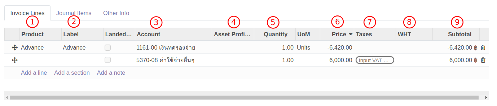

4. Tab **Journal Items** ระบบจะแสดงคู่บัญชี ซึ่งดึงมาจาก Product หรือ Account

5. Tab **Tax invoice** จะแสดงเมื่อมีการเลือก Taxes เป็นภาษีซื้อ (Input VAT) ซึ่งจะต้องกรอกข้อมูลดังนี้
    * (1) Partner: ให้แก้ไขเป็นชื่อบริษัทที่อยู่ในใบกำกับภาษี กดปุ่ม Edit เพื่อแก้ไข
    * (2) Tax Invoice Number: เลขที่ใบกำกับภาษี
    * (3) Tax Invoice Date: วันที่ในใบกำกับภาษี
    * (4) Tax Base: ยอดเงินก่อนภาษีมูลค่าเพิ่ม
    * (5) Tax Amount: ภาษีมูลค่าเพิ่ม
    * (6) Split: ใช้สำหรับกรณีที่มีใบกำกับภาษีหลายใบ สามารถกด Split เพื่อเพิ่มเอกสาร

6. Terms and Conditions: คำอธิบายการ 
 

7. กดปุ่ม Save เพื่อบันทึกข้อมูลและตรวจทาน หากต้องการแก้ไขข้อมูลอีกครั้ง ให้กดปุ่ม Edit เพื่อแก้ไข

8. กดปุ่ม Confirm เพื่อบันทึกบัญชี สถานะเอกสารจะเปลี่ยนจาก Draft เป็น Posted

!!! Note "เคลียร์เงินทดรองจ่ายน้อยกว่ายอดที่ยืม"
    * แก้ไขบรรทัดยอดเงินทดรองจ่าย ที่คอลัมน์ **Price** ใส่เครื่องหมายลบและจำนวนเงินที่จ่ายจริง เพื่อระบุการล้างเงินทดรองจ่าย
        

**2. บันทึกตั้งหนี้ลูกหนี้**

**Menu:** Invoicing > Customer > Invoices

1. กดปุ่ม Create เพื่อสร้างเอกสาร
2. กรอกข้อมูลในส่วน Header ซึ่งมีรายละเอียดดังนี้
    * (1) Customer: เลือกชื่อพนักงาน
    * (2) Invoice Date: วันที่ตั้งลูกหนี้
    * (3) Due Date: วันที่ครบกำหนดชำระเงิน
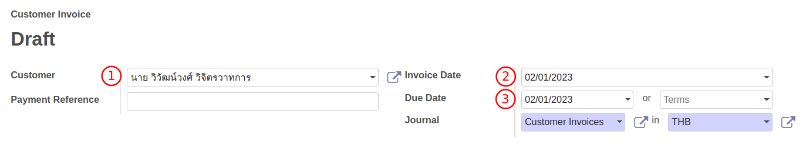

3. ในส่วนของ Invoice lines กรอกรายละเอียดดังนี้
    * (1) Product: เลือกเป็น **Advance** 
    * (2) Label: คำอธิบายรายการ
    * (3) Account: รหัสบัญชี
    * (4) Quantity: จำนวนที่ต้องรับคืน
    * (5) Price: ราคาต่อหน่วย 
    * (6) Subtotal: ยอดรวมรายบรรทัด
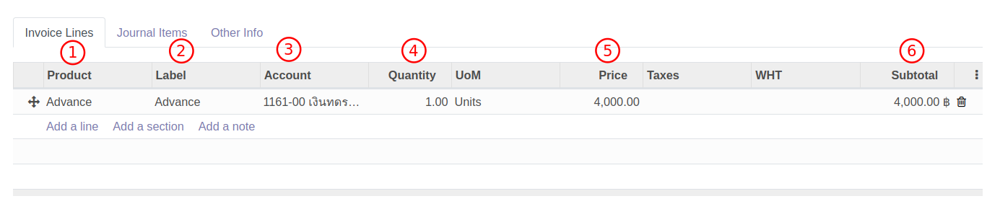

4. คลิกที่ Tab "Journal items" เพื่อตรวจสอบการลงบันทึกบัญชี
    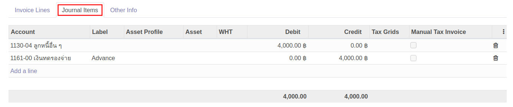

5. กดปุ่ม Save สถานะของเอกสารจะยังคงเป็น Draft อยู่ หากต้องการแก้ไขข้อมูลสามารถให้กด Edit 
6. Terms and Conditions: คำอธิบายการ
  
7. ตรวจสอบข้อมูลให้ครบถ้วนแล้วกดปุ่ม Confirm เพื่อลงบัญชี สถานะของเอกสารจะเปลี่ยนเป็น Posted

**3. บันทึกรับเงินทดรองจ่ายคืน**

ขั้นตอนรับเงินคืนสามารถดูได้ที่หัวข้อ **การบันทึกรับเงิน**

End.

------------------------------------