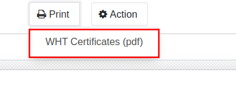

# เงินสดย่อย (Petty Cash)

## วิธีการบันทึกเงินสดย่อย

การบันทึกค่าใช้จ่ายที่จ่ายผ่านเงินสดย่อยสามารถทำได้ดังนี้

**Menu:** Invoicing > Vendors > Bills

1. กดปุ่ม Create เพื่อสร้างเอกสาร Vendor Bill สถานะ Draft

2. กรอกข้อมูลที่ Header (ส่วนบนเอกสาร) ดังนี้
    * (1) Vendor: เลือกชื่อพนักงานผู้ถือเงินสดย่อย
    * (2) Bill Reference: กรอกคำอธิบายขึ้นต้นด้วยคำว่า Petty Cash
    * (3) Bill Date: วันที่เบิกเงินสดย่อย
    * (4) Accounting Date: วันที่บันทึกบัญชี
    * (5) Due Date: ใช้วันเดียวกับวันที่บันทึกบัญชี
    

3. Tab **Invoice Lines** กด add a line เพื่อกรอกข้อมูลดังนี้ 
    * (1) Product: ไม่ต้องเลือก
    * (2) Label: คำอธิบายรายการรายบรรทัด
    * (3) Account: รหัสบัญชีที่ใช้ในการบันทึกค่าใช้จ่าย
    * (4) Quantity: จำนวน
    * (5) Price: ราคาต่อหน่วย
    * (6) Taxes: ประเภท VAT
    * (7) WHT: ภาษีหัก ณ ที่จ่าย
    * (8) Subtotal: ยอดรวมรายบรรทัด
    

4. Tab **Journal Items** ระบบจะแสดงคู่บัญชี ซึ่งดึงมาจาก Account

5. Tab **Tax invoice** จะแสดงเมื่อมีการเลือก Taxes เป็นภาษีซื้อ (Input VAT) ซึ่งจะต้องกรอกข้อมูลดังนี้
    * (1) Partner: ให้แก้ไขเป็นชื่อบริษัทที่อยู่ในใบกำกับภาษี กดปุ่ม Edit เพื่อแก้ไข
    * (2) Tax Invoice Number: เลขที่ใบกำกับภาษี
    * (3) Tax Invoice Date: วันที่ในใบกำกับภาษี
    * (4) Tax Base: ยอดเงินก่อนภาษีมูลค่าเพิ่ม
    * (5) Tax Amount: ภาษีมูลค่าเพิ่ม
    * (6) Split: ใช้สำหรับกรณีที่มีใบกำกับภาษีหลายใบ สามารถกด Split เพื่อเพิ่มเอกสาร

6. Terms and Conditions: คำอธิบายการ 
 

7. กดปุ่ม Save เพื่อบันทึกข้อมูลและตรวจทาน หากต้องการแก้ไขข้อมูลอีกครั้ง ให้กดปุ่ม Edit เพื่อแก้ไข

8. กดปุ่ม Confirm เพื่อบันทึกบัญชี สถานะเอกสารจะเปลี่ยนจาก Draft เป็น Posted

!!! Note "เงินสดย่อย"
    * เมื่อต้องการจ่ายคืนเงินสดย่อยให้กดปุ่ม **Register Payment** เพื่อให้ทำการจ่ายชำระ ซึ่งสามารถดูวิธีการจ่ายได้ที่หัวข้อ **การบันทึกจ่ายชำระ**

------------------------------------------------------

## กรณีที่เงินสดย่อยมีหนังสือรับรองหัก ณ ที่จ่ายมากกว่า 1 ใบ 

ตัวอย่างตามกรณีบันทึกรายการในเอกสารบันทึกเงินสดย่อย มีการระบุหัก ณ ที่จ่ายไว้หลายรายการ

ตามตัวอย่างข้างต้นสามารถบันทึกเงินสดย่อยที่เมนู Invoicing > Vendors > Bills ได้ตามหัวข้อ **วิธีการบันทึกเงินสดย่อย** ได้ตามปกติ

จากนั้นการออกหนังสือรับรองหัก ณ ที่จ่าย สำหรับกรณีที่เป็นเงินสดย่อย มีการออกหนังสือรับรองหัก ณ ที่จ่ายมากกว่า 1 ใบ มีวิธีการปฏิบัติดังนี้

1. เมื่อบันทึกข้อมูลเสร็จเรียบร้อยแล้ว ขั้นตอนต่อมาคือจ่ายชำระเงินให้ผู้ถือเงินย่อย ให้กดปุ่ม **Register Payment** ที่หน้าเอกสาร

2. ระบบจะหน้าต่างบันทึกการจ่ายเงิน ให้กรอกข้อมูลดังนี้
    * (1) Journal: เลือกบัญชีธนาคาร ที่จ่ายเงิน
    * (2) Amount: กรอกจำนวนเงินที่จ่ายชำระตามจริง
    * (3) Payment Date: วันที่ได้จ่ายเงิน
    * (4) Memo: คำอธิบายรายการเพิ่มเติม
    * (5) เลือก Mark as fully paid (multi deduct)
    * (6) Partner: ชื่อคู่ค้าที่ต้องการออกหนังสือรับรอง (ใบที่ 1)
    * (7) WHT: ประเภทของหัก ณ ที่จ่าย (ใบที่ 1)
    * (8) Base: ยอดก่อนหัก ณ ที่จ่าย (ใบที่ 1)
    * (9) Account: รหัสบัญชีที่บันทึกบัญชี (ใบที่ 1)
    * (10) Label: คำอธิบายรายการ (ใบที่ 1)
    * (11) Deduction Amount: จำนวนเงินที่หัก ณ ที่จ่าย (ใบที่ 1)
    

3. เมื่อกรอกข้อมูลของการหัก ณ ที่จ่ายในบรรทัดแรกเสร็จแล้ว ให้กด **add a line** และกรอกข้อมูลเพิ่มเติมดังนี้
    * (1) Partner: ชื่อคู่ค้าที่ต้องการออกหนังสือรับรอง (ใบที่ 2)
    * (2) WHT: ประเภทของหัก ณ ที่จ่าย (ใบที่ 2)
    * (3) Base: ยอดก่อนหัก ณ ที่จ่าย (ใบที่ 2)
    * (4) Account: รหัสบัญชีที่บันทึกบัญชี (ใบที่ 2)
    * (5) Label: คำอธิบายรายการ (ใบที่ 2)
    * (6) Deduction Amount: จำนวนเงินที่หัก ณ ที่จ่าย (ใบที่ 2)
    

4. เมื่อกรอกข้อมูลที่หน้าต่างบันทึกชำระเงินครบตามจำนวนหนังสือรับรองแล้ว ให้กด **Create Payment** เพื่อบันทึกบัญชี

5. เมื่อบันทึกบัญชีเรียบร้อยแล้ว สถานะเอกสารจะเปลี่ยนเป็น Paid สามารถเข้าไปดูรายละเอียดการบันทึกบัญชีได้ดังนี้
    * (1) คลิกที่สัญลักษณ์ตัว i เพื่อแสดงหน้าต่างรายละเอียด
    * (2) กดปุ่ม View เพื่อเข้าสู่หน้าต่างของเอกสาร RV
    

6. เมื่อเข้าสู่หน้าต่างของเอกสารจ่ายชำระเงินจะเห็นได้ว่ามีบรรทัดของการหัก ณ ที่จ่าย ตามบรรทัดที่ได้บันทึกไว้ก่อนหน้า

7. กดปุ่ม Edit เพื่อกรอกข้อมูลดังนี้
    * (1) Type of Income: ประเภทของเงินได้
    * (2) Income Description: คำอธิบายเงินได้ จะนำไปออกในฟอร์ม เมื่อเลือกประเภทเงินได้ ประเภทที่ 6 
    

8. เมื่อกรอกข้อมูลเรียบร้อยให้กด Save และกด **Create witholding tax cert.** เพื่อสร้างใบหัก ณ ที่จ่ายสถานะ Drat 

9. กด Show witholding tax certs เพื่อดูรายการใบหัก ณ ที่จ่าย

10. ระบบจะแสดงหน้าต่าง ให้คลิกเพื่อเข้าสู่หน้าต่างการออกฟอร์มหนังสือรับรอง จะเห็นได้ว่ามีการสร้างหนังสือรับรองขึ้น 2 ใบ

11. เมื่อเข้าสู่หน้าต่างฟอร์มหนังรับรอง ให้เลือกกรอกข้อมูลดังนี้ 
    * (1) Vendor: ชื่อคู่ค้า
    * (2) Income Tax Form: ประเภทหนังสือรับรอง

9. กดปุ่ม Print > WHT Certificates (pdf) เพื่อดาวน์โหลดฟอร์มในรูปแบบ pdf

8. หากข้อมูลถูกต้องเรียบร้อยแล้ว ให้กดปุ่ม Done สถานะเอกสารจะเปลี่ยนเป็น Done 

    

End.

----------------------------------------------------------

