# การจัดการสินทรัพย์ 

## การบันทึกสินทรัพย์

เมื่อมีการจัดซื้อสินทรัพย์และทำการตั้งหนี้แล้ว ระบบจะสร้างข้อมูลสินทรัพย์ สถานะ Draft ให้อัตโนมัติ สามารถดูข้อมูลสินทรัพย์ได้จากปุ่ม Smart Button "Asset" หน้า Invoice หรือดำเนินการดังนี้

**Menu:** Invoicing > Assets > Assets

1. เลือก Filter เป็น Draft เพื่อกรองการค้นหารายการสินทรัพย์ที่ยังมีสถานะเป็น Draft 
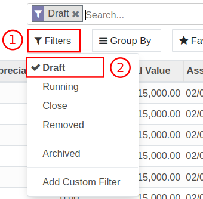

2. เลือกรายการสินทรัพย์ที่ต้องการตรวจสอบข้อมูลส่วนบนของสินทรัพย์
    * (1) Asset Name: ชื่อสินทรัพย์
    * (2) Reference: เลขที่เอกสารอ้างอิง
    * (3) Depreciation Base: มูลค่าที่สามารถนําไปคํานวณค่าเสื่อมราคา
    * (4) Residual Valua: ราคามูลค่าคงเหลือ
    * (5) Depreciated Valua: มูลค่าของค่าเสื่อมสะสมที่บันทึกบัญชีไปแล้ว
    * (6) Depreciation Rate: อัตราการคิดค่าเสื่อม (%)
    * (7) รูปภาพ
    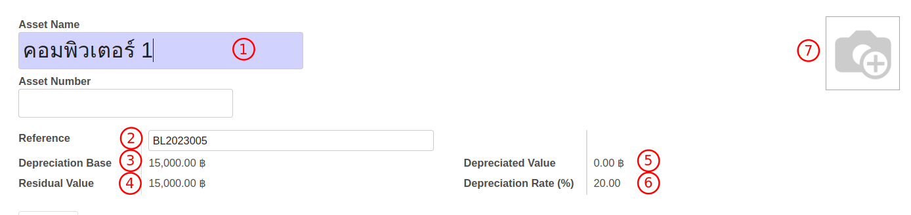

3. กดปุ่ม Edit และตรวจสอบข้อมูลดังนี้
    * (1) Purchase Value: ราคาที่ซื้อสินทรัพย์
    * (2) Asset Start Date: วันที่คำนวณค่าเสื่อมราคา
    * (3) Salvage Value: ราคาซาก
    * (4) Asset Profile: หมวดหมู่สินทรัพย์
    * (5) Partner: คู่ค้า
    * (6) Asset Groups: กลุ่มสินทรัพย์
    * (7) Number of Years: จำนวนปีที่คิดค่าเสื่อม
    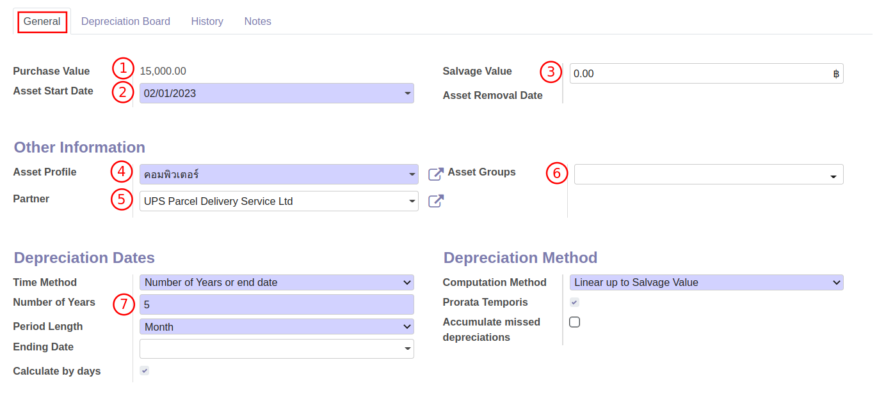

4. Tab Depreciation Board เมื่อกด Compute ระบบจะแสดงตารางการคิดค่าเสื่อม
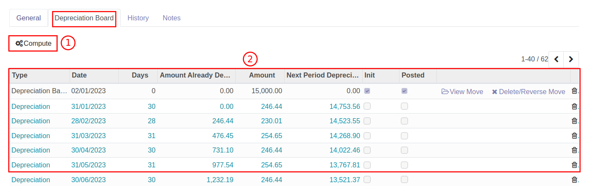

5. กดปุ่ม Save เพื่อบันทึกข้อมูลและตรวจสอบข้อมูลอีกครั้ง หากต้องการแก้ไขสามารถกดปุ่ม Edit เพื่อแก้ไขได้

6. เมื่อข้อมูลถูกต้องเรียบร้อยแล้ว กดปุ่ม Confirm Asset เพื่อยืนยันการสร้างทะเบียนสินทรัพย์

7. สถานะ Asset จะเปลี่ยนเป็น Running เพื่อเตรียมสำหรับบันทึกค่าเสื่อมราคา

---

## การบันทึกค่าเสื่อมราคา

เมื่อต้องการบันทึกค่าเสื่อมราคา แบบทีละหลายรายการ สามารถทำได้โดยมีขั้นตอนดังนี้

**Menu:** Invoicing > Assets > Compute Asset Batch

1. กดปุ่ม Create เพื่อสร้างเอกสาร
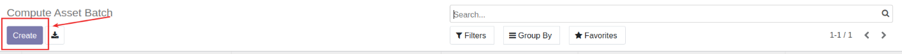

2. กรอกข้อมูลการบันทึกค่าเสื่อมราคา
    * (1) ชื่อเอกสาร Batch Name 
    * (2) Description: คําอธิบายรายการ
    * (3) Date: วันที่บันทึกค่าเสื่อม
    * (4) Auto Compute: หากทำเครื่องหมายในช่อง ระบบจะ Post บัญชีค่าเสื่อมให้อัตโนมัติ ตาม Date
    * (5) Delay Posting: หากทำเครื่องหมายในช่อง ระบบจะสร้าง Voucher ที่มีสถานะเป็น Draft  และบันทึกบัญชีให้เมื่อถึงวันที่กําหนด
    * (6) Profiles: เลือกหมวดหมู่สินทรัพย์ที่ต้องการบันทึกค่าเสื่อมราคา หากต้องการบันทึกค่าเสื่อมราคาของทุก Asset Profile ไม่ต้องกรอกข้อมูลส่วนนี้
    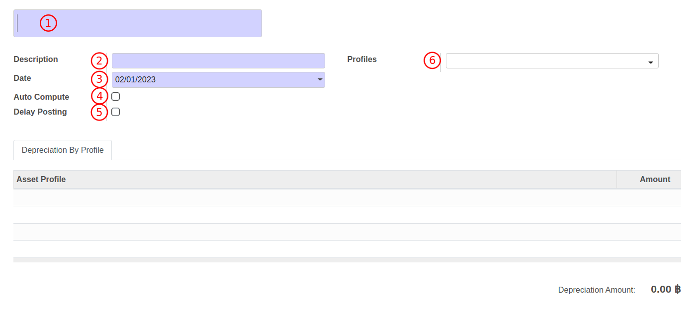

3. กดปุ่ม Save เพื่อบันทึกข้อมูล และตรวจสอบอีกครั้ง หากต้องการแก้ไขสามารถกดปุ่ม Edit ได้

4. กดปุ่ม Compute เพื่อให้ระบบคำนวณและบันทึกค่าเสื่อมราคา สถานะเอกสารจะเปลี่ยนเป็น Computed
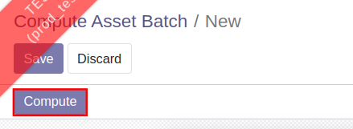

5. Tab Depreciation By Profile จะแสดงค่าเสื่อมของแต่ละ Profile
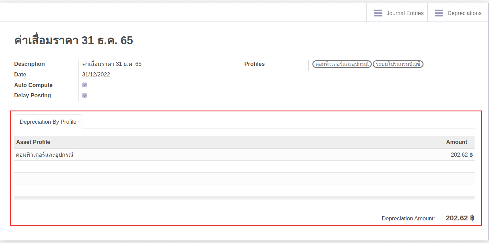

6. สามารถดูการบันทึกบัญชี ได้ที่ปุ่ม Smart Button "Journal Entries" หรือ "Depreciations"
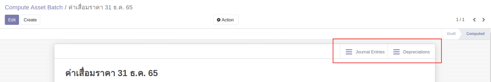

---

## การตัดจำหน่ายสินทรัพย์

เมื่อต้องการตัดจำหน่ายสินทรัพย์ สามารถดำเนินการได้ดังนี้

**Menu:** Invoicing > Assets > Assets

1. เลือกรายการสินทรัพย์ที่ต้องการตัดจำหน่าย
2. กดปุ่ม Remove ระบบจะแสดงหน้าต่างการ Remove Asset ให้กรอกข้อมูลดังนี้

3. กรณีเลือก Removal Entry Policy เป็น Gain/Loss on Sale (ตัดจำหน่ายจากการขาย)
    * (1) Force Accounting Date: วันที่ในการลงบันทึกบัญชี
    * (2) Removal Entry Policy: วิธีการตัดจำหน่าย ให้เลือก Gain/Loss on Sale
    * (3) Plus- Value Account: ลงบันทึกบัญชีกําไรจากการขายสินทรัพย์
    * (4) Asset Removal Date: วันที่ตัดจําหน่าย
    * (5) Sale Value: กรอกราคาที่ขาย
    * (6) Min- Value Account: ลงบันทึกบัญชีขาดทุนจากการขายสินทรัพย์
    * (7) Note: บันทึกข้อความเพิ่มเติม (ถ้ามี)
    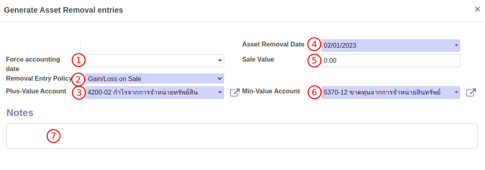
        
4. กรณีเลือก Removal Entry Policy เป็น Residual Value (ตัดจำหน่ายจากบริจาคหรือเสื่อมสภาพ)
    * (1) Force Accounting Date: วันที่ในการลงบันทึกบัญชี
    * (2) Removal Entry Policy: วิธีการตัดจำหน่าย ให้เลือก Residual Value
    * (3) Residual Value Account: บัญชีที่ต้องการลงส่วนต่างระหว่างราคาทุนและค่าเสื่อมสะสม
    * (4) Asset Removal Date: วันที่ตัดจําหน่าย
    * (5) Sale Value: ไม่ต้องกรอก
    * (6) Note: บันทึกข้อความเพิ่มเติม (ถ้ามี)
    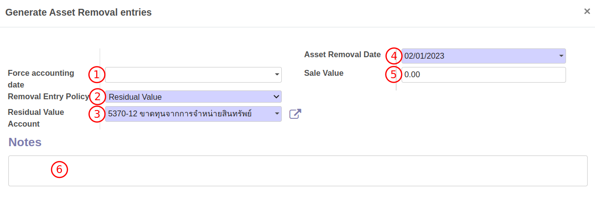

4. ตรวจสอบข้อมูล และเลือกดำเนินการ
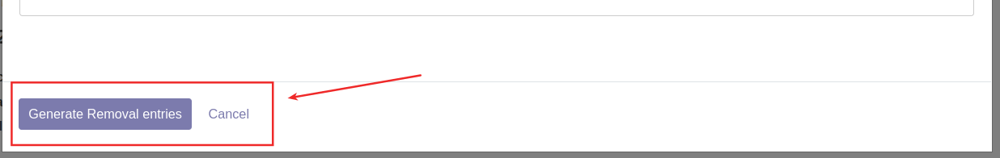
    * กดปุ่ม Generate Removal Entries เพื่อยืนยันการบันทึกบัญชีการตัดจำหน่ายสินทรัพย์ สถานะจะเปลี่ยนเป็น Removed 
    * กด Cancel เพื่อยกเลิกการตัดจำหน่าย

5. เมื่อกดปุ่ม Generate Removal Entries แล้ว ระบบจะสร้าง Journal Entries สถานะ Draft กดเพื่อเปิดเอกสาร
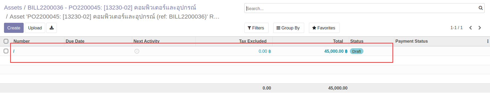

6. ตรวจสอบข้อมูลการบันทึกบัญชี และกดปุ่ม Post เพื่อยืนยัน สถานะเอกสารจะเปลี่ยนเป็น Posted
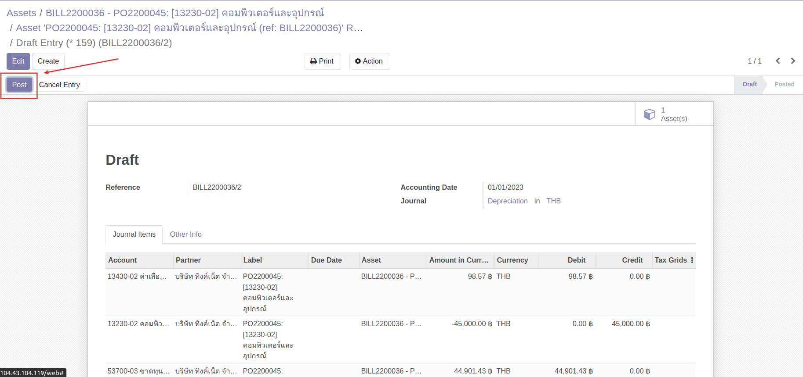

---

