# การปิดบัญชี

## การปิดบัญชีภาษีหัก ณ ที่จ่าย

มีกระบวนการทำงานดังนี้

1. ตรวจสอบรายงานภาษีหัก ณ ที่จ่าย
2. ตรวจสอบบัญชีแยกประเภท (General Ledger)
3. บันทึกค่าใช้จ่ายและตั้งเจ้าหนี้ เพื่อปิดบัญชีภาษีหัก ณ ที่จ่าย

### ตรวจสอบรายงานภาษีหัก ณ ที่จ่าย 

การเรียกดูรายงานภาษีหัก ณ ที่จ่ายผ่านเมนู WHT Income Tax Report ใช้สำหรับกรณีที่ต้องการดูรายการภาษีหัก ณ ที่จ่ายประจำเดือนในระบบ เพื่อทำการปิดบัญชี และนำส่งภาษีให้กับกรมสรรพากร

**Menu:** Invoicing > Reporting > WHT Income Tax Report

เมื่อกดที่เมนู WHT Income Tax Report ระบบจะแสดงหน้าต่าง

1. กรอกข้อมูลเพื่อเรียกรายงาน

    * (1) Income Tax Form: เลือกประเภทของภาษีหัก ณ ที่จ่าย
    * (2) Show cancelled: ทำเครื่องหมาย หากต้องการให้รายการที่มีสถานะยกเลิกออกในรายงาน
    * (3) Date From: วันที่เริ่มต้นการเรียกดูรายงาน
    * (4) Date To: วันที่สิ้นสุดการเรียกดูรายงาน

2. เลือกวิธีการดูรายงาน
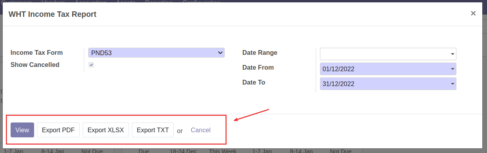

    * View: เรียกดูรายงานในระบบ
    * Export PDF: เรียกดูรายงานเป็น PDF File เพื่อพิมพ์รายงานภาษีหัก ณ ที่จ่ายตามรูปแบบของกรมสรรพากร
    * Export XLSX: ระบบจะออกรายงานเป็น Excel File
    * Export TXT: ระบบจะออกรายงานเป็น Text File เพื่ออัพโหลดข้อมูลเข้าเว็บกรมสรรพากร
    * Cancel: ยกเลิกการเรียกดูรายงาน

3. ระบบจะแสดงรายงานภาษีหัก ณ ที่จ่าย ให้ตรวจสอบข้อมูลดังนี้
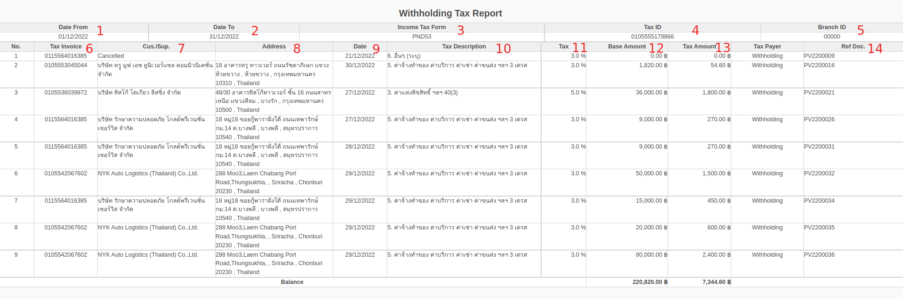

    * (1) Date From: วันที่เริ่มต้นของการเรียกรายงาน
    * (2) Date To: วันที่สิ้นสุดของการเรียกรายงาน
    * (3) Income Tax Form: ประเภทของภาษีหัก ณ ที่จ่าย
    * (4) Tax ID: เลขประจำตัวผู้เสียภาษีอากร
    * (5) Branch ID: รหัสสาขา
    * (6) Tax Invoice: เลขประจำตัวผู้เสียภาษีอากรผู้ถูกหักภาษี ณ ที่จ่าย
    * (7) Cus./Sup.: ชื่อผู้ถูกหักภาษี ณ ที่จ่าย
    * (8) Address: ที่อยู่ผู้ถูกหักภาษี ณ ที่จ่าย
    * (9) Date: วันที่หัก ณ ที่จ่าย
    * (10) Tax Description: ประเภทเงินได้
    * (11) Tax : เปอร์เซ็นต์ของการหัก ณ ที่จ่าย
    * (12) Base Amount: ยอดก่อนหักภาษี ณ ที่จ่าย
    * (13) Tax Amount: ภาษีที่หักและนำส่งไว้
    * (14) Ref Doc.: เอกสารอ้างอิง

4. ตรวจสอบยอดรวมของภาษีหัก ณ ที่จ่าย โดยดูที่ยอด Balance มุมล่างของรายงาน เพื่อนำไปบันทึกบัญชีสำหรับนำส่งภาษีให้กับกรมสรรพากร
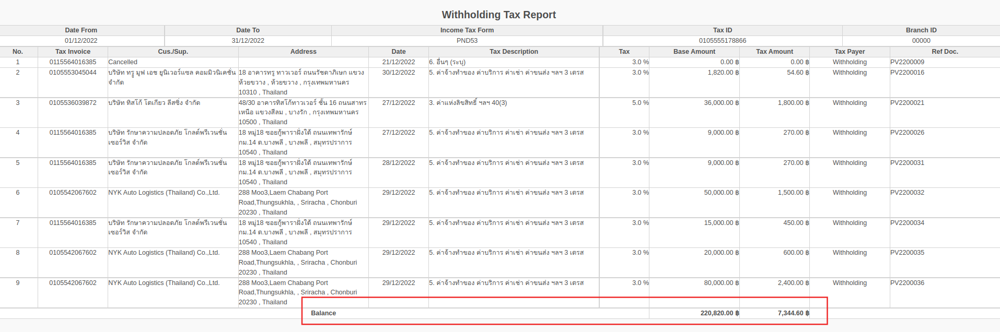

---

### ตรวจสอบบัญชีแยกประเภท (General Ledger)

**Menu:** Invoicing > Reporting > General Ledger

เมื่อกดที่เมนู General Ledger ระบบจะแสดงหน้าต่าง

1. กรอกข้อมูลเพื่อเรียกรายงาน

    * (1) Date From: วันที่เริ่มต้นของการเรียกบัญชีแยกประเภท
    * (2) Date To: วันที่สิ้นสุดของการเรียกบัญชีแยกประเภท
    * (3) ที่แท็บ Filter accounts ค้นหาเลขที่บัญชีที่ต้องการปิดบัญชี

2. เลือกวิธีการดูรายงาน
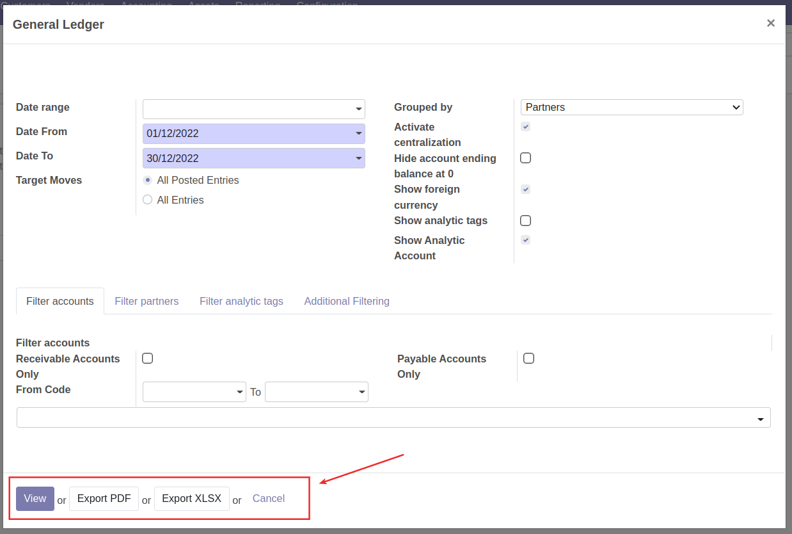

    * View: เพื่อดูรายงานในระบบ
    * Export PDF: ระบบจะออกรายงานเป็น PDF File
    * Export XLSX: ระบบจะออกรายงานเป็น Excel file
    * Cancel: ยกเลิกการเรียกดูรายงาน

3. ตรวจสอบรายละเอียดและยอดรวมในบัญชีแยกประเภท เพื่อนำส่งภาษีหัก ณ ที่จ่ายให้กรมสรรพากร
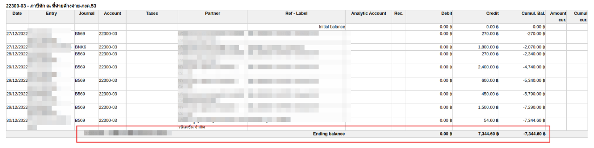

---

### บันทึกค่าใช้จ่ายและตั้งเจ้าหนี้ เพื่อปิดบัญชีภาษีหัก ณ ที่จ่าย

**Menu:** Invoicing > Dashboard > Vendor Bills

2. กดปุ่ม Create เพื่อสร้างเอกสาร Vendor Bill สถานะ Draft

3. กรอกข้อมูลที่ Header และตรวจสอบข้อมูลการตั้งเจ้าหนี้
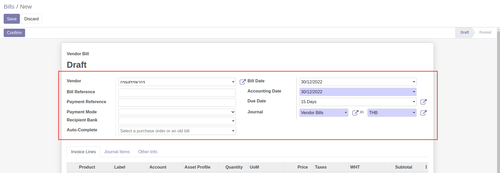
    * Vendor: เลือกคู่ค้า กรมสรรพากร
    * Bill Reference: กรอกเลขที่เอกสารใบแจ้งหนี้จากคู่ค้าเพื่ออ้างอิง (ถ้ามี)
    * Bill Date: วันที่ตามใบแจ้งหนี้
    * Accounting Date: วันที่บันทึกบัญชี ระบบเลือกให้เป็นวันที่ปัจจุบัน
    * Due Date: กำหนดการชำระเงิน สามารถเลือกเป็นระยะเวลาหรือระบุวันที่ได้ (หากมีการตั้งค่า Payment term ไว้ที่ข้อมูลหลัก Contacts ระบบจะช่วยดึงค่ามากรอกให้อัตโนมัติ)
     
4. ที่แท็บ Invoice Line กด Add a line และกรอกข้อมูลภาษีหัก ณ ที่จ่าย

    * Label: กรอกคำอธิบายรายการ เช่น ปิดบัญชีภาษีหัก ณ ที่จ่ายค้างจ่าย-ภงด.53 เป็นต้น
    * Account: เลือกรหัสบัญชี
    * Price: ยอดเงินภาษี

5. กดปุ่ม Save เพื่อบันทึกข้อมูลและตรวจทานอีกครั้ง หากต้องการแก้ไขให้กดปุ่ม Edit
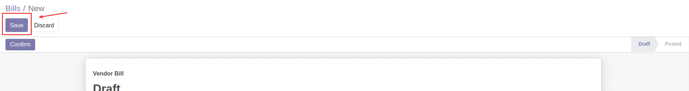

6. กดปุ่ม Confirm เพื่อยืนยันการบันทึกค่าใช้จ่ายและตั้งเจ้าหนี้ สถานะเอกสารจะเปลี่ยนจาก Draft เป็น Posted และรอการบันทึกจ่ายชำระเงินต่อไป

---

## การปิดบัญชีภาษีมูลค่าเพิ่ม

เมื่อต้องการปิดบัญชีภาษีมูลค่าเพิ่มประจำเดือน สามารถทำได้ดังนี้

**Menu ::** Invoicing > Reporting > Thai Tax Report  

1. เมื่อกดที่ Thai Tax Report ระบบจะแสดงหน้าต่างให้กรอกข้อมูลดังนี้
    * (1) Tax: เลือกประเภทของภาษีมูลค่าเพิ่ม
    * (2) Show cancelled: ติ๊กเลือกเมื่อต้องการดูรายการที่มีสถานะยกเลิก
    * (3) Period: เลือกเดือนที่ต้องการตรวจสอบรายงาน
    * (4) Date From: วันที่เริ่มต้นของการเรียกดูรายงาน
    * (5) Date To: วันที่สิ้นสุดของการเรียกดูรายงาน
    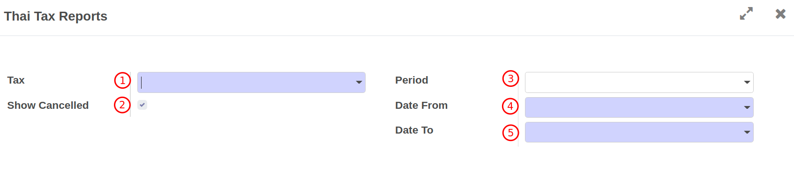

2. หากต้องการตรวจสอบรายงานสามารถเลือกวิธีการดูรายงานได้ดังนี้
    * (1) View: เรียกดูรายงานในระบบ
    * (2) Export PDF: เรียกดูรายงานภาษีมูลค่าตามรูปแบบของกรมสรรพากร
    * (3) Export XLSX: ระบบจะออกรายงานเป็น Excel File
    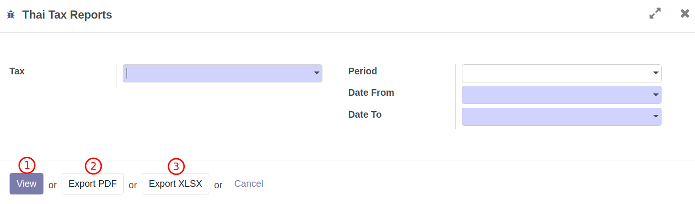

3. ระบบจะแสดงรายงานภาษีมูลค่าเพิ่มให้ตรวจสอบข้อมูลดังนี้
    * (1) Period: วันที่เริ่มต้นของการเรียกรายงาน
    * (2) Partner: ชื่อสำนักงาน
    * (3) Tax ID: เลขประจำตัวผู้เสียภาษีอากร
    * (4) Branch ID: สาขา
    * (5) Date: วันที่ในใบกำกับภาษี
    * (6) Number: เลขที่ใบกำกับภาษี           
    * (7) Cus./Sup.: ชื่อคู่ค้าที่อยู่ในใบกำกับภาษี
    * (8) Tax ID: เลขประจำตัวผู้เสียภาษีอากรของคู่ค้าในใบกำกับภาษี
    * (9) Branch ID: สาขาของคู่ค้าในใบกำกับภาษี
    * (10) Base Amount: ยอดก่อนภาษีมูลค่าเพิ่ม
    * (11) Tax Amount: ภาษีมูลค่าเพิ่ม
    * (12) Doc. Ref: เอกสารอ้างอิง
    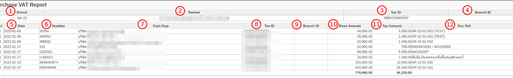    

4. ตรวจสอบยอดรวมของภาษีมูลค่าเพิ่ม โดยดูที่ยอดรวมมุมล่างของรายงาน เพื่อนำไปบันทึกบัญชีสำหรับนำส่งภาษีให้กับกรมสรรพากร
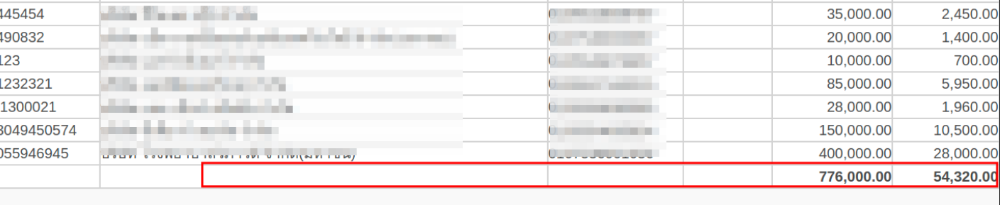

---------------------------------------------

### การตรวจสอบบัญชีแยกประเภทของภาษีมูลค่าเพิ่ม

**เอกสารนี้สำหรับ ::** พนักงานบัญชี (Accounting User)

**Menu ::** Invoicing > Reporting > General Ledger 

1. เมื่อกดที่ General Ledger 

2. ระบบจะแสดงหน้าต่างให้กรอกวันที่สำหรับดึงข้อมูลดังนี้
    * (1) Date Range: เลือกเดือนที่ต้องการเรียกบัญชีแยกประเภท
    * (2) Date From: วันที่เริ่มต้นของการเรียกบัญชีแยกประเภท
    * (3) Date To: วันที่สิ้นสุดของการเรียกบัญชีแยกประเภท
    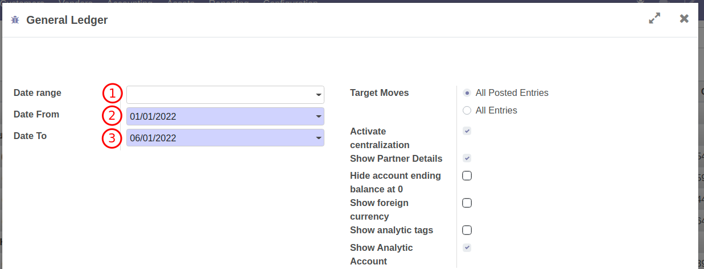    

3. เสิร์ชชื่อเลขที่บัญชีที่ต้องการเพื่อนำไปปิดบัญชี ที่ Tab Filter accounts 
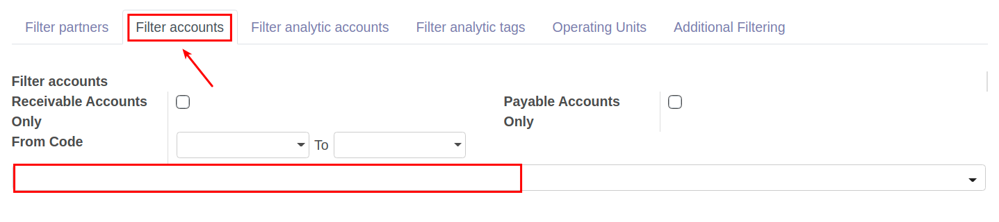
4. ตรวจสอบข้อมูลให้ครบถ้วนแล้วสามารถเลือกวิธีการดูรายงาน ได้ 3 วิธีดังนี้
    * (1) View: เพื่อดูรายงานในระบบ
    * (2) Export PDF: ระบบจะออกรายงานเป็น PDF
    * (3) Export XLSX: ระบบจะออกรายงานเป็น Excel
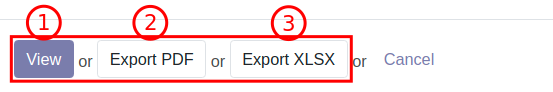
5. ตรวจสอบรายละเอียดในบัญชีแยกประเภท เพื่อนำส่งภาษีมูลค่าเพิ่มให้กรมสรรพากร
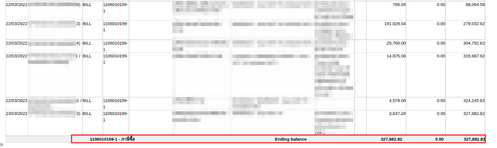

!!! Tip "หากตรวจสอบยอดรวมของภาษีซื้อและภาษีขาย แล้วเกิดผลต่างสามารถทำได้ดังนี้"
    - กรณีภาษีซื้อมากกว่าภาษีขาย ให้ไปที่เมนู Invoicing > Accounting > Journal Entries เพื่อบันทึกตั้งลูกหนี้กรมสรรพากร 
    - กรณีภาษีขายมากกว่าภาษีซื้อ ให้ไปที่เมนู Invoicing > Vendors > Bills เพื่อบันทึกนำส่งภาษีมูลค่าเพิ่ม

--------------------------------------------------------------------

## การปรับปรุงบัญชี

**Menu:** Invoicing > Accounting > Journal Entries

1. กดปุ่ม Create เพื่อสร้างเอกสารปรับปรุง

2. กรอกข้อมูลการปรับปรุง

    * (1) ส่วน Header
        * Reference: กรอกข้อมูลอ้างอิง เช่น เลขที่เอกสารที่ต้องการปรับปรุง เป็นต้น
        * Accounting: วันที่ลงบัญชี
        * Journal: ประเภทสมุดรายวันที่ต้องการปรับปรุง
    * (2) ที่แท็บ Journal Items
        * กด Add a Line: เพื่อเพิ่มบรรทัดรายการคู่บัญชีที่ต้องการปรับปรุง
        * Account: เลือกบัญชีที่ต้องการปรับปรุง
        * Partner: ชื่อคู่ค้า (ถ้ามี)
        * Label: คำอธิบายรายการ (ถ้ามี)
        * Currency: ระบบแสดงค่า THB
        * Debit: กรอกยอดเงินฝั่ง Debit
        * Credit: กรอกยอดเงินฝั่ง Crebit

3. กดปุ่ม Save เพื่อบันทึกข้อมูลและตรวจทาน หากต้องการแก้ไขให้กดปุ่ม Edit

4. กดปุ่ม Post เพื่อยืนยันการปรับปรุงบัญชี สถานะเอกสารจะปลี่ยนเป็น Posted

!!! Note
    * เมื่อเอกสารอยู่ในสถานะ Posted หากต้องการแก้ไขการปรับปรุง ให้กดปุ่ม Reset to Draft สถานะเอกสารจะเปลี่ยนเป็น Draft และสามารถกดปุ่ม Edit เพื่อแก้ไขรายละเอียดได้ 
    
    * เมื่อเอกสารอยู่ในสถานะ Draft หากต้องการยกเลิกการปรับปรุง ให้กดปุ่ม Cancel Entry สถานะเอกสารจะเปลี่ยนเป็น Cancelled
    
