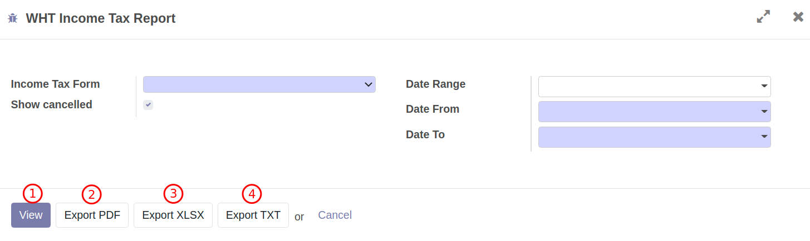
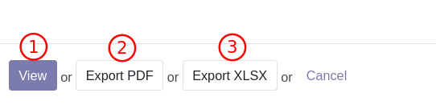
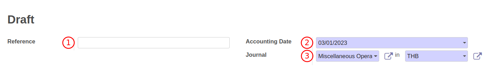
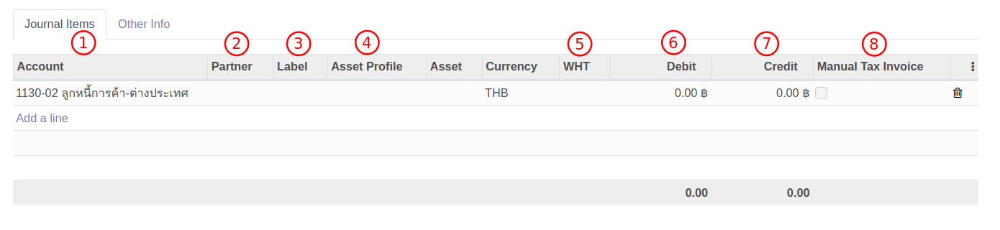
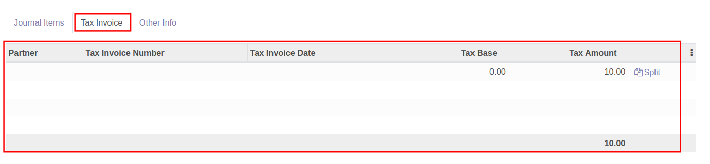

# การปิดบัญชี

## การปิดบัญชีภาษีหัก ณ ที่จ่าย

มีกระบวนการทำงานดังนี้

1. ตรวจสอบรายงานภาษีหัก ณ ที่จ่าย
2. ตรวจสอบบัญชีแยกประเภท (General Ledger)
3. บันทึกค่าใช้จ่ายและตั้งเจ้าหนี้ เพื่อปิดบัญชีภาษีหัก ณ ที่จ่าย

### ตรวจสอบรายงานภาษีหัก ณ ที่จ่าย

**Menu ::** Invoicing > Reporting > WHT Income Tax Report 

การเรียกดูรายงานภาษีหัก ณ ที่จ่ายผ่านเมนู WHT Income Tax Report ใช้สำหรับกรณีที่ต้องการดูข้อมูลในระบบ

1. เมื่อกดที่ WHT Income Tax Report ระบบจะแสดงหน้าต่างให้กรอกข้อมูลดังนี้
    1. Income Tax Form: เลือกประเภทของภาษีหัก ณ ที่จ่าย
    2. Show cancelled: ติ๊กเลือกเมื่อต้องการดูรายการที่มีสถานะยกเลิก
    3. Date Range: เลือกเดือนที่ต้องการตรวจสอบรายงาน
    4. Date From: วันที่เริ่มต้นการเรียกดูรายงาน
    5. Date To: วันที่สิ้นสุดการเรียกดูรายงาน
    

2. หากต้องการตรวจสอบรายงานสามารถเลือกวิธีการดูรายงานได้ดังนี้
    1. View: เรียกดูรายงานในระบบ
    2. Export PDF: เรียกดูรายงานภาษีหัก ณ ที่จ่ายตามรูปแบบของกรมสรรพากร
    3. Export XLSX: ระบบจะออกรายงานเป็น Excel File
    4. Export TXT: ระบบจะออกรายงานเป็น Text File 

3. ระบบจะแสดงรายงานภาษีหัก ณ ที่จ่าย ให้ตรวจสอบข้อมูลดังนี้
    1. Date From: วันที่เริ่มต้นของการเรียกรายงาน
    2. Date To: วันที่สิ้นสุดของการเรียกรายงาน
    3. Income Tax Form: ประเภทของภาษีหัก ณ ที่จ่าย
    4. Tax ID:เลขประจำตัวผู้เสียภาษีอากร
    5. Branch ID: สาขา
    6. Tax Invoice: เลขประจำตัวผู้เสียภาษีอากรผู้ถูกหักภาษี ณ ที่จ่าย          
    7. Cus./Sup.: ชื่อผู้ถูกหักภาษี ณ ที่จ่าย
    8. Address: ที่อยู่ผู้ถูกหักภาษี ณ ที่จ่าย
    9. Date: วันที่หัก ณ ที่จ่าย
    10. Tax Description: ประเภทเงินได้
    11. Tax : เปอร์เซ็นต์ของการหัก ณ ที่จ่าย
    12. Base Amount: ยอดก่อนหักภาษี ณ ที่จ่าย
    13. Tax Amount: ภาษีที่หักและนำส่งไว้
    14. Ref Doc.: เอกสารอ้างอิง
        

4. ตรวจสอบยอดรวมของภาษีหัก ณ ที่จ่าย โดยดูที่ยอด Balance มุมล่างของรายงาน เพื่อนำไปบันทึกบัญชีสำหรับนำส่งภาษีให้กับกรมสรรพากร

---

### ตรวจสอบบัญชีแยกประเภท (General Ledger)

**Menu:** Invoicing > Reporting > General Ledger

เมื่อกดที่เมนู General Ledger ระบบจะแสดงหน้าต่าง

1. ระบบจะแสดงหน้าต่างเงื่อนไขการเรียกรายงานดังนี้
    * (1) Date Range: ใส่ช่วงเวลา
    * (2) Date From: วันที่เริ่มต้นรายงาน
    * (3) Date To: วันที่สิ้นสุดรายงาน
    * (4) Target moves: 
        - All Posted Entry แค่รายการที่ลงบัญชีแล้ว
        - All Entries ทุกรายการ
    * (5) Activate Centralize: ระบบจะ Default ให้ ไม่ต้องเลือก
    * (6) Hide account ending balance at 0: ซ่อนบัญชีที่มียอดเหลือ 0
    * (7) Filter: สามารถใส่ค่าที่ต้องการกรองได้

2. หลังจากใส่เงื่อนไขการเรียกดุรายงานเรียบร้อยแล้ว สามารถกดปุ่ม
    * (1) View: เพื่อดูรายงานในหน้าระบบ
    * (2) Export PDF: เพื่อ Export รายงานเป็น PDF
    * (3) Export XLSX: เพื่อ Export รายงานเป็น Excel

3. ตรวจสอบรายละเอียดและยอดรวมในบัญชีแยกประเภท เพื่อนำส่งภาษีหัก ณ ที่จ่ายให้กรมสรรพากร

---

### บันทึกค่าใช้จ่ายและตั้งเจ้าหนี้ เพื่อปิดบัญชีภาษีหัก ณ ที่จ่าย

**Menu:** Invoicing > Dashboard > Vendor Bills

2. กดปุ่ม Create เพื่อสร้างเอกสาร Vendor Bill สถานะ Draft

3. กรอกข้อมูลที่ Header และตรวจสอบข้อมูลการตั้งเจ้าหนี้

    * Vendor: เลือกคู่ค้า กรมสรรพากร
    * Bill Reference: กรอกเลขที่เอกสารใบแจ้งหนี้จากคู่ค้าเพื่ออ้างอิง (ถ้ามี)
    * Bill Date: วันที่ตามใบแจ้งหนี้
    * Accounting Date: วันที่บันทึกบัญชี ระบบเลือกให้เป็นวันที่ปัจจุบัน
    * Due Date: กำหนดการชำระเงิน สามารถเลือกเป็นระยะเวลาหรือระบุวันที่ได้ (หากมีการตั้งค่า Payment term ไว้ที่ข้อมูลหลัก Contacts ระบบจะช่วยดึงค่ามากรอกให้อัตโนมัติ)
     
4. ที่แท็บ Invoice Line กด Add a line และกรอกข้อมูลภาษีหัก ณ ที่จ่าย

    * Label: กรอกคำอธิบายรายการ เช่น ปิดบัญชีภาษีหัก ณ ที่จ่ายค้างจ่าย-ภงด.53 เป็นต้น
    * Account: เลือกรหัสบัญชี
    * Price: ยอดเงินภาษี

5. กดปุ่ม Save เพื่อบันทึกข้อมูลและตรวจทานอีกครั้ง หากต้องการแก้ไขให้กดปุ่ม Edit

6. กดปุ่ม Confirm เพื่อยืนยันการบันทึกค่าใช้จ่ายและตั้งเจ้าหนี้ สถานะเอกสารจะเปลี่ยนจาก Draft เป็น Posted และรอการบันทึกจ่ายชำระเงินต่อไป

---

## การปิดบัญชีภาษีมูลค่าเพิ่ม

### ตรวจสอบรายงานภาษีมูลค่าเพิ่ม 

เมื่อต้องการปิดบัญชีภาษีมูลค่าเพิ่มประจำเดือน สามารถทำได้ดังนี้

**Menu ::** Invoicing > Reporting > Thai Tax Report  

1. เมื่อกดที่ Thai Tax Report ระบบจะแสดงหน้าต่างให้กรอกข้อมูลดังนี้
    * (1) Tax: เลือกประเภทของภาษีมูลค่าเพิ่ม
    * (2) Show cancelled: ติ๊กเลือกเมื่อต้องการดูรายการที่มีสถานะยกเลิก
    * (3) Period: เลือกเดือนที่ต้องการตรวจสอบรายงาน
    * (4) Date From: วันที่เริ่มต้นของการเรียกดูรายงาน
    * (5) Date To: วันที่สิ้นสุดของการเรียกดูรายงาน
    

2. หากต้องการตรวจสอบรายงานสามารถเลือกวิธีการดูรายงานได้ดังนี้
    * (1) View: เรียกดูรายงานในระบบ
    * (2) Export PDF: เรียกดูรายงานภาษีมูลค่าตามรูปแบบของกรมสรรพากร
    * (3) Export XLSX: ระบบจะออกรายงานเป็น Excel File
    

3. ระบบจะแสดงรายงานภาษีมูลค่าเพิ่มให้ตรวจสอบข้อมูลดังนี้
    * (1) Period: วันที่เริ่มต้นของการเรียกรายงาน
    * (2) Partner: ชื่อสำนักงาน
    * (3) Tax ID: เลขประจำตัวผู้เสียภาษีอากร
    * (4) Branch ID: สาขา
    * (5) Date: วันที่ในใบกำกับภาษี
    * (6) Number: เลขที่ใบกำกับภาษี           
    * (7) Cus./Sup.: ชื่อคู่ค้าที่อยู่ในใบกำกับภาษี
    * (8) Tax ID: เลขประจำตัวผู้เสียภาษีอากรของคู่ค้าในใบกำกับภาษี
    * (9) Branch ID: สาขาของคู่ค้าในใบกำกับภาษี
    * (10) Base Amount: ยอดก่อนภาษีมูลค่าเพิ่ม
    * (11) Tax Amount: ภาษีมูลค่าเพิ่ม
    * (12) Doc. Ref: เอกสารอ้างอิง
        

4. ตรวจสอบยอดรวมของภาษีมูลค่าเพิ่ม โดยดูที่ยอดรวมมุมล่างของรายงาน เพื่อนำไปบันทึกบัญชีสำหรับนำส่งภาษีให้กับกรมสรรพากร

---------------------------------------------

### การตรวจสอบบัญชีแยกประเภทของภาษีมูลค่าเพิ่ม

**เอกสารนี้สำหรับ ::** พนักงานบัญชี (Accounting User)

**Menu ::** Invoicing > Reporting > General Ledger 

1. เมื่อกดที่ General Ledger 

2. ระบบจะแสดงหน้าต่างให้กรอกวันที่สำหรับดึงข้อมูลดังนี้
    * (1) Date Range: เลือกเดือนที่ต้องการเรียกบัญชีแยกประเภท
    * (2) Date From: วันที่เริ่มต้นของการเรียกบัญชีแยกประเภท
    * (3) Date To: วันที่สิ้นสุดของการเรียกบัญชีแยกประเภท
        

3. เสิร์ชชื่อเลขที่บัญชีที่ต้องการเพื่อนำไปปิดบัญชี ที่ Tab Filter accounts 

4. ตรวจสอบข้อมูลให้ครบถ้วนแล้วสามารถเลือกวิธีการดูรายงาน ได้ 3 วิธีดังนี้
    * (1) View: เพื่อดูรายงานในระบบ
    * (2) Export PDF: ระบบจะออกรายงานเป็น PDF
    * (3) Export XLSX: ระบบจะออกรายงานเป็น Excel

5. ตรวจสอบรายละเอียดในบัญชีแยกประเภท เพื่อนำส่งภาษีมูลค่าเพิ่มให้กรมสรรพากร

!!! Tip "หากตรวจสอบยอดรวมของภาษีซื้อและภาษีขาย แล้วเกิดผลต่างสามารถทำได้ดังนี้"
    - กรณีภาษีซื้อมากกว่าภาษีขาย ให้ไปที่เมนู Invoicing > Accounting > Journal Entries เพื่อบันทึกตั้งลูกหนี้กรมสรรพากร 
    - กรณีภาษีขายมากกว่าภาษีซื้อ ให้ไปที่เมนู Invoicing > Vendors > Bills เพื่อบันทึกนำส่งภาษีมูลค่าเพิ่ม

--------------------------------------------------------------------

## การปรับปรุงบัญชี

**Menu:** Invoicing > Accounting > Journal Entries

1. กดปุ่ม Create เพื่อสร้างเอกสารปรับปรุง

2. กรอกข้อมูลการปรับปรุง ส่วน Header
    * (1) Reference: กรอกข้อมูลอ้างอิง เช่น เลขที่เอกสารที่ต้องการปรับปรุง เป็นต้น
    * (2) Accounting: วันที่ลงบัญชี
    * (3) Journal: ประเภทสมุดรายวันที่ต้องการปรับปรุง
    

3. กด Add a Line ที่ Tab Journal Items เพื่อเพิ่มบรรทัดรายการคู่บัญชีที่ต้องการปรับปรุง
    * (1) Account: เลือกบัญชีที่ต้องการปรับปรุง
    * (2) Partner: ชื่อคู่ค้า (ถ้ามี)
    * (3) Label: คำอธิบายรายการ (ถ้ามี)
    * (4) Asset Profile: ใช้ระบุในกรณีที่ต้องการสร้างสินทรัพย์ในทะเบียน (เช่น ปรับปรุงอุปกรณ์ระหว่างทางเป็นอุปกรณ์)
    * (5) WHT: ใช้ในกรณีที่ต้องออกหนังสือหัก ณ ที่จ่าย
    * (6) Debit: เดบิต
    * (7) Credit: เครดิต
    * (8) Manual Tax Invoice: ใช้ในกรณีที่ต้องการออกรายงานภาษีมูลค่าเพิ่ม
    

3. กดปุ่ม Save เพื่อบันทึกข้อมูลและตรวจทาน หากต้องการแก้ไขให้กดปุ่ม Edit

4. กดปุ่ม Post เพื่อยืนยันการปรับปรุงบัญชี สถานะเอกสารจะปลี่ยนเป็น Posted

!!! Note
    * เมื่อเลือก WHT ระบบจะแสดง link ให้ไปออกหนังรับรองหัก ณ ที่จ่าย
    
    * เมื่อติ๊ก Manual Tax Invoice ระบบจะแสดง Tab Tax Invoice สำหรับการออกรายงานภาษีมูลค่าเพิ่ม
    
