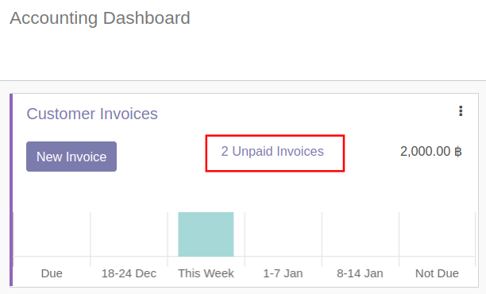
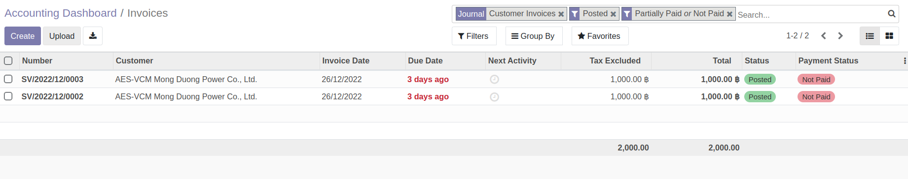
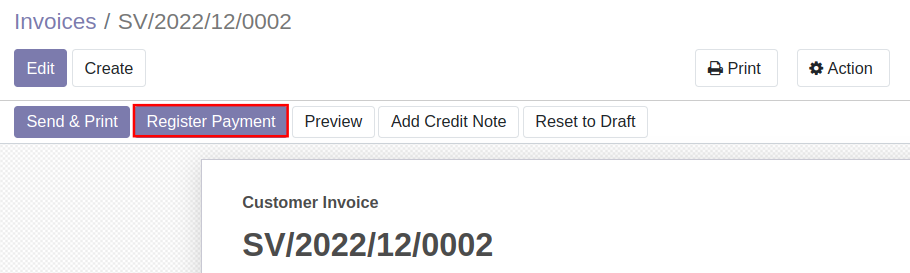
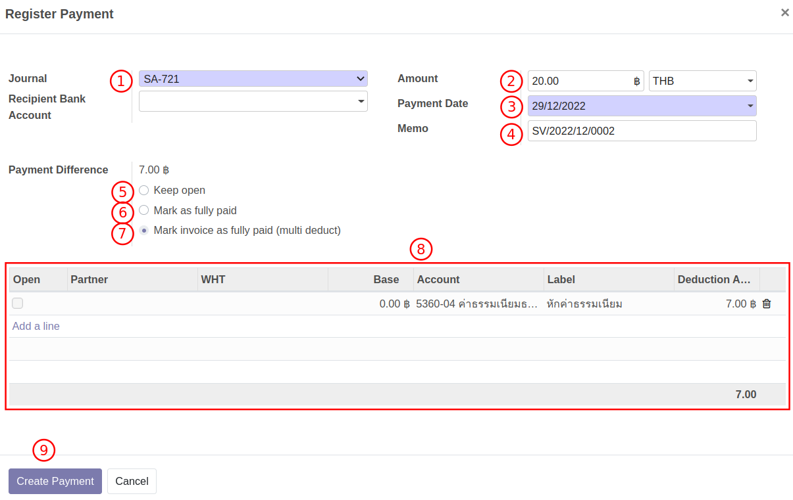
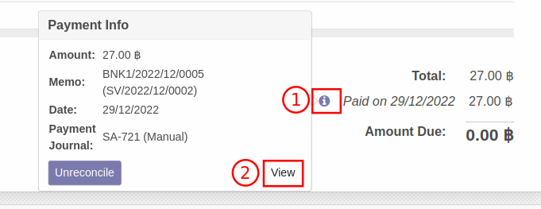
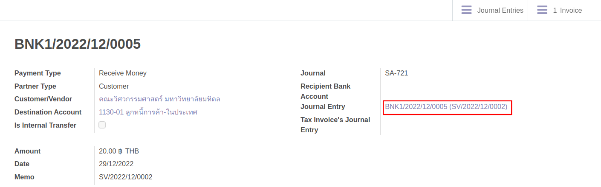
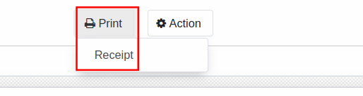
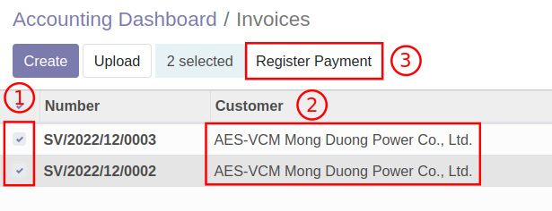

# การบันทึกรับชำระเงิน (Customer Payment)

**Menu:** Invoicing > Dashboard

1. กล่อง Customer Invoices จะแสดงรายการที่ยังไม่ได้รับชำระเงิน ให้คลิกที่คำว่า **Unpaid Invoices**

2. ระบบจะเปิดหน้าต่างของเอกสารที่ยังไม่ได้รับเงิน ให้เลือกเอกสารที่ต้องการบันทึกรับเงิน 

3. ระบบจะเปิดเอกสารใบแจ้งหนี้ ตรวจสอบข้อมูลให้ถูกต้อง จากนั้นกดปุ่ม Register Payment เพื่อบันทึกรับชำระเงิน

4. ระบบแสดงหน้าต่างให้กรอกข้อมูลบันทึกรับชำระเงิน ดังนี้
    * (1) Journal: เลือกบัญชีธนาคาร ที่ได้รับเงิน
    * (2) Amount: กรอกจำนวนเงินที่รับชำระตามจริง 
    * (3) Payment Date: วันที่ได้รับเงิน
    * (4) Memo: คำอธิบายรายการเพิ่มเติม
    * (5) Keep Open: เลือกในกรณีลูกค้าจ่ายเงินไม่ครบ และต้องการเก็บยอดคงค้างไว้
    * (6) Mark as fully paid: เลือกบันทึกบัญชียอดผลต่าง เข้ารหัสบัญชีเดียว เช่น ถูกหัก ณ ที่จ่าย
    * (7) Mark as fully paid (multi deduct): ใช้ในกรณีที่มีผลต่าง ให้บันทึกบัญชีมากกว่า 1 บัญชี เช่น ค่าธรรมเนียม และถูกหัก ณ ที่จ่าย
    * (8) กรณีเลือก Mark as fully paid (multi deduct) กดปุ่ม Add a line เพื่อเลือกรหัสบัญชีที่ต้องการบันทึก และเพิ่มคำอธิบานรายการ
    * (9) กดปุ่ม Create Payment เพื่อบันทึกบัญชี
    

5. เมื่อบันทึกบัญชีเรียบร้อยแล้ว สถานะเอกสารจะเปลี่ยนเป็น Paid สามารถเข้าไปดูรายละเอียดการบันทึกบัญชีได้ดังนี้
    * (1) คลิกที่สัญลักษณ์ตัว i เพื่อแสดงหน้าต่างรายละเอียด
    * (2) กดปุ่ม View เพื่อเข้าสู่หน้าต่างของเอกสาร RV
    

6. เมื่อเข้าสู่หน้าต่างของเอกสารรับเงิน หากต้องการดูคู่บัญชี สามารถคลิกที่ **Journal Entry** เพื่อการบันทึกบัญชี

7. หากต้องการ Print ใบเสร็จรับเงิน ให้คลิกที่ปุ่ม Print 
    

!!! note
    หากลูกค้ารายเดียวกันชำระเงินรวม  สามารถติ๊กถูกหน้าเอกสารที่ต้องการบันทึกรับชำระ เพื่อบันทึกรับเงินหลาย Invoice 
    

End.

----------------------------------------------------------

