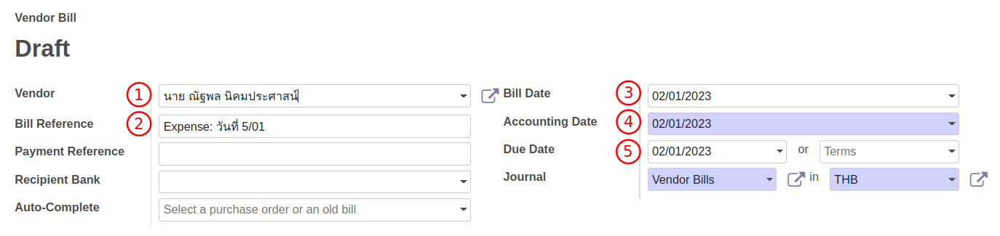
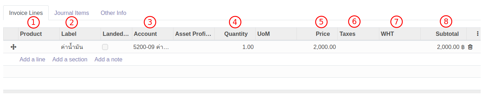

# สำรองจ่าย (Expense)

## วิธีการบันทึกพนักงานเบิกสำรองจ่าย

การบันทึกค่าใช้จ่ายที่จ่ายผ่านการสำรองจ่ายของพนักงาน สามารถทำได้ดังนี้

**Menu:** Invoicing > Vendors > Bills

1. กดปุ่ม Create เพื่อสร้างเอกสาร Vendor Bill สถานะ Draft

2. กรอกข้อมูลที่ Header (ส่วนบนเอกสาร) ดังนี้
    * (1) Vendor: เลือกชื่อพนักงานผู้สำรองจ่ายค่าใช้จ่าย
    * (2) Bill Reference: กรอกคำอธิบายขึ้นต้นด้วยคำว่า Expense
    * (3) Bill Date: วันที่เบิกสำรองจ่าย
    * (4) Accounting Date: วันที่บันทึกบัญชี
    * (5) Due Date: ใช้วันเดียวกับวันที่บันทึกบัญชี
    

3. Tab **Invoice Lines** กด add a line เพื่อกรอกข้อมูลดังนี้ 
    * (1) Product: ไม่ต้องเลือก
    * (2) Label: คำอธิบายรายการรายบรรทัด
    * (3) Account: รหัสบัญชีที่ใช้ในการบันทึกค่าใช้จ่าย
    * (4) Quantity: จำนวน
    * (5) Price: ราคาต่อหน่วย
    * (6) Taxes: ประเภท VAT
    * (7) WHT: ภาษีหัก ณ ที่จ่าย
    * (8) Subtotal: ยอดรวมรายบรรทัด
    

4. Tab **Journal Items** ระบบจะแสดงคู่บัญชี ซึ่งดึงมาจาก Account

5. Tab **Tax invoice** จะแสดงเมื่อมีการเลือก Taxes เป็นภาษีซื้อ (Input VAT) ซึ่งจะต้องกรอกข้อมูลดังนี้
    * (1) Partner: ให้แก้ไขเป็นชื่อบริษัทที่อยู่ในใบกำกับภาษี กดปุ่ม Edit เพื่อแก้ไข
    * (2) Tax Invoice Number: เลขที่ใบกำกับภาษี
    * (3) Tax Invoice Date: วันที่ในใบกำกับภาษี
    * (4) Tax Base: ยอดเงินก่อนภาษีมูลค่าเพิ่ม
    * (5) Tax Amount: ภาษีมูลค่าเพิ่ม
    * (6) Split: ใช้สำหรับกรณีที่มีใบกำกับภาษีหลายใบ สามารถกด Split เพื่อเพิ่มเอกสาร

6. Terms and Conditions: คำอธิบายการ 
 

7. กดปุ่ม Save เพื่อบันทึกข้อมูลและตรวจทาน หากต้องการแก้ไขข้อมูลอีกครั้ง ให้กดปุ่ม Edit เพื่อแก้ไข

8. กดปุ่ม Confirm เพื่อบันทึกบัญชี สถานะเอกสารจะเปลี่ยนจาก Draft เป็น Posted

!!! Note "การจ่ายเงินคืนพนักงานสำรองจ่าย"
    * เมื่อต้องการจ่ายคืนพนักงานให้กดปุ่ม **Register Payment** เพื่อให้ทำการจ่ายชำระ ซึ่งสามารถดูวิธีการจ่ายได้ที่หัวข้อ **การบันทึกจ่ายชำระ**

End.

----------------------------------------------------------

