# รายงาน (Report)

ในการเรียกดูรายงานทางการเงินจากระบบ สามารถเรียกดูได้จาก 3 เมนูดังนี้

1. MIS report สำหรับเรียกดู
    * (1) งบแสดงฐานะการเงิน
    * (2) งบแสดงกำไรขาดทุน
2. General Ledger สำหรับเรียกดูรายงานบัญชีแยกประเภท
3. Trial balance สำหรับเรียกดูงบทดลอง

-----------------------------------------------------------------

## 1. MIS report

**Menu ::** Invoicing > Reporting > MIS report

1. เมื่อเข้าสู่หน้า MIS report ให้คลิกที่ปุ่ม Preview หน้ารายงานที่ต้องการเรียกดู
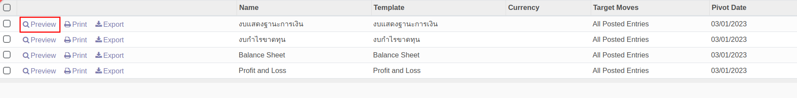
2. ระบบจะแสดงหน้า Preview งบการเงินในระบบ
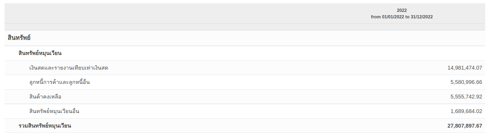

4. หากต้องการ Export file ให้กดปุ่มดังนี้
    * (1) ปุ่ม Print เมื่อต้องการดาวน์โหลดไฟล์เป็น Pdf.
    * (2) ปุ่ม Export เมื่อต้องการดาวน์โหลดไฟล์เป็น Excel
    * (3) ปุ่ม Setting ใช้สำหรับเลือกช่วงเวลาในการดูรายงาน
    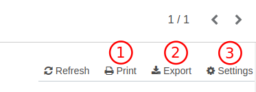
5. หากต้องการดูรายละเอียดของแต่ละรายการ สามารถกดที่ตัวเลขบนงบการเงิน
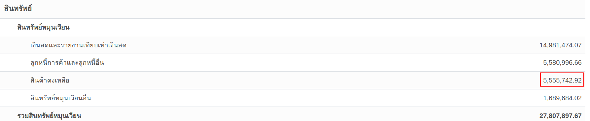
6. ระบบจะแสดง voucher ของรายการที่เกี่ยวข้อง
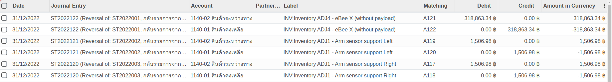

---------------------------------------------------------------

## 2. General Ledger

**Menu ::** Invoicing > Reporting > General Ledger

1. ระบบจะแสดงหน้าต่างเงื่อนไขการเรียกรายงานดังนี้
    * (1) Date Range: ใส่ช่วงเวลา
    * (2) Date From: วันที่เริ่มต้นรายงาน
    * (3) Date To: วันที่สิ้นสุดรายงาน
    * (4) Target moves: 
        - All Posted Entry แค่รายการที่ลงบัญชีแล้ว
        - All Entries ทุกรายการ
    * (5) Activate Centralize: ระบบจะ Default ให้ ไม่ต้องเลือก
    * (6) Hide account ending balance at 0: ซ่อนบัญชีที่มียอดเหลือ 0
    * (7) Filter: สามารถใส่ค่าที่ต้องการกรองได้
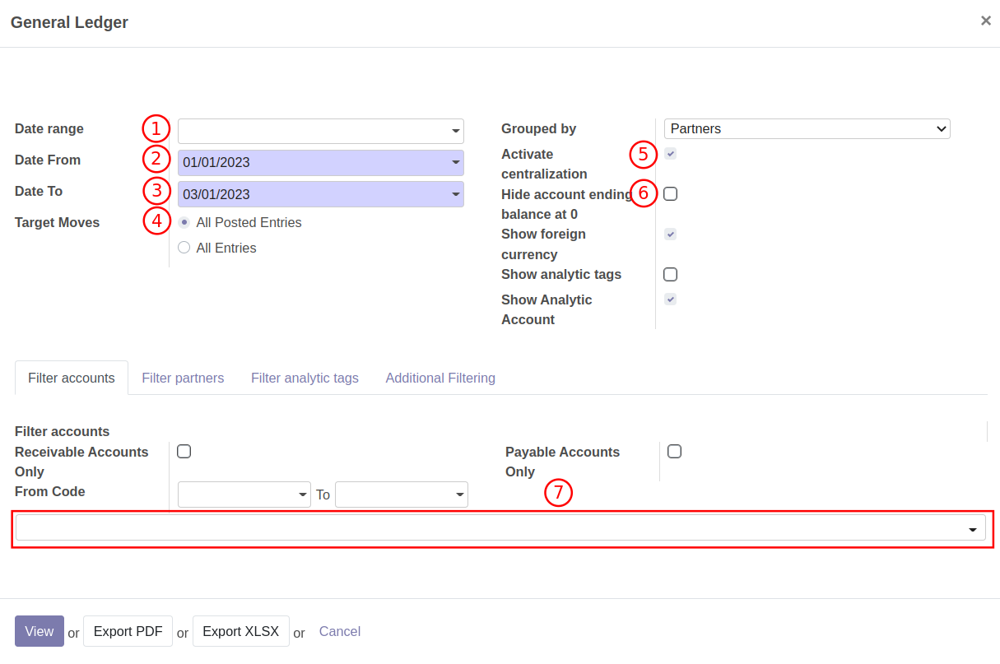

2. หลังจากใส่เงื่อนไขการเรียกดุรายงานเรียบร้อยแล้ว สามารถกดปุ่ม
    * (1) View: เพื่อดูรายงานในหน้าระบบ
    * (2) Export PDF: เพื่อ Export รายงานเป็น PDF
    * (3) Export XLSX: เพื่อ Export รายงานเป็น Excel
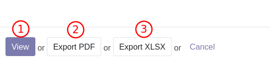

-----------------------------------------------------------------

## 3. Trial Balance

**Menu ::** Invoicing > Reporting > Trial Balance

1. ระบบจะแสดงหน้าต่างเงื่อนไขการเรียกรายงานดังนี้
    * (1) Date Range: ใส่ช่วงเวลา
    * (2) Date From: วันที่เริ่มต้นรายงาน
    * (3) Date To: วันที่สิ้นสุดรายงาน
    * (4) Target moves: 
        - All Posted Entry แค่รายการที่ลงบัญชีแล้ว
        - All Entries ทุกรายการ
    * (5) Hide accounts at 0: ซ่อนบัญชีที่มียอดเหลือ 0
    * (6) Show Partner Details: เลือกหากต้องการดูบัญชีที่เป็นเจ้าหนี้และลูกหนี้
    * (7) Journal: กรองประเภทของสมุดรายวัน
    * (8) Receiveable accounts: เลือกหากต้องการดูบัญชีลูกหนี้
    * (9) Payable accounts: เลือกหากต้องการดูบัญชีที่เป็นเจ้าหนี้
    * (10) From code: เลือกรหัสบัญชี
    * (11) เลือกรหัสบัญชีที่ต้องการ
    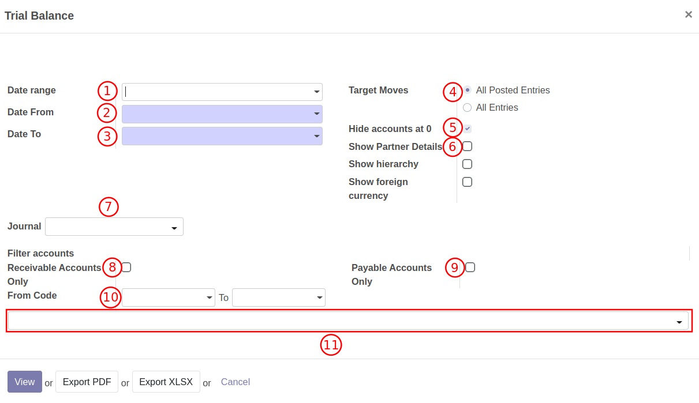

2. หลังจากใส่เงื่อนไขการเรียกดุรายงานเรียบร้อยแล้ว สามารถกดปุ่ม
    * (1) View: เพื่อดูรายงานในหน้าระบบ
    * (2) Export PDF: เพื่อ Export รายงานเป็น PDF
    * (3) Export XLSX: เพื่อ Export รายงานเป็น Excel

------------------------------------------------------------

### การตั้งค่าการแสดงผลรายงานทางการเงิน (MIS Report) 

**Menu ::** Invoicing > Reporting > MIS report

หากต้องการตั้งค่าการแสดงผล ให้กดปุ่ม Setting ที่หน้าของงบการเงินนั้นๆ

1. Tab **column** สามารถเพิ่ม Column ในงบการเงินได้ 
    * (1) กดปุ่ม edit
    * (2) กด Add a line
    * (3) ระบบจะแสดงหน้าต่างการสร้าง Column ดังนี้
        * (1) Label: ใส่ชื่อหัวข้อ Column
        * (2) Source: เลือก actual
        * (3) Mode: เลือก fixed date
        * (4) From: วันที่เริ่มต้นรายงาน
        * (5) To: วันที่สิ้นสุดรายงาน
        * (6) กด Save เมื่อเสร็จสิ้น
    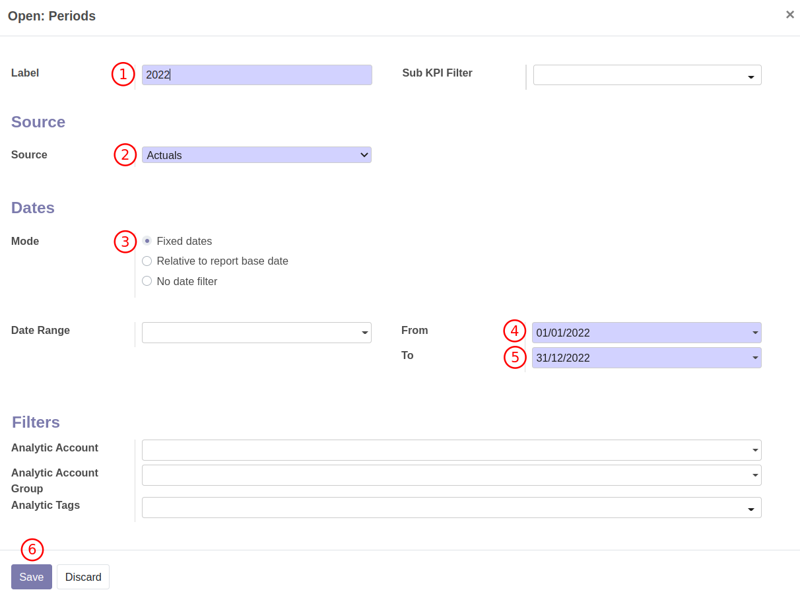

2. Tab **Filter** สามารถเพิ่มการกรองข้อมูลได้
    * (1) กด Edit
    * (2) ตั้งค่า Target moves ดังนี้
        * (1) All posted Entries: เลือกเฉพาะรายการที่ลงบัญชีแล้ว 
        * (2) All Entries: เลือกทุกรายการแม้ยังไม่ได้ลงบัญชี
        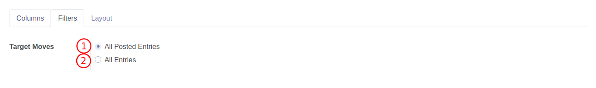

3. Tab **Layout** ปรับเปลี่ยนการแสดงผลได้
    * (1) Landscape PDF: หากต้องการ Print PDF แนวนอน
    * (2) Display columns Description: ติ๊กหากต้องการโชว์วันที่บนหัว column
    * (3) Hide Analytic Filters: ติ๊ก หากต้องการซ่อน Field ที่ใช้สำหรับ filter จากหน้ารายงาน
    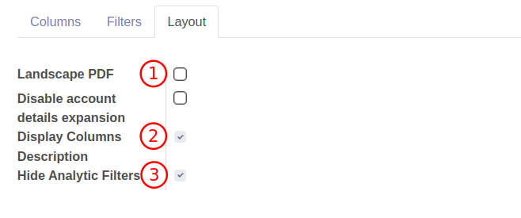

End. 

--------------------------------------

