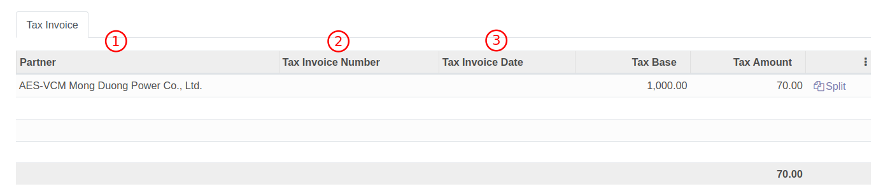

# การกลับรายการภาษีซื้อที่ยังไม่ถึงกำหนดชำระ

## การกลับรายการภาษีซื้อที่ยังไม่ถึงกำหนดชำระ

-----------------------------------------------------------------

**Menu ::** Invoicing > Vendors > Payments

1. กดปุ่ม Favorites และเลือก Clear Tax เพื่อกรองรายการ PV ที่ยังไม่ได้ทำการกลับรายการภาษีซื้อที่ยังไม่ถึงกำหนดชำระ

2. เลือกรายการ PV ที่ต้องกลับรายการ
3. กดปุ่ม Edit และใส่ข้อมูลดังนี้
    * (1) Partner: ชื่อบริษัทที่อยู่ในใบกำกับภาษี สามารถกดปุ่ม Edit เพื่อแก้ไขชื่อให้ตรงกับใบกำกับภาษี
    * (2) Tax Invoice Number: เลขที่ใบกำกับภาษี
    * (3) Tax Invoice Date: วันที่ตามใบกำกับภาษี

4. สำหรับกรณีที่มีใบกำกับภาษีมากกว่าหนึ่งใบ ให้คลิกที่ **Split**

5. เมื่อคลิกที่ปุ่ม Split ระบบจะสร้างบรรทัดใหม่ให้กรอกข้อมูลของบรรทัดถัดไป
    * (1) Partner: ชื่อบริษัทที่อยู่ในใบกำกับภาษี สามารถกดปุ่ม Edit เพื่อแก้ไขชื่อให้ตรงกับใบกำกับภาษี (ใบที่ 2)
    * (2) Tax Invoice Number: เลขที่ใบกำกับภาษี (ใบที่ 2)
    * (3) Tax Invoice Date: วันที่ตามใบกำกับภาษี (ใบที่ 2)
    * (4) Tax Base: รวมในใบกำกับภาษีก่อน VAT (ใบที่ 2)
    * (5) Tax Amount: ยอดภาษีมูลค่าเพิ่ม (ใบที่ 2)

6. กดปุ่ม Save เพื่อบันทึกข้อมูล
7. หากต้องการแก้ไขข้อมูลให้กด Edit
7. กดปุ่ม Clear Tax เพื่อลงบันทึกบัญชีกลับรายการ

8. ระบบจะแสดงเลขที่เอกสารในการลงบันทึกบัญชีกลับรายการที่ Tax Invoice's Journal Entry

9. หากต้องการดูคู่บัญชีให้คลิกที่ปุ่ม Smart button "Journal Entries"

--------------------------------------------------------------------

## การยื่นภาษีย้อนหลัง

**Menu ::** Invoicing > Accounting > Tax Invoices

ใช้สำหรับกรณีวันที่ในใบกำกับภาษีไม่ตรงกับเดือนที่ต้องการยื่นภาษี สามารถแก้ไขโดยการไปที่หน้าต่าง Tax Invoices ซึ่งหน้าต่างนี้จะแสดงรายการภาษีมูลค่าเพิ่มทั้งหมดที่มีการสร้างในระบบ

1. เลือกเอกสารที่ต้องการแก้ไขเดือนสำหรับการออกรายงานภาษี
2. ระบบจะแสดงหน้าต่างของภาษีมูลค่าเพิ่มที่ต้องการแก้ไข ซึ่งมีความหมายดังนี้
    * (1) Tax invoice number: เลขที่ใบกำกับภาษี
    * (2) Tax Invoice date: วันที่ในใบกำกับภาษี
    * (3) Report date: ระบบจะคำนวณเดือนที่จะนำไปออกรายงานภาษี สามารถเลือกได้ดังนี้
        * (1) 0 month หากต้องการยื่นภาษีในเดือนเดียวกับวันที่บนใบกำกับภาษี 
        * (2) 1 month หากต้องการเลื่อนการยื่นภาษี ไปเดือนถัดไป
        * (3) 2 month หากต้องการเลื่อนการยื่นภาษี ไปอีก 2 เดือน
        * (4) 3 month หากต้องการเลื่อนการยื่นภาษี ไปอีก 3 เดือน
        * (5) 4 month หากต้องการเลื่อนการยื่นภาษี ไปอีก 4 เดือน
        * (6) 5 month หากต้องการเลื่อนการยื่นภาษี ไปอีก 5 เดือน
        * (7) 6 month หากต้องการเลื่อนการยื่นภาษี ไปอีก 6 เดือน
    * (4) Partner: ชื่อของคู่ค้า
    * (5) Tax base: มูลค่าก่อน VAT
    * (6) Tax amount: มูลค่า VAT 

End.

--------------------------------------------------------------------