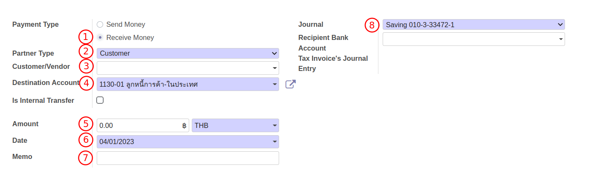
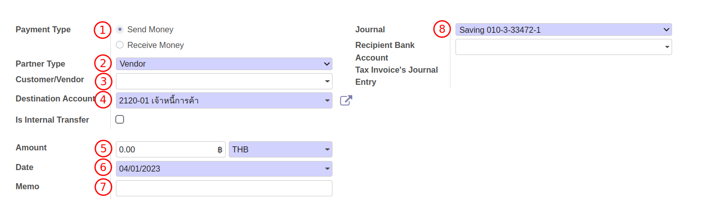
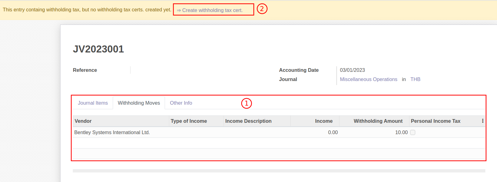
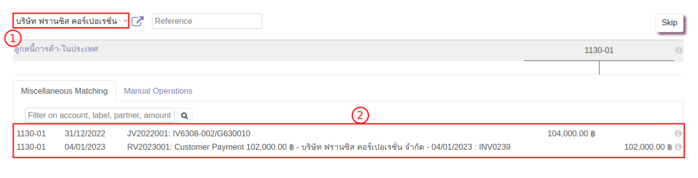
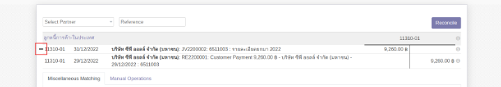
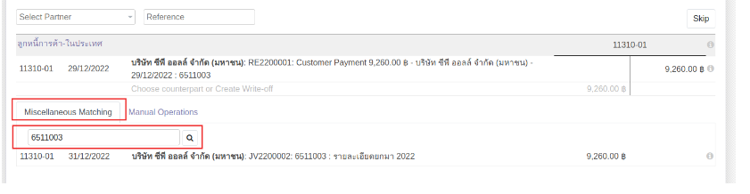
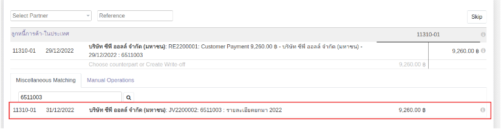
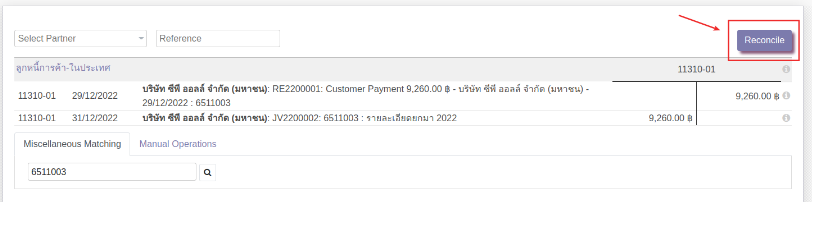

# การบันทึกรับชำระยอดยกมา

สำหรับกรณีที่มีการตั้งหนี้ไว้ในอดีตก่อนการขึ้นระบบใหม่ เมื่อขึ้นระบบแล้วต้องการบันทึกรับหรือจ่ายเงิน สามารถทำได้ดังนี้

## การบันทึกรับชำระเงิน

**Menu:** Invoicing > Customers > Payments

1. กดปุ่ม Create เพื่อสร้างเอกสาร

2. กรอกข้อมูลการรับชำระเงิน
    * (1) Payment Type: ระบบเลือกมาให้เป็น Receive Money (การรับเงิน)
    * (2) Partner Type: ระบบเลือกมาให้เป็น Customer (ลูกค้า)
    * (3) Customer/Vendor: เลือกชื่อ Customer
    * (4) Destination Account: เลือกรหัสบัญชีที่ตั้งหนี้ไว้
    * (5) Amount: กรอกยอดเงินที่ได้รับ
    * (6) Date: เลือกวันที่ได้รับเงิน
    * (7) Memo: กรอกข้อมูลอ้างอิง เช่น เลขที่ใบวางบิล
    * (8) Journal: แสดงข้อมูลสมุดรายวันที่จะบันทึกรับเงิน ตรวจสอบความถูกต้อง
    

3. กดปุ่ม Save เพื่อบันทึกข้อมูลและตรวจทาน หากต้องการแก้ไขให้กดปุ่ม Edit

4. กดปุ่ม Confirm เพื่อยืนยันบันทึกรับชำระเงิน สถานะเอกสารจะเปลี่ยนเป็น Posted

---

## การบันทึกจ่ายชำระเงิน 

**Menu:** Invoicing > Vendors > Payments

1. กดปุ่ม Create เพื่อสร้างเอกสาร PV

2. กรอกข้อมูลการจ่ายชำระเงิน
    * (1) Payment Type: ระบบเลือกมาให้เป็น Send Money (การจ่ายเงิน)
    * (2) Partner Type: ระบบเลือกมาให้เป็น Vendor (คู่ค้า)
    * (3) Customer/Vendor: เลือกชื่อ Vendor
    * (4) Destination Account: เลือกรหัสบัญชีที่ตั้งหนี้ไว้
    * (5) Amount: กรอกยอดเงินที่ทำจ่าย
    * (6) Date: เลือกวันที่จ่ายเงิน
    * (7) Memo: กรอกข้อมูลอ้างอิง เช่น เลขที่ใบวางบิล
    * (8) Journal: แสดงข้อมูลสมุดรายวันที่จะบันทึกจ่ายชำระเงิน ตรวจสอบความถูกต้อง
    

3. กดปุ่ม Save เพื่อบันทึกข้อมูลและตรวจทาน หากต้องการแก้ไขให้กดปุ่ม Edit

4. กดปุ่ม Confirm เพื่อยืนยันบันทึกจ่ายชำระเงิน สถานะเอกสารจะเปลี่ยนเป็น Posted 

!!! Tip "กรณีรับหรือจ่ายเงินมียอดหัก ณ ที่จ่าย"
    * เมื่อบันทึกรับหรือจ่ายตามจำนวนเงินที่ได้รับเรียบร้อยแล้ว ให้ไปที่เมนู Invoicing > Accounting > Journal Entries เพื่อบันทึกปรับปรุง
    * บันทึกบัญชีล้างลูกหนี้เจ้าหนี้ส่วนที่เหลือ และบันทึกหัก ณ ที่จ่าย
    * เลือก WHT ในบรรทัดที่บันทึกปรับปรุง ระบบจะแสดง link ให้ไปออกหนังรับรองหัก ณ ที่จ่าย
    

---

## การจับคู่การกระทบยอด (Reconcile)

**Menu:** Invoicing > Accounting > Reconciliation

1. เข้าสู่หน้าต่างของการ Reconcile ให้เลื่อนหา Account Code ที่ต้องการจับคู่

2. ระบบจะแสดงชื่อคู่ค้าที่สามารถจับคู่กระทบยอดมาให้เบื้องต้น ตรวจสอบความถูกต้องดังนี้
    * (1) Partner: ชื่อคู่ค้า สามารถเปลี่ยนได้หากไม่ใช่เจ้าที่ต้องการจับคู่
    * (2) รายการที่ต้องการจับคู่ ให้เลือกรายการที่รับหรือจ่ายเงินกับ JV ที่นำเข้าข้อมูล

2. หากไม่ต้องการจับคู่รายการที่ระบบเลือกมาให้ สามารถกด - ที่หน้าบรรทัดรายการเพื่อลบรายการ

3. ค้นหารายการที่ต้องการจับคู่โดย
    * ที่แท็บ Miscellaneous Matching แสดงรายการที่รอการจับคู่ทั้งหมด
    * ช่อง Search กรอกข้อมูลที่ต้องการค้นหา เช่น ชื่อลูกค้า เลขที่เอกสาร ยอดเงิน บัญชี เป็นต้น
     

4. กดเลือกรายการที่ต้องการจับคู่ และตรวจทาน
 

5. กดปุ่ม Reconcile เพื่อยืนยันการจับคู่
 

---

End.
