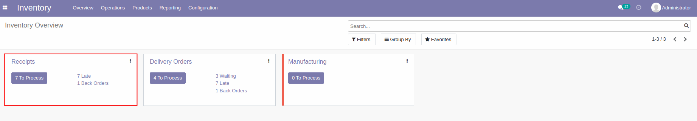
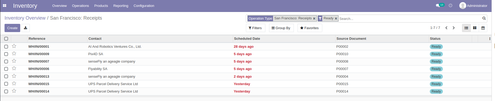
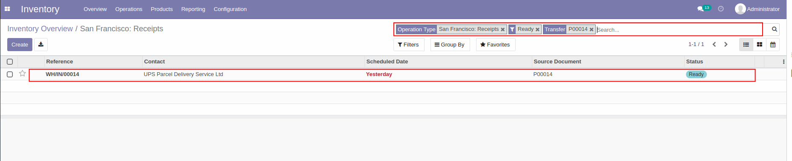
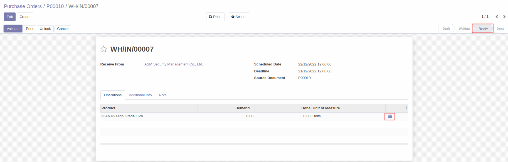
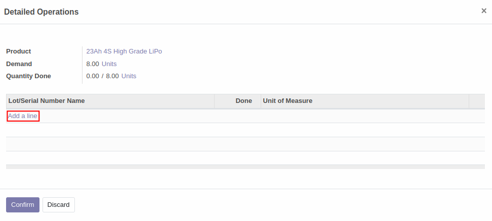
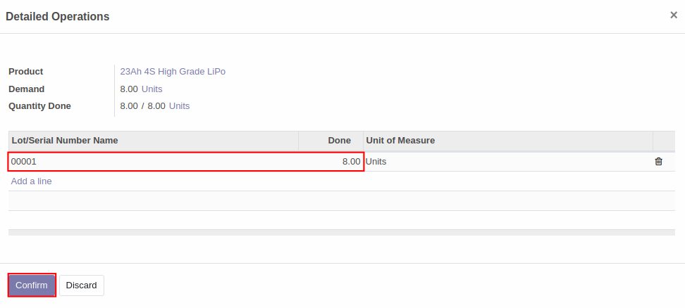
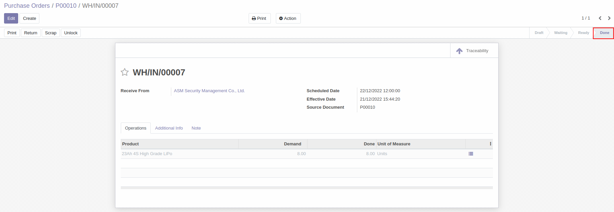
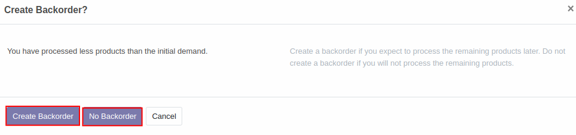
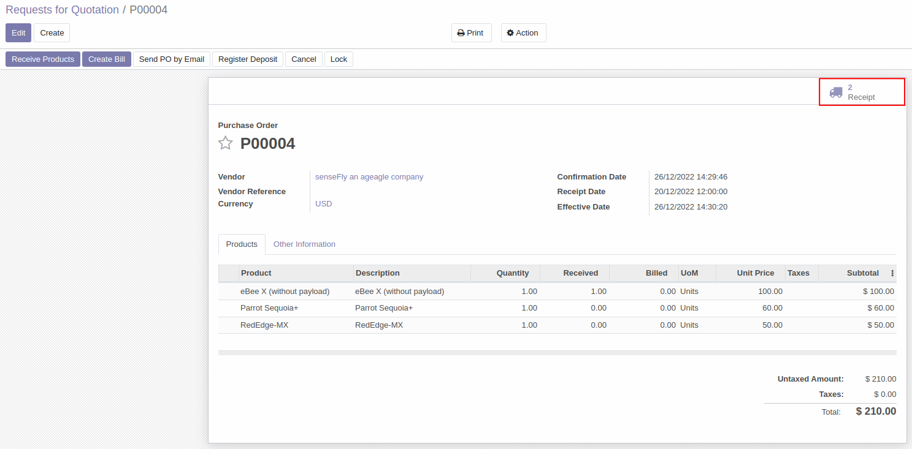
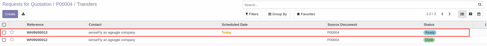

# การรับสินค้าเข้าคลัง (Stock In)

## วิธีการรับสินค้าเข้าคลัง 
เมื่อสินค้าที่สั่งซื้อมาส่งที่คลังสินค้า สามารถกดรับสินค้าเข้าคลังได้ตามวิธีด้านล่าง

**Menu ::** Inventory > Overview > Receipts

1. ในหน้าต่าง Overview หัวข้อ **Receipts** ผู้ใช้งานสามารถดูได้ว่ามีกี่รายการที่ต้องเข้าไปกดรับสินค้าจากตรง **xx to Process** โดยสามารถกดเข้าไปที่ปุ่มได้เลย 

     

    เมื่อกดเข้าไปแล้วระบบจะแสดงรายการทั้งหมดที่รอกดรับสินค้า
     
     

2. สามารถเลือกเอกสารที่ต้องการกดรับสินค้า โดยพิมพ์ **เลขที่เอกสาร (PO number)** จากช่อง **search** ในหน้าต่างด้านล่าง
    
    

3. เมื่อกดเข้าไปในเอกสารแล้วระบบจะแสดงหน้าต่างของเอกสารรับของ เพื่อให้ตรวจสอบ (**Validate**) สินค้าที่ได้รับเข้ามา โดยสามารถกดปุ่ม 3 ขีดเพื่อใส่ Lot/Serial number ของสินค้าที่รับเข้ามาได้
   
     ซึ่งในขั้นตอนนี้สถานะของเอกสารจะแสดงเป็น **Ready**  

    

4. เมื่อกดปุ่ม 3 ขีดแล้ว ระบบจะแสดงหน้าต่างด้านล่างขึ้นมา 

    1. กดที่ **Add a line**  
    2. กำหนดเลข Lot/Serial Number รวมถึงจำนวนของสินค้าในแต่ละ Lot/Serial Number นั้น
            
            โดยเลข Lot/Serial Number ให้กำหนดตามเลขที่ SO number ที่เปิดคำสั่งขายสินค้า
            ดังกล่าว 

    3. กด **Confirm**

    
    

5. เมื่อยืนยันการรับสินค้าเข้าแล้ว สถานะของเอกสารจะเปลี่ยนเป็น Done

    

---

## การสร้าง Backorder
**กรณีรับสินค้าไม่ครบตามจำนวนที่อยู่ในคำสั่งซื้อ** 

ถ้าจำนวนสินค้าที่กด Validate น้อยกว่าสินค้าที่เปิดคำสั่งซื้อไป ระบบจะแสดงหน้าต่างด้านล่างขึ้นมา

1. กด **Create Backorder** ในกรณีที่ต้องการให้ Vendor ส่งสินค้าที่ขาดตามมาทีหลัง
2. กด **No Backorder** ในกรณีที่จะรับสินค้าเท่าที่ได้รับ ไม่ต้องการสินค้าที่ขาด

ถ้ากดปุ่ม **Create Backorder** ในหน้าต่าง Purchase orders บริเวณไอคอนรูปรถ (Receipt) จะแสดงตัวเลขเพิ่มขึ้นเป็น 2

เมื่อกดเข้าไปที่ไอคอนรูปรถ จะเห็นเอกสารใบส่งของสำหรับ Backorder เพิ่มขึ้นมา สามารถกดเข้าไปในเอกสารเพื่อดำเนินการรับของที่ส่งตามมาจาก Vendor ได้

