# การส่งสินค้าออกจากคลัง (Stock Out)

## วิธีการส่งสินค้าออกจากคลัง 
เมื่อต้องการส่งสินค้าออกจากคลังสินค้าไปให้ลูกค้า สามารถทำได้ตามวิธีด้านล่าง

**Menu ::** Inventory > Overview > Delivery Orders

1. ในหน้าต่าง Overview หัวข้อ **Delivery Orders** ผู้ใช้งานสามารถดูได้ว่ามีกี่รายการที่ต้องเข้าไปกดส่งสินค้าจากตรง **xx to Process** โดยสามารถกดเข้าไปที่ปุ่มได้เลย 

    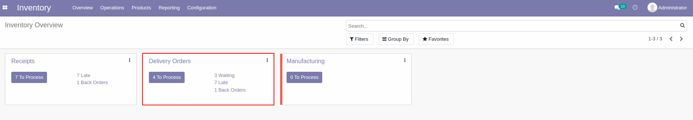

    เมื่อกดเข้าไปแล้วระบบจะแสดงรายการทั้งหมดที่รอกดส่งสินค้า 

    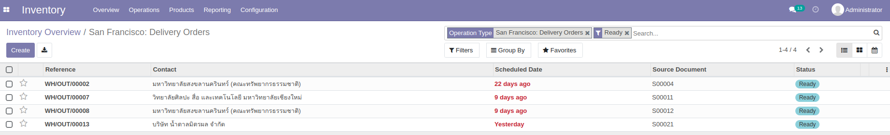

2. สามารถเลือกเอกสารที่ต้องการกดส่งสินค้า โดยพิมพ์ **เลขที่เอกสาร (SO number)** จากช่อง **search** ในหน้าต่างด้านล่าง
    
    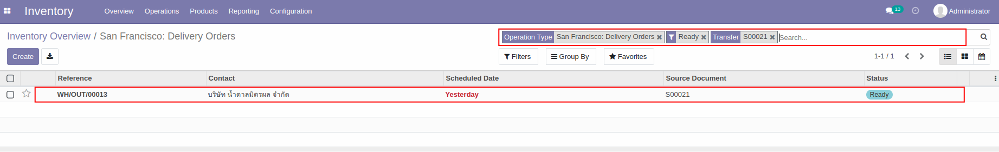

3. เมื่อกดแล้วระบบจะแสดงหน้าต่างของเอกสารส่งของ โดยสามารถกดปุ่ม **Edit** เพื่อใส่ข้อมูลด้านล่าง

    - จำนวนของสินค้าที่จะส่งตรงคอลัมน์ Done 
    - เลือก Lot/Serial Number ตาม SO number ที่เปิดคำสั่งขาย
    
        จากนั้นกด **Save** เพื่อบันทึกข้อมูล 

    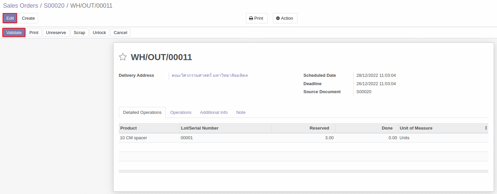 
    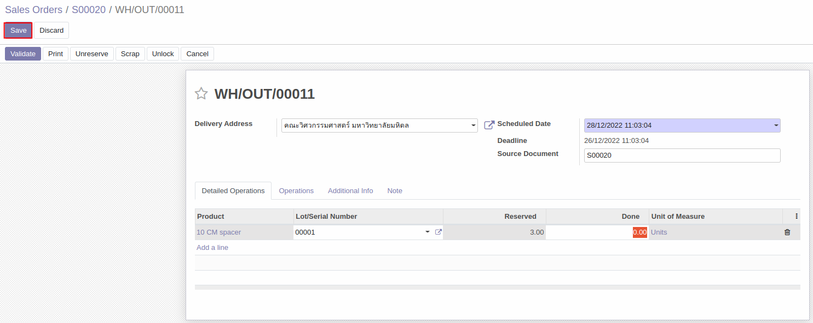 

     ซึ่งในขั้นตอนนี้สถานะของเอกสารจะแสดงเป็น **Ready**  

    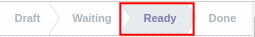

4. เมื่อตรวจสอบข้อมูลเรียบร้อยแล้วกดปุ่ม **Validate** เพื่อยืนยันการส่งสินค้าให้ลูกค้า 

    - หากกดปุ่ม Validate โดยที่ยังไม่ได้ใส่ข้อมูลจำนวนสินค้าที่จะส่งตรงคอลัมน์ Done ระบบจะแสดงหน้าต่างด้านล่างเพื่อให้ผู้ใช้งานยืนยันว่าจะทำการส่งสินค้าทั้งหมดตามจำนวนในคำสั่งขาย ใช่หรือไม่
    - ถ้าใช่กดปุ่ม **Apply** ถ้าไม่ใช่กด Cancel แล้วใส่ข้อมูลจำนวนสินค้าที่ต้องการส่งตรงคอลัมน์ Done

     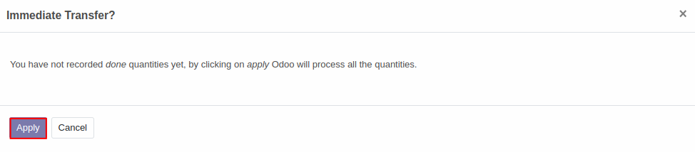

5. หลังยืนยันการส่งสินค้าให้ลูกค้าแล้ว สถานะของเอกสารจะเปลี่ยนเป็น **Done**

    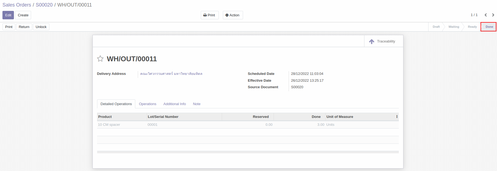

---
## การสร้าง Backorder
 **กรณีส่งสินค้าไม่ครบตามจำนวนที่อยู่ในคำสั่งขาย**  

ถ้าจำนวนสินค้าที่กด Validate น้อยกว่าสินค้าที่เปิดคำสั่งขายไป ระบบจะแสดงหน้าต่างด้านล่างขึ้นมา

1. กด **Create Backorder** ในกรณีที่ต้องการส่งสินค้าที่ขาดไปให้ลูกค้าตามไปทีหลัง 
2. กด **No Backorder** ในกรณีที่จะส่งสินค้าตามจำนวนเท่านี้ ไม่ต้องการส่งสินค้าที่ขาดตามไปทีหลัง

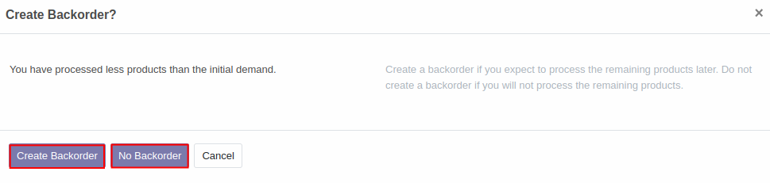

ถ้ากดปุ่ม **Create Backorder** ในหน้าต่าง Sales orders บริเวณไอคอนรูปรถ (Delivery) จะแสดงตัวเลขเพิ่มขึ้นเป็น 2

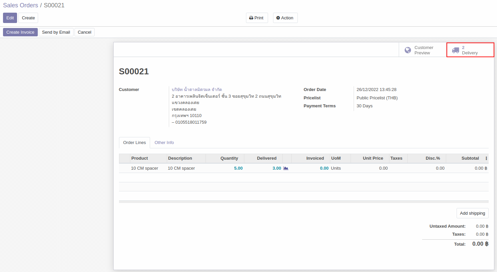

เมื่อกดเข้าไปที่ไอคอนรูปรถ จะเห็นเอกสารใบส่งของสำหรับ Backorder เพิ่มขึ้นมา สามารถกดเข้าไปในเอกสารเพื่อดำเนินการส่งของที่ขาดให้กับลูกค้าได้

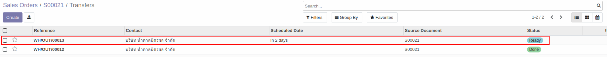