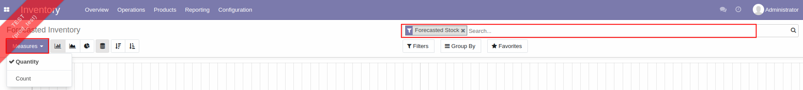
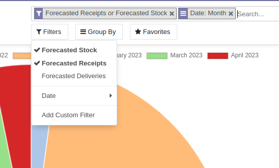
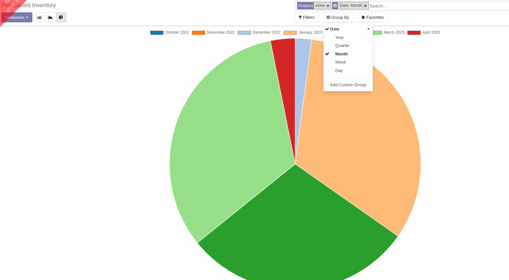
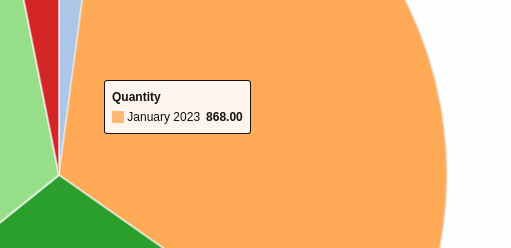

# รายงานการคาดการณ์สินค้าคงเหลือ (Forcasted Inventory)

## การดูข้อมูลรายงานการพยากรณ์สินค้าคงเหลือ

**Menu ::** Inventory > Reporting > Forcasted Inventory

ระบบจะแสดงหน้าต่าง **Forcasted Inventory** ที่แสดงรายงานการคาดการณ์ของสินค้าคงเหลือขึ้นมาว่า ณ ปัจจุบันสินค้าคงเหลือมีจำนวนเท่าใด และจะมีจำนวนเท่าใดในอนาคต โดยคาดการณ์จากคำสั่งซื้อ/ขายที่จะเกิดขึ้น ซึ่งส่งผลต่อจำนวนของสินค้าคงเหลือ 

รายละเอียดของรายงานประกอบด้วย

1) **Measures**: รูปแบบการแสดงผลจำนวน สามารถเลือกได้ระหว่างจำนวนสินค้าคงเหลือที่มีอยู่ในคลัง (Quantity) หรือจำนวนที่ตรวจนับสินค้าคงเหลือได้(Count)

2) **รูปแบบการแสดงผลกราฟ**: รูปแบบการแสดงผลของกราฟสามารถเลือกได้ว่าจะให้ระบบแสดงผลเป็นกราฟแท่ง กราฟเส้น หรือกราฟวงกลม โดยสามารถกดปุ่มไอคอนรูปกราฟแต่ละประเภท 
    
ตัวอย่างการแสดงผลของกราฟวงกลม 
            
- สามารถค้นหาชื่อสินค้าเพื่อแสดงผลได้ตรงช่อง Search 
- สามารถ **Filters** ประเภทของการคาดการณ์ได้ว่าจะเป็นการคาดการณ์จำนวนสินค้าคงเหลือ คาดการณ์จำนวนสินค้าที่จะส่งออกจากคลัง หรือคาดการณ์จำนวนสินค้าที่จะรับเข้าคลัง
    

- สามารถเลือกรูปแบบการแสดงข้อมูลเป็นช่วงของเวลาได้ตรงปุ่ม **Group By** โดยรูปภาพด้านล่างเป็นรูปแบบของข้อมูลรายเดือนของสินค้าตัวหนึ่ง

- เมื่อเลื่อนลูกศรเมาส์ไปวางไว้ตรงเดือนที่เราต้องการทราบจำนวนของสินค้า ระบบจะแสดงผลจำนวนสินค้าในเดือนนั้นให้ทราบ
