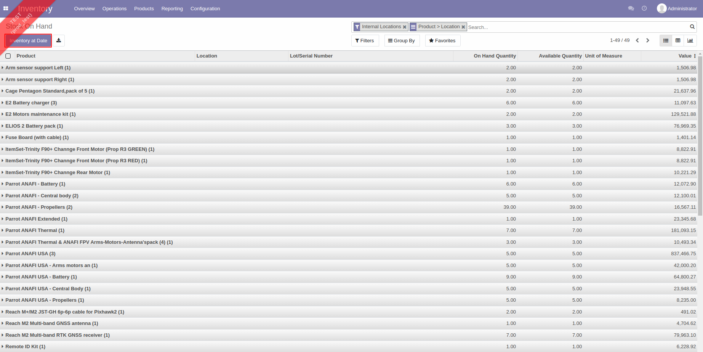
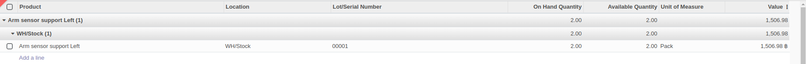
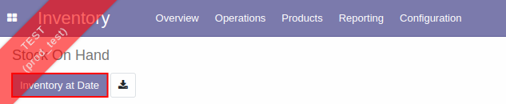
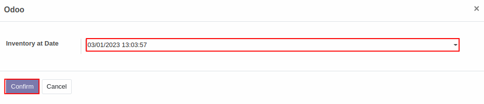
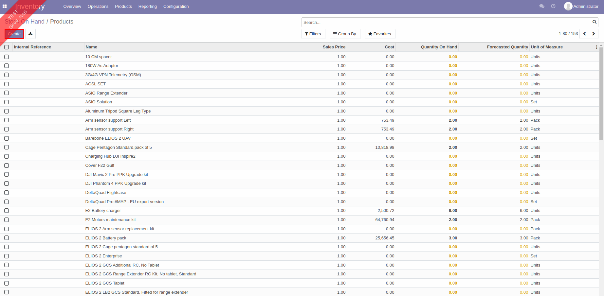
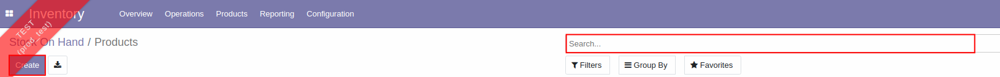
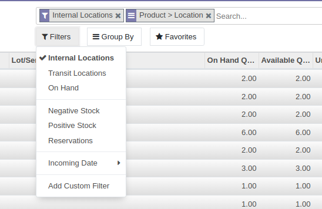
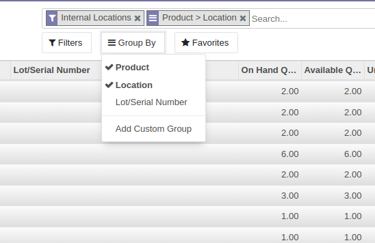

# รายงานสินค้าคงเหลือ (Inventory Report)

## การดูข้อมูลรายงานสินค้าคงเหลือ

**Menu ::** Inventory > Reporting > Inventory Report

1. ระบบจะแสดงหน้าต่าง **Stock On Hand** ที่แสดงสถานะของสินค้าคงเหลือ ณ ปัจจุบันขึ้นมา ซึ่งประกอบไปด้วย
        
        1) Product: รายชื่อสินค้าคงเหลือ
        2) Location: สถานที่เก็บสินค้าคงเหลือ
        3) Lot/Serial Number: เลขรหัสสินค้าคงเหลือ
        4) On Hand Quantity: จำนวนสินค้าคงเหลือที่มีอยู่ในคลังสินค้า
        5) Available Quantity: จำนวนสินค้าคงเหลือในคลังสินค้าที่พร้อมขาย(ไม่ได้ถูกสำรองไว้ขายในคำสั่งขาย)
        6) Unit of Measure: หน่วยนับของสินค้าคงเหลือ
        7) Value: มูลค่าของสินค้าคงเหลือ

     

2. สามารถกดลูกศร drop down เพื่อดูรายละเอียดของสินค้าแต่ละตัวได้ ตามตัวอย่างด้านล่าง

     

3. สามารถกดปุ่ม **Inventory at Date** เพื่อดูรายงานสถานะสินค้าคงเหลือ ณ วันที่ที่เรากำหนดได้

     

    เมื่อกดเข้าไปแล้วระบบจะแสดงหน้าต่างด้านล่าง สามารถเลือกวันที่ที่ต้องการดึงข้อมูลจากระบบได้ จากนั้นกดปุ่ม **Confirm**

    

    ระบบจะแสดงหน้าต่างด้านล่างซึ่งเป็นรายงานสถานะสินค้าคงเหลือ ณ วันที่ที่ผู้ใช้ต้องการดึงข้อมูลจากระบบ

    ซึ่งในหน้าต่างนี้จะมีข้อมูลเพิ่มเติมในส่วนของ **ราคาขาย(Sales Price)** และ **ต้นทุนขาย(Cost)** ของสินค้าคงเหลือ

    

4. สามารถค้นหาชื่อของสินค้าที่ต้องการดูข้อมูลได้ในปุ่ม **Search** และสามารถเพิ่มสินค้าใหม่เข้าไปได้ผ่านการกดปุ่ม Create 

    

    สามารถเลือกให้แสดงข้อมูลสินค้าเพียงแค่บางรายการ โดยการกำหนดเงื่อนไข **Filters** ต่างๆ ได้แก่ สถานที่ของสินค้าคงเหลือว่าเป็นคลังสินค้ารูปแบบไหน สถานะของสินค้าคงเหลือว่าเป็นสินค้าที่ถูกสำรองไว้เพื่อการขายหรือมีจำนวนสินค้าปกติหรือติดลบ รวมถึงเวลาที่สินค้าคงเหลือจะมาส่งที่คลังสินค้า

     

    เลือกวิธีการแสดงข้อมูลได้ว่าจะให้แสดงรายสินค้า, สถานที่ หรือเลขรหัสของสินค้าคงเหลือ ด้วยปุ่ม **Group By** 
    
     