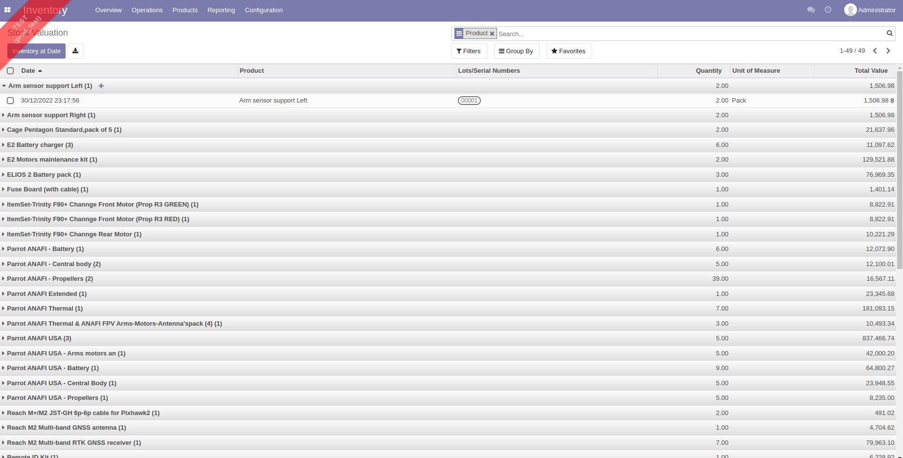
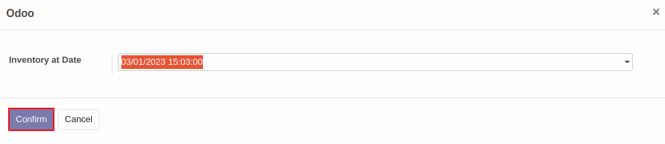
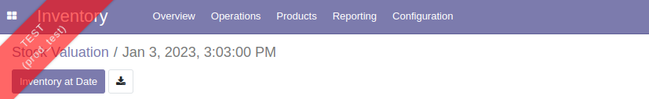

# รายงานมูลค่าสินค้าคงเหลือ (Inventory Valuation)

## การดูข้อมูลรายงานการพยากรณ์สินค้าคงเหลือ

**Menu ::** Inventory > Reporting > Inventory Valuation

1. ระบบจะแสดงหน้าต่าง **Stock Valuation** ขึ้นมา ที่เป็นรายงานแสดงมูลค่าปัจจุบันของสินค้าคงเหลือ ซึ่งประกอบไปด้วย

        1) Date: วันที่ที่แสดงมูลค่าสินค้าคงเหลือ
        2) Product: รายการสินค้าคงเหลือ
        3) Lot/Serial Numbers: เลขรหัสสินค้าคงเหลือ
        4) Quantity: จำนวนสินค้าคงเหลือ
        5) Unit of Measure: หน่วยนับของสินค้าคงเหลือ
        6) Total Value: มูลค่าของสินค้าคงเหลือ

     

2. สามารถกดปุ่ม **Inventory at Date** เพื่อกำหนดวันที่และเวลาที่ต้องการดึงข้อมูลได้ โดยเมื่อกดปุ่มแล้วระบบจะแสดงหน้าต่างให้เลือกวันที่และเวลา จากนั้นกด **Confirm** ระบบจะแสดงข้อมูลต้นทุนของสินค้าคงเหลือ ณ วันที่และเวลาที่กำหนดไว้

    
    