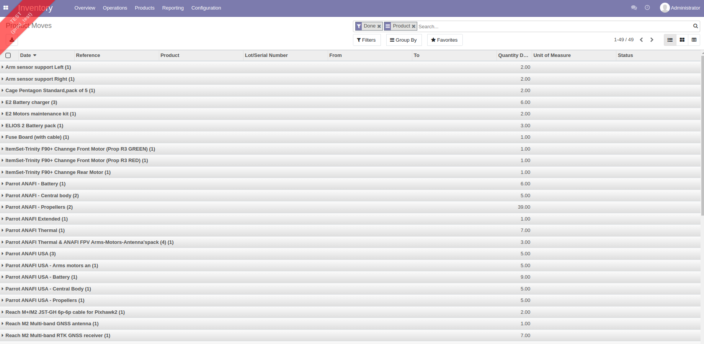
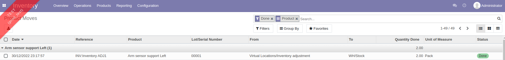
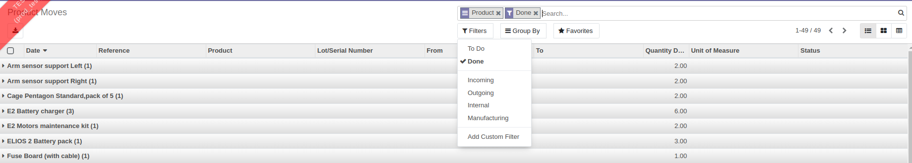
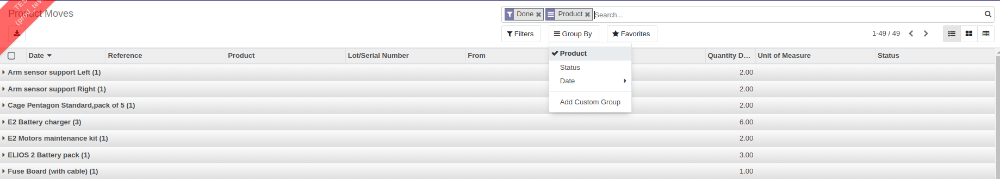

# รายงานการเคลื่อนไหวของสินค้าคงเหลือ (Product Moves)

## การดูข้อมูลรายงานการเคลื่อนไหวของสินค้าคงเหลือ

**Menu ::** Inventory > Reporting > Product Moves

1. ระบบจะแสดงหน้าต่าง **Product Moves** ขึ้นมา ที่เป็นรายงานแสดงการเคลื่อนไหวของสินค้าคงเหลือ ซึ่งประกอบไปด้วย

        1) Date: วันที่ที่สินค้าคงเหลือมีการเคลื่อนไหว
        2) Reference: รายการอ้างอิงการเคลื่อนไหว เช่น เป็นการเคลื่อนไหวที่เกิดจากรายการ Adjust สินค้าคงเหลือ
        2) Product: รายการสินค้าคงเหลือ
        3) Lot/Serial Numbers: เลขรหัสสินค้าคงเหลือ
        4) From: สถานที่ต้นทางของสินค้าคงเหลือ
        5) To: สถานที่ปลายทางของสินค้าคงเหลือ
        6) Quantity Done: จำนวนของสินค้าคงเหลือที่มีการเคลื่อนไหว
        5) Unit of Measure: หน่วยนับของสินค้าคงเหลือ
        6) Status: สถานะการเคลื่อนไหวของสินค้าคงเหลือ

     
     

2. สามารถค้นหาชื่อสินค้าคงเหลือที่ต้องการดึงข้อมูลทางช่อง **Search** รวมถึง **Filters status** ให้แสดงข้อมูลแค่บางรายการเคลื่อนไหวของสินค้าคงเหลือ และเลือกวิธีการแสดงข้อมูลได้ว่าจะให้แสดงรายสินค้า, สถานะ หรือวันที่ ด้วยปุ่ม **Group By** 

    
    