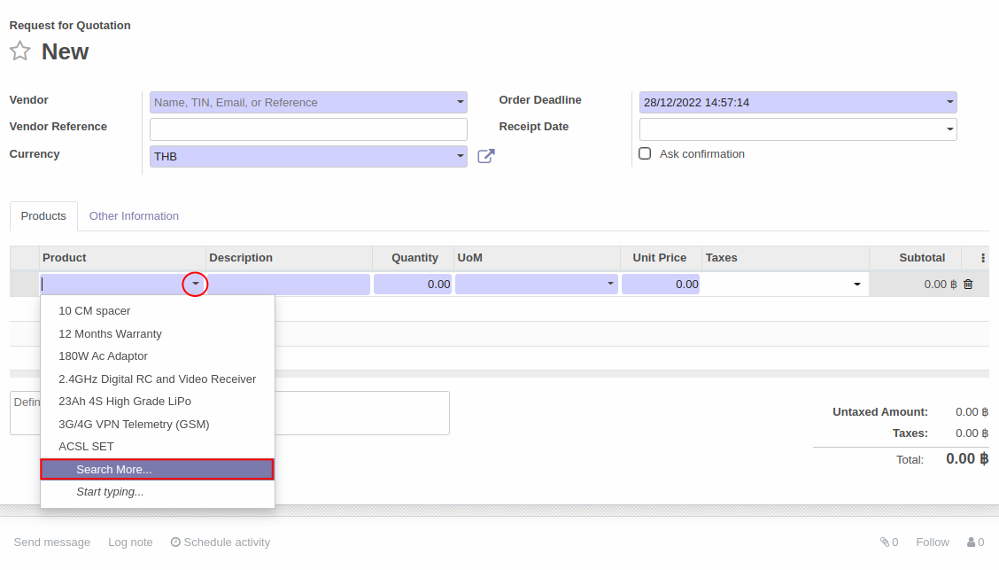
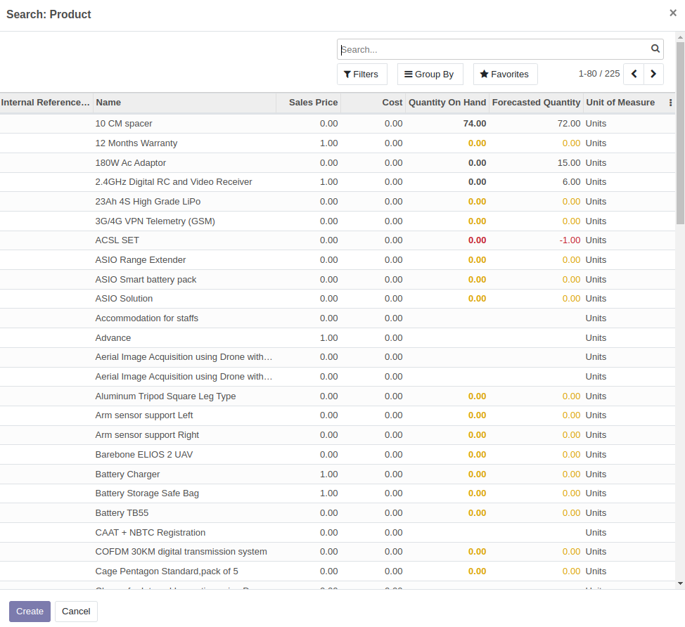
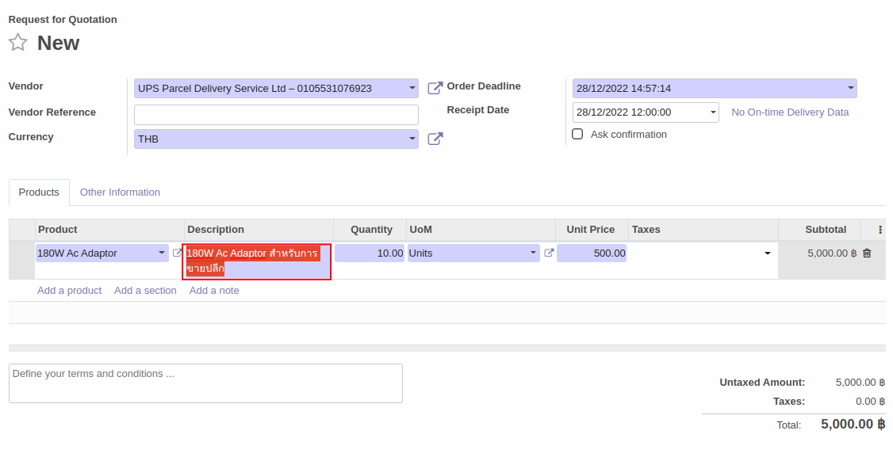
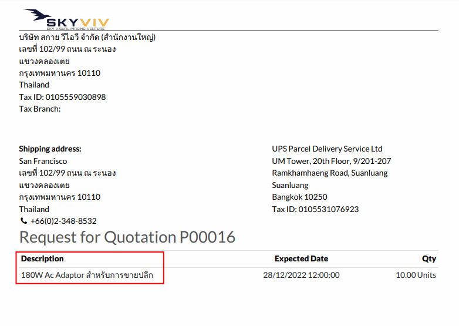
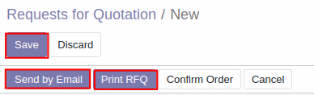
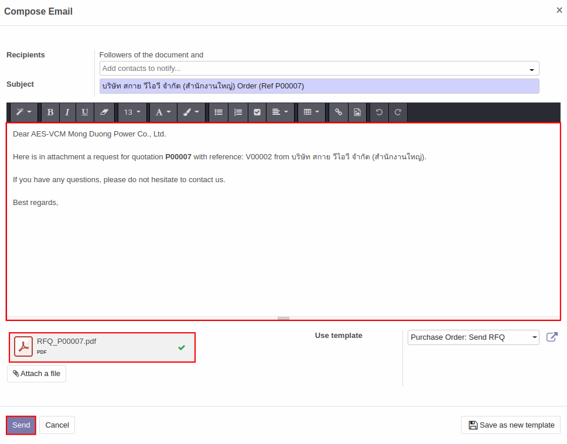
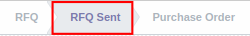

# คำขอใบเสนอราคา (Request for Quotation)

## การสร้างคำขอใบเสนอราคา (RFQ)
เมื่อมีการตกลงกันว่าจะทำการสั่งซื้อสินค้า แล้วผู้ใช้งานจะต้องสร้างคำขอใบเสนอราคา (RFQ) ส่งไปให้ Vendor โดยวิธีการสร้างคำขอใบเสนอราคาสามารถทำได้ตามวิธีด้านล่าง

**Menu ::** Purchase > Order > Request for Quotaion

1. กดปุ่ม Create เพื่อสร้างคำขอใบเสนอราคา

    

2. ระบบจะนำไปสู่หน้าต่างให้กรอกข้อมูลเพื่อสร้างคำขอใบเสนอราคา(RFQ) ดังนี้
    1. Vendor: เลือก vendor ที่จะสั่งซื้อ
    2. Vendor Reference: สำหรับใส่หมายเลขอ้างอิงของ vendor
    3. Currency: สกุลเงินที่ต้องการสั่งซื้อ
    4. Add a product: เพิ่มสินค้าที่ต้องการสั่งซื้อ พร้อมใส่จำนวน, ราคาซื้อที่ตกลงไว้กับ vendor, หน่วยนับ(UoM) และภาษีมูลค่าเพิ่ม(ถ้ามี)
       
        Add a section: เพิ่มส่วนคั่นรายการสั่งซื้อ

        Add a note: เพิ่มหมายเหตุประกอบสินค้าที่สั่งซื้อ 
        
    5. Order Deadline: กำหนดเวลาที่ต้องการสั่งซื้อ (ภายในวันที่และเวลาเท่าไหร่)
    6. Defind your terms and conditions: สำหรับเงื่อนไขและหมายเหตุเพิ่มเติม

    

    เมื่อกดปุ่ม **Add a product**

        1. ระบบจะเพิ่มบรรทัดสำหรับเพิ่ม
            - สินค้าที่ต้องการสั่งซื้อ(Product)
            - คำอธิบายรายการสินค้า(Description)
            - จำนวนของสินค้าที่ต้องการสั่งซื้อ(Quantity)
            - ราคาซื้อ(Unit Price)
            - หน่วยของสินค้าที่ขาย(UoM)
            - ภาษีขาย(Taxes)
        2. กดลูกศร dropdown เพื่อเลือกสินค้าที่ต้องการสั่งซื้อ โดยสามารถเลือกได้ทั้งสินค้าที่เป็นชิ้นและเป็นชุดที่กำหนดไว้ (set/kit) 
        3. เมื่อกดปุ่ม Search More.. จะสามารถเลือกดูสินค้าตัวอื่นนอกเหนือจากที่ระบบแสดงผลขึ้นมาได้ รวมถึงจำนวนสินค้าคงเหลือที่มีอยู่ ณ ปัจจุบัน (Quantity On Hand)

    
    

    สำหรับ **คำอธิบายรายการสินค้า (Description)**

        - เมื่อใส่คำอธิบายรายการสินค้าที่ต้องการสั่งซื้อลงไป ระบบจะไปแสดงผลคำอธิบายดังกล่าวบน
        แบบฟอร์ม RFQ ตามตัวอย่างด้านล่าง

    
    

3. เมื่อกรอกข้อมูลเรียบร้อยแล้วให้กดปุ่ม **save** เพื่อบันทึกข้อมูล หรือกด discard หากไม่ต้องการบันทึกข้อมูล กด print RFQ หากต้องการพิมพ์ใบ RFQ ออกมาดูเป็นไฟล์ pdf 

    

4. กดปุ่ม **Send by Email** เพื่อส่ง RFQ ไปให้ vendor หลังจากใส่ที่อยู่อีเมลของ vendor แล้วระบบจะแสดงหน้าต่างด้านล่างขึ้นมาเพื่อแก้ไขหรือเพิ่มเติมเนื้อหาอีเมลที่จะส่ง รวมถึงแนบไฟล์ RFQ ไว้ด้วย ถ้าต้องการแนบไฟล์เพิ่มเติมสามารถกด Attach a file ได้ หลังจากตรวจสอบความถูกต้องเรียบร้อยแล้วกดปุ่ม **send** เพื่อส่ง

    

5. หลังจากส่ง RFQ ไปยัง vendor สถานะของเอกสารจะเปลี่ยนเป็น **RFQ sent**

    

