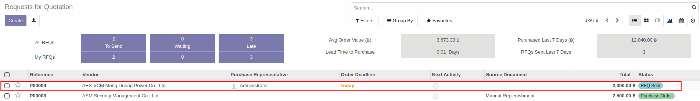
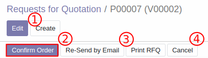
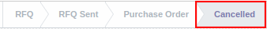
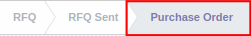

# การยืนยันคำสั่งซื้อ (Purchase Order)

## วิธียืนยันคำสั่งซื้อ (การเปิด PO)
หลังได้รับใบเสนอราคาจาก vendor และตัดสินใจเลือก vendor ที่จะทำการสั่งซื้อสินค้าได้แล้ว สามารถยืนยันคำสั่งซื้อได้ตามวิธีด้านล่าง

**Menu ::** Purchase > Order > Request for Quotation

1. เลือกเอกสารที่ต้องการ **ยืนยันคำสั่งซื้อ** ในหน้าต่างด้านล่าง
    
    โดยสถานะของเอกสารที่รอการยืนยันคำสั่งซื้อจะมีสถานะเป็น **RFQ sent**
    ส่วนเอกสารที่ได้รับการยืนยันคำสั่งซื้อแล้วจะมีสถานะเป็น **Purchase Order**

    

2. เมื่อกดเข้าไปในเอกสาร ระบบจะแสดงหน้าต่างด้านล่าง

    1. Edit: สามารถกดเพื่อแก้ไขข้อมูลได้
    2. **Confirm Order**: ถ้าข้อมูลถูกต้องแล้ว สามารถกดเพื่อยืนยันคำสั่งซื้อ
    3. Re-Send by Email: ส่งอีเมลให้ vendor อีกครั้งหลังการแก้ไขข้อมูล
    4. Cancel: กดเพื่อยกเลิก RFQ/PO

    

    ถ้ากดปุ่ม Cancel เพื่อยกเลิก RFQ/ PO สถานะของเอกสารจะเปลี่ยนจาก RFQ sent/ Purchase Order เป็น **Cancelled**

    

3. เมื่อกดยืนยันคำสั่งซื้อ สถานะเอกสารจะเปลี่ยนจาก RFQ sent เป็น **Purchase Order** แสดงถึงการยืนยันคำสั่งซื้อ

    

