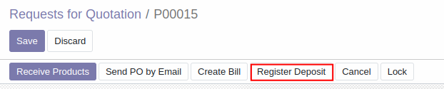
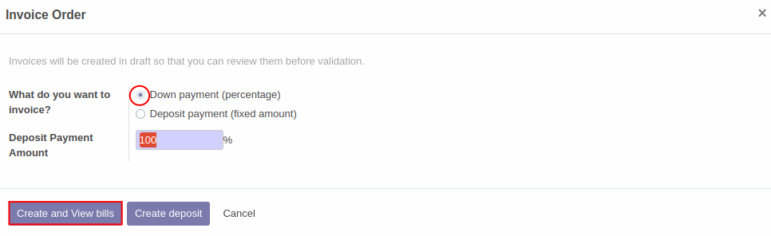
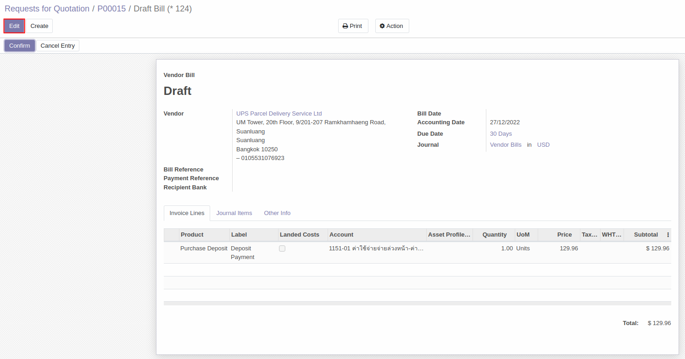
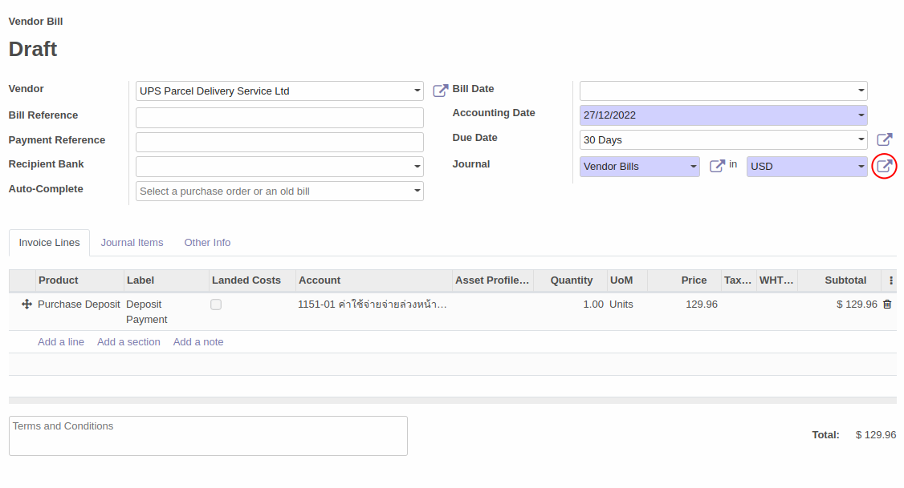
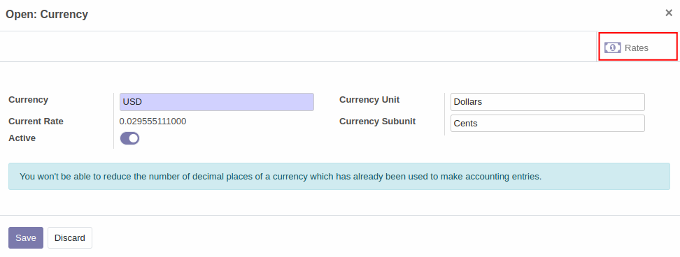
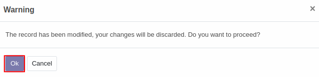
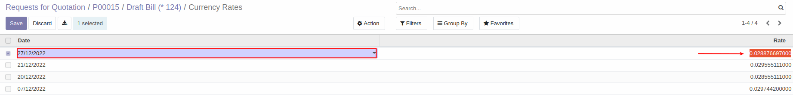
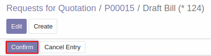
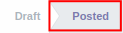

# การจ่ายค่าสินค้าล่วงหน้า (Register Deposit)

## วิธีการจ่ายค่าสินค้าล่วงหน้า (Register Deposit)
การสร้างเอกสารเพื่อทำการจ่ายค่าสินค้าล่วงหน้าก่อนได้รับสินค้าสามารถทำได้ตามวิธีด้านล่าง

**Menu ::** Purchase > Order > Request for Quotaion

1. เลือกเอกสารคำสั่งซื้อที่ต้องการทำจ่ายค่าสินค้าล่วงหน้า กดเข้าไปในเอกสาร แล้วสามารถกดที่ปุ่ม **Register Deposit** บนแถบเมนูตามภาพด้านล่าง

    

2. ระบบจะแสดงหน้าต่าง Invoice Order ขึ้นมา 
    - เลือก **Down payment** (percentage)
    - ในช่อง Deposit Payment Amount กรอก **100%** 
    - กด Create and View bills

    

3. ระบบจะแสดงหน้าต่าง **Draft Bill** ขึ้นมา กดปุ่ม **Edit** เพื่อแก้ไขข้อมูล

    

4. หากคำสั่งซื้อเป็นสกุลเงินต่างประเทศ สามารถเข้าไปตั้งค่าอัตราแลกเปลี่ยนได้โดยกดเข้าไปในปุ่ม External link ที่อยู่บริเวณด้านหลังสกุลเงิน ตามวงกลมสีแดงในภาพด้านล่าง

    

5. ระบบจะแสดงหน้าต่าง Open: Currency ขึ้นมา ให้กดเข้าไปที่ปุ่ม **Rates** ในกรอบสีแดงด้านล่าง 

    

6. ระบบจะแจ้งเตือนว่าข้อมูลที่ใส่ในหน้า Open: Currency จะไม่ถูกบันทึกหากเราต้องการดำเนินการต่อไป กดปุ่ม **Ok**

    

7. ระบบจะแสดงหน้าต่าง **Currency Rates** 
    - กดปุ่ม **Create** เพื่อสร้างอัตราแลกเปลี่ยน ของวันที่ที่ต้องการทำจ่ายค่าสินค้าล่วงหน้า
    - สำหรับ **วิธีการคำนวณอัตราแลกเปลี่ยน** ทำได้ดังนี้

        1) ดูข้อมูลอัตราแลกเปลี่ยนว่า ณ วันที่ดังกล่าวค่าเงิน 1 USD คิดเป็นเท่ากับกี่ THB

        2) จากนั้นนำ 1 ไปหารด้วยค่าเงิน THB เพื่อคิดกลับมาว่า 1 THB คิดเป็นเท่ากับกี่ USD 

        - **ตัวอย่างการคำนวณ** 

        - อัตราแลกเปลี่ยน ณ วันที่ 27 ธันวาคม 2565 
        -  1 USD = 34.63 THB
        - 1 THB = 1/34.63 = **0.0288767** USD
        

    - นำอัตราแลกเปลี่ยนที่คำนวณได้ไปใส่ในช่อง **Rate** ด้านขวามือ
    - หลังสร้างข้อมูลอัตราแลกเปลี่ยนเรียบร้อยแล้ว กดปุ่ม **Save**

     
    
8. กลับมาที่หน้าต่าง Draft Bill แล้วกดปุ่ม **Confirm** เพื่อยืนยันเอกสารการทำจ่ายค่าสินค้าล่วงหน้า
     
     

    สถานะของเอกสารจะเปลี่ยนจาก Draft เป็น Posted

    

