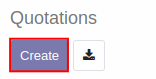
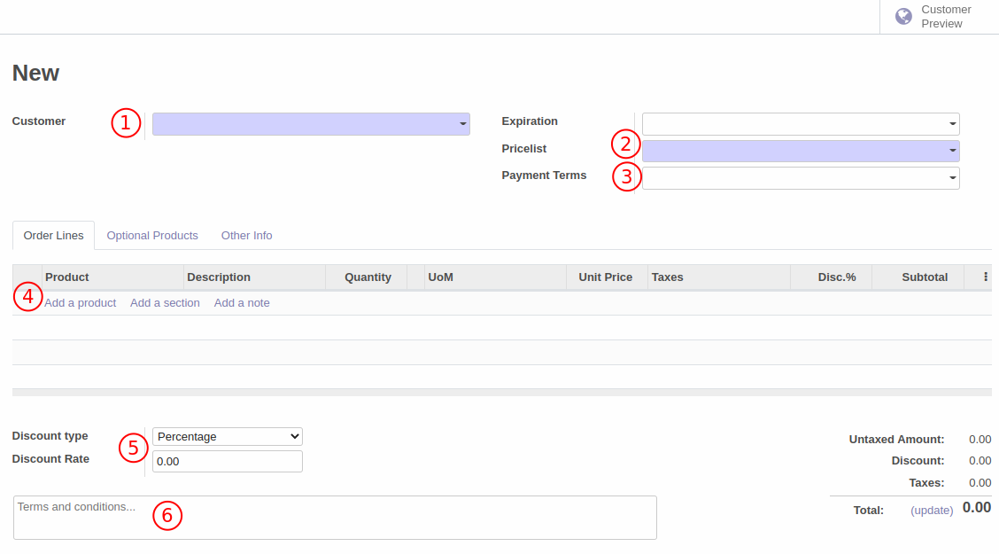
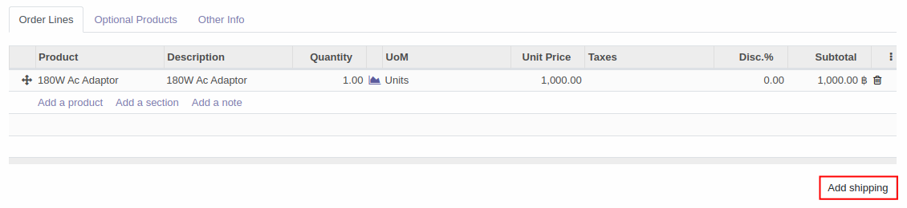
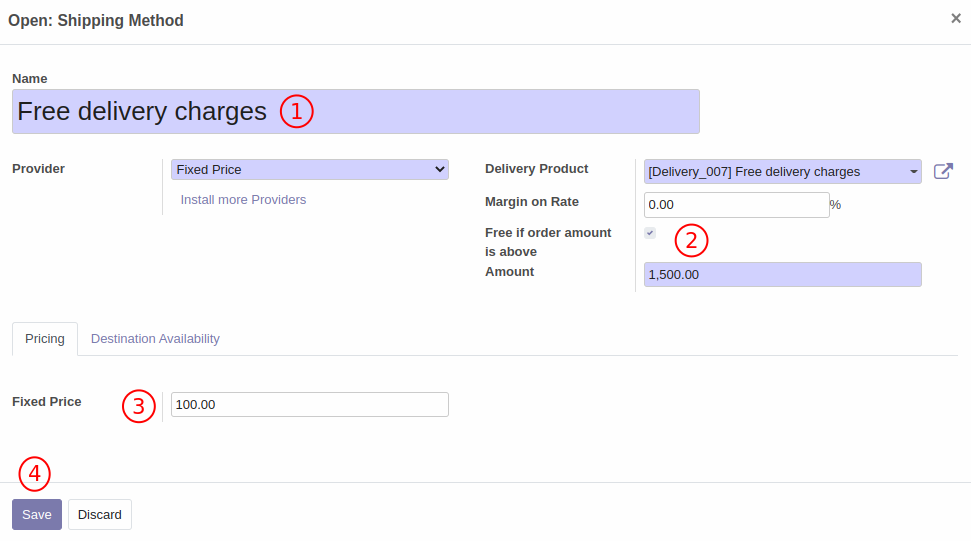
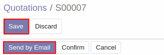
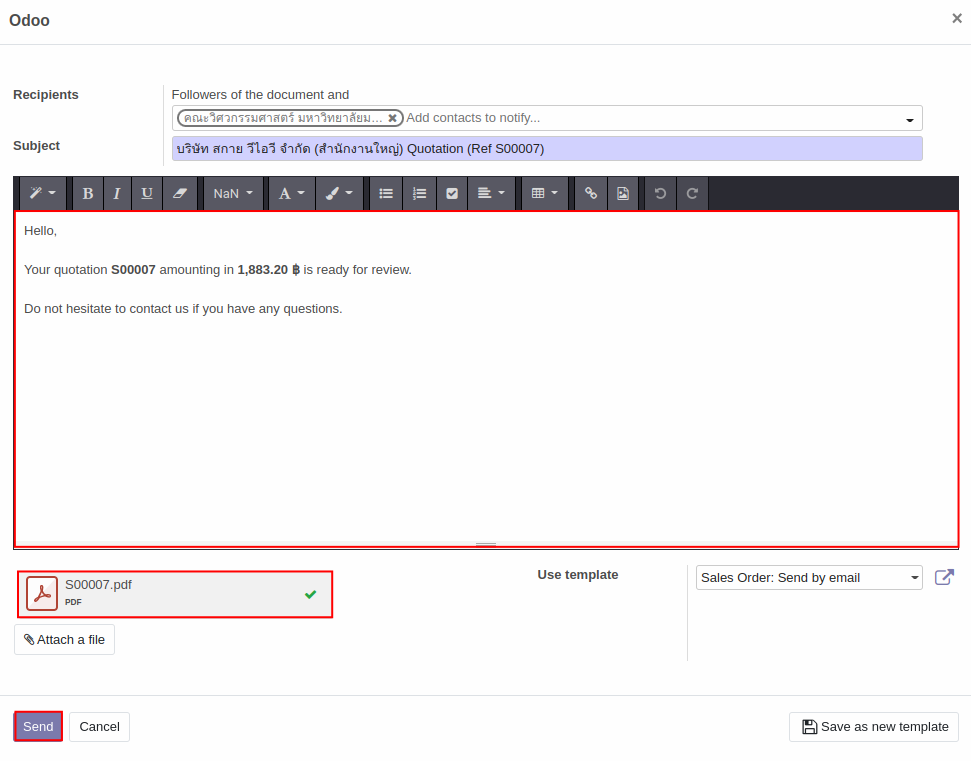
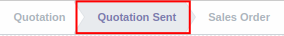

# ใบเสนอราคา (Quotation)

## การสร้างใบเสนอราคา (Quotation)
วิธีการสร้างใบเสนอราคาสามารถทำได้ตามวิธีด้านล่าง

**Menu ::** Sales > Order > Quotaion

1. กดปุ่ม Create เพื่อสร้างใบเสนอราคา

    

2. ระบบจะนำไปสู่หน้าต่างให้กรอกข้อมูลเพื่อสร้างใบเสนอราคา(Quotation) ดังนี้
    1. Customer: เลือก Customer ที่จะขายสินค้า
    2. Pricelist: ราคาขายของสินค้าต่างๆที่กำหนดไว้ให้ลูกค้า
    3. Payment Terms: เงื่อนไขการชำระเงิน
    4. Add a product: เพิ่มสินค้าที่ต้องการขาย พร้อมใส่จำนวน, ราคาขายที่ตกลงไว้กับ customer, หน่วย(UoM) และภาษี(ถ้ามี)
       
        Add a section: เพิ่มส่วนคั่นรายการขาย

        Add a note: เพิ่มหมายเหตุประกอบสินค้าที่ขาย 

    5. Discount type: ประเภทของส่วนลดที่มีให้ลูกค้า สามารถเลือกได้ระหว่าง ร้อยละ(Percentage) และจำนวน(amount) หรือถ้าไม่มีส่วนลดสามารถเลือกช่องว่างได้

         Discount Rate: ใส่ส่วนลดที่ให้ลูกค้า เช่น 10% หรือ 20บาท

    6. Terms and conditions: สำหรับเงื่อนไขและหมายเหตุเพิ่มเติม

    

    **ค่าบริการขนส่ง (Shipping)**

    เมื่อเพิ่มข้อมูลสินค้าที่จะขายใน Add a product ระบบจะแสดงปุ่ม **Add Shipping** สามารถกดในกรณีที่ต้องการเพิ่มค่าบริการขนส่งสินค้า 

    
    เมื่อกดแล้วระบบจะแสดงหน้าต่างด้านล่างขึ้นมา ซึ่งสามารถเข้าไปตั้งค่าเกี่ยวกับค่าบริการขนส่งได้โดยกดเข้าไปที่กล่องสี่เหลี่ยมด้านขวา

    

    เมื่อกดเข้าไปแล้ว ระบบจะแสดงหน้าต่างตามด้านล่าง

    1. Name: ชื่อของค่าบริการขนส่ง
    2. Free if order amount is above: ใส่เครื่องหมายถูกในกรณีที่อยากให้ยกเว้นค่าบริการขนส่งหากยอดขายถึงตามกำหนด โดยกำหนดยอดขายไว้ในช่อง amount 
    3. Fixed Price: กำหนดค่าบริการขนส่ง
    4. Save: กดบันทึกข้อมูล

    

3. เมื่อกรอกข้อมูลเรียบร้อยแล้วให้กดปุ่ม **save** เพื่อบันทึกข้อมูล หรือกด discard หากไม่ต้องการบันทึกข้อมูล 

    กดปุ่ม **Send by Email** เพื่อส่ง Quotation ไปให้ customer หลังจากใส่ที่อยู่อีเมลของ vendor แล้วระบบจะแสดงหน้าต่างด้านล่างขึ้นมาเพื่อแก้ไขหรือเพิ่มเติมเนื้อหาอีเมลที่จะส่ง รวมถึงแนบไฟล์ RFQ ไว้ด้วย ถ้าต้องการแนบไฟล์เพิ่มเติมสามารถกด Attach a file ได้ หลังจากตรวจสอบความถูกต้องเรียบร้อยแล้วกดปุ่ม **send** เพื่อส่ง

    
    

4. หลังจากส่ง Quotation ไปยัง customer สถานะของเอกสารจะเปลี่ยนเป็น **Quotation sent**

    

