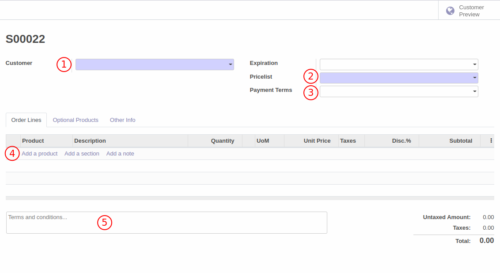
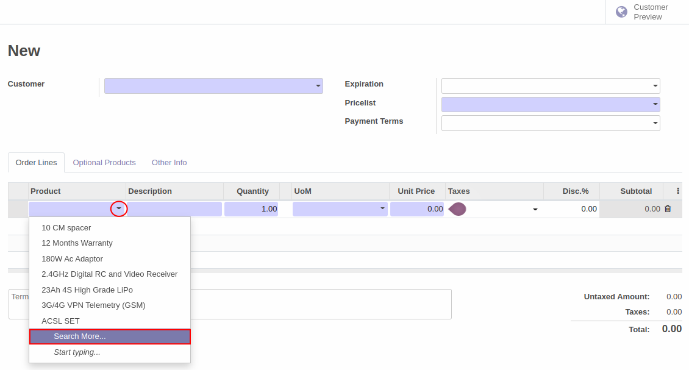
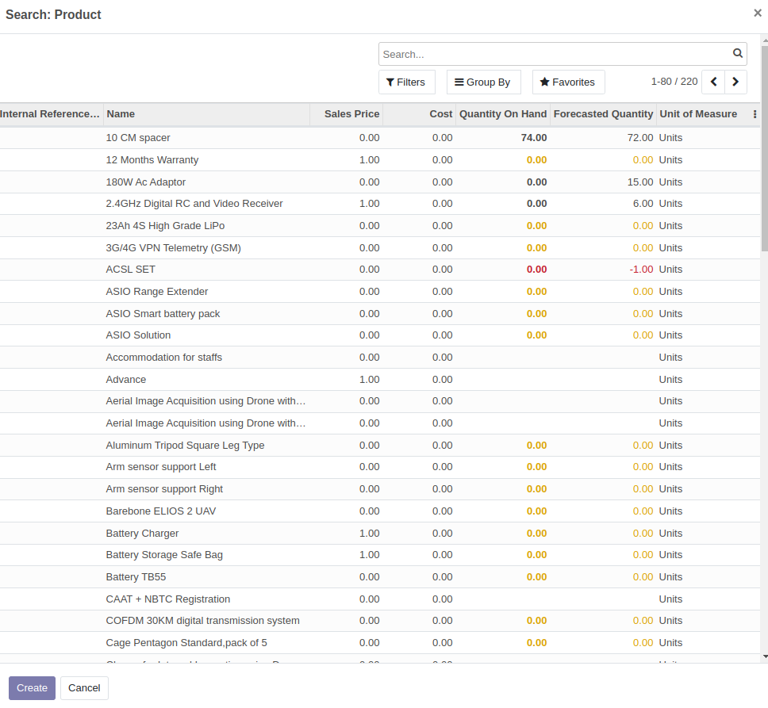
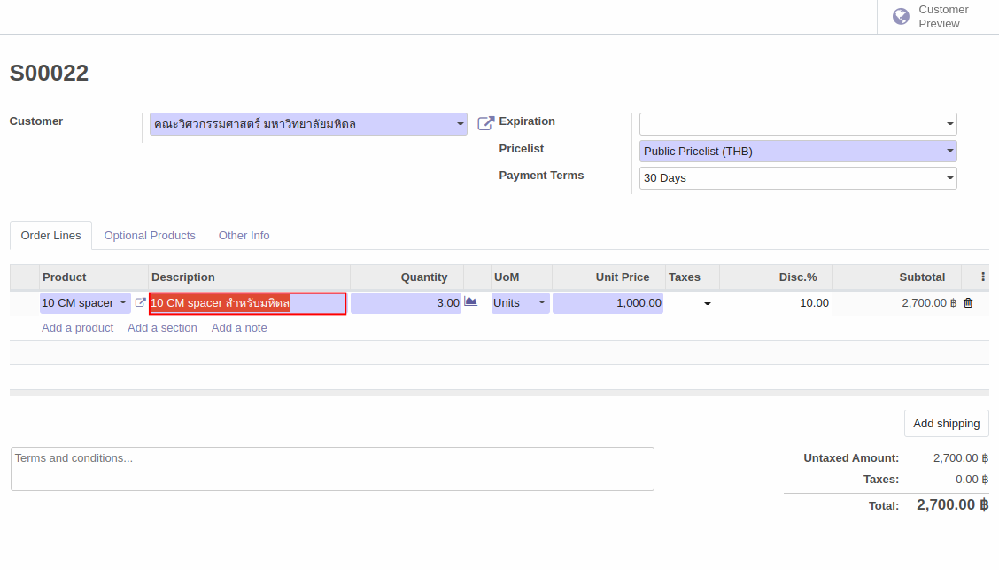
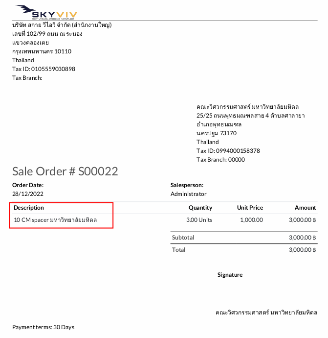

# ใบเสนอราคา (Quotation)

## การสร้างใบเสนอราคา (Quotation)
วิธีการสร้างใบเสนอราคาสามารถทำได้ตามวิธีด้านล่าง

**Menu ::** Sales > Order > Quotaion

1. กดปุ่ม Create เพื่อสร้างใบเสนอราคา

    

2. ระบบจะนำไปสู่หน้าต่างให้กรอกข้อมูลเพื่อสร้างใบเสนอราคา(Quotation) ดังนี้
    1. Customer: เลือก Customer ที่จะขายสินค้า
    2. Pricelist: ราคาขายของสินค้าต่างๆที่กำหนดไว้ให้ลูกค้า
    3. Payment Terms: เงื่อนไขการชำระเงิน
    4. Add a product: เพิ่มสินค้าที่ต้องการขาย พร้อมใส่จำนวน, ราคาขายที่ตกลงไว้กับ customer, หน่วยนับ(UoM) และภาษีมูลค่าเพิ่ม(ถ้ามี)

       Add a section: เพิ่มส่วนคั่นรายการขาย
       
       Add a note: เพิ่มหมายเหตุประกอบสินค้าที่ขาย 
    
    5. Terms and conditions: สำหรับเงื่อนไขและหมายเหตุเพิ่มเติม

    
       
    เมื่อกดปุ่ม **Add a product**

        1. ระบบจะเพิ่มบรรทัดสำหรับเพิ่ม
            - สินค้าที่ต้องการขาย(Product)
            - คำอธิบายรายการสินค้า(Description)
            - จำนวนของสินค้าที่ต้องการขาย(Quantity)
            - ราคาขาย(Unit Price)
            - หน่วยของสินค้าที่ขาย(UoM)
            - ภาษีมูลค่าเพิ่ม(Taxes)
            - ส่วนลดที่ให้ลูกค้าโดยใส่เป็นจำนวนร้อยละ(Disc%)
        2. กดลูกศร dropdown เพื่อเลือกสินค้าที่ต้องการขาย โดยสามารถเลือกได้ทั้งสินค้าที่เป็นชิ้นและเป็นชุดที่กำหนดไว้ (set/kit) 
        3. เมื่อกดปุ่ม Search More.. จะสามารถเลือกดูสินค้าตัวอื่นนอกเหนือจากที่ระบบแสดงผลขึ้นมาได้ รวมถึงจำนวนสินค้าคงเหลือที่มีอยู่ ณ ปัจจุบัน (Quantity On Hand)

    
    

    สำหรับ **คำอธิบายรายการสินค้า (Description)**

        - เมื่อใส่คำอธิบายรายการสินค้าที่ขายลงไป ระบบจะไปแสดงผลคำอธิบายดังกล่าวบนแบบฟอร์ม 
        Sales Order ตามตัวอย่างด้านล่าง

    สำหรับ **การเช็คจำนวนสินค้าคงเหลือในสต็อค**
    
        สามารถดูได้จากไอคอนรูปกราฟด้านข้างคอลัมน์ Quantity 
            - ถ้าไอคอนเป็น สีม่วง หมายความว่า มีของในสต็อค เพียงพอ  
            - ถ้าไอคอนเป็น สีแดง หมายความว่า มีของในสต็อค ไม่เพียงพอ 

    
    

3. เมื่อกรอกข้อมูลเรียบร้อยแล้วให้กดปุ่ม **save** เพื่อบันทึกข้อมูล หรือกด discard หากไม่ต้องการบันทึกข้อมูล 

    กดปุ่ม **Send by Email** เพื่อส่ง Quotation ไปให้ customer หลังจากใส่ที่อยู่อีเมลของ vendor แล้วระบบจะแสดงหน้าต่างด้านล่างขึ้นมาเพื่อแก้ไขหรือเพิ่มเติมเนื้อหาอีเมลที่จะส่ง รวมถึงแนบไฟล์ RFQ ไว้ด้วย ถ้าต้องการแนบไฟล์เพิ่มเติมสามารถกด Attach a file ได้ หลังจากตรวจสอบความถูกต้องเรียบร้อยแล้วกดปุ่ม **send** เพื่อส่ง

    
    
    

4. หลังจากส่ง Quotation ไปยัง customer สถานะของเอกสารจะเปลี่ยนเป็น **Quotation sent**

    

