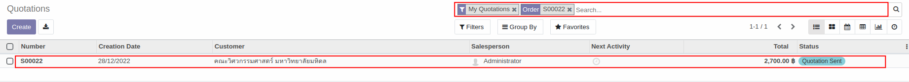
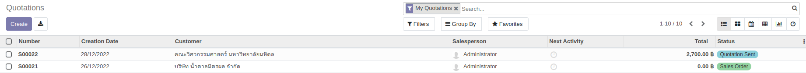
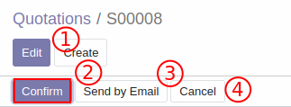
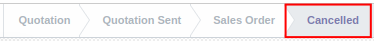
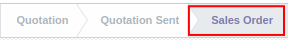

# การยืนยันคำสั่งขาย (Sales Order)

## วิธียืนยันคำสั่งขาย (การเปิด SO)
หลังได้รับการยืนยันใบเสนอราคาหรือการตัดสินใจซื้อสินค้าจาก customer แล้ว สามารถยืนยันคำสั่งขายได้ตามวิธีด้านล่าง

**Menu ::** Sales > Order > Quotation

1. เลือกเอกสารที่ต้องการ **ยืนยันคำสั่งขาย** โดยพิมพ์เลขที่เอกสาร (SO number) จากช่อง **search**

    
    โดยสถานะของเอกสารที่รอการยืนยันคำสั่งขายจะมีสถานะเป็น **Quotation sent** ส่วนเอกสารที่ได้รับการยืนยันคำสั่งขายแล้วจะมีสถานะเป็น **Sales Order**

    

2. เมื่อกดเข้าไปในเอกสาร ระบบจะแสดงหน้าต่างด้านล่าง

    1. Edit: สามารถกดเพื่อแก้ไขข้อมูลได้
    2. **Confirm**: ถ้าข้อมูลถูกต้องแล้ว สามารถกดเพื่อยืนยันคำสั่งขาย
    3. Send by Email: ส่งอีเมลให้ customer อีกครั้งหลังการแก้ไขข้อมูล
    4. Cancel: กดเพื่อยกเลิก Quotation/SO

    

    ถ้ากดปุ่ม Cancel เพื่อยกเลิก Quotation/ SO สถานะของเอกสารจะเปลี่ยนจาก Quotation sent/ Sales Order เป็น **Cancelled**

    

3. เมื่อกดยืนยันคำสั่งขาย สถานะเอกสารจะเปลี่ยนจาก Quotation sent เป็น **Sales Order** แสดงถึงการยืนยันคำสั่งขาย

    