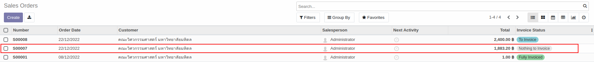
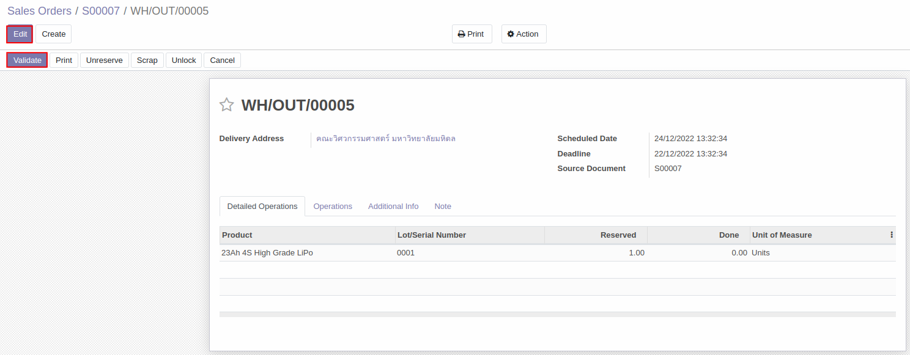

# การส่งสินค้าออกจากคลัง (Stock Out)

## วิธีการส่งสินค้าออกจากคลัง 
เมื่อต้องการส่งสินค้าออกจากคลังสินค้าไปให้ลูกค้า สามารถทำได้ตามวิธีด้านล่าง

**Menu ::** Sales > Orders > Orders

1. เลือกเอกสารที่ต้องการ **กดส่งสินค้าออก** ในหน้าต่างด้านล่าง
    
    โดยสถานะของเอกสาร มีดังต่อไปนี้

        1. Nothing to invoice: สถานะรอส่งสินค้าและยังไม่ได้ออก invoice
        2. To invoice: สถานะส่งสินค้าแล้วรอออก invoice ให้ customer
        3. Fully Invoiced: สถานะส่งสินค้าและออก invoice ให้ customer เรียบร้อยแล้ว

    

2. เมื่อกดเข้าไปในเอกสารที่เลือก ระบบจะแสดงหน้าต่างด้านล่าง

    โดยเมื่อจะทำการส่งสินค้าให้ customer สามารถเข้าไปกดส่งสินค้าได้ที่ไอคอนรูปรถ **(Delivery)** 

    

3. เมื่อกดแล้วระบบจะแสดงหน้าต่างของเอกสารรับของ เพื่อให้ตรวจสอบ      (**Validate**) สินค้าที่ได้รับเข้ามา โดยสามารถกดปุ่ม 3 ขีดเพื่อใส่ Lot/Serial number ของสินค้าที่รับเข้ามาได้
   
     ซึ่งในขั้นตอนนี้สถานะของเอกสารจะแสดงเป็น **Ready**  

    

4. เมื่อกดปุ่ม 3 ขีดแล้ว ระบบจะแสดงหน้าต่างด้านล่างขึ้นมา 

    1. กดที่ **Add a line**  
    2. กำหนดเลข Lot/Serial Number รวมถึงจำนวนของสินค้าในแต่ละ Lot/Serial Number นั้น
    3. กด **Confirm**

    
    

5. เมื่อยืนยันการรับสินค้าเข้าแล้ว สถานะของเอกสารจะเปลี่ยนเป็น Done

    

---

 **กรณียังรับสินค้าไม่ครบตามจำนวนที่สั่ง**  

ถ้าจำนวนสินค้าที่กด Validate น้อยกว่าสินค้าที่เปิดคำสั่งซื้อไป ระบบจะแสดงหน้าต่างด้านล่างขึ้นมา

1. กด **Create Backorder** ในกรณีที่ต้องการให้ Vendor ส่งสินค้าที่ขาดตามมาทีหลัง
2. กด **No Backorder** ในกรณีที่จะรับสินค้าเท่าที่ได้รับ ไม่ต้องการสินค้าที่ขาด

