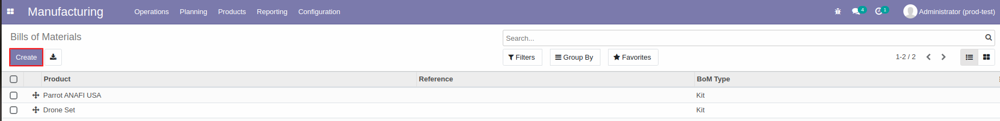
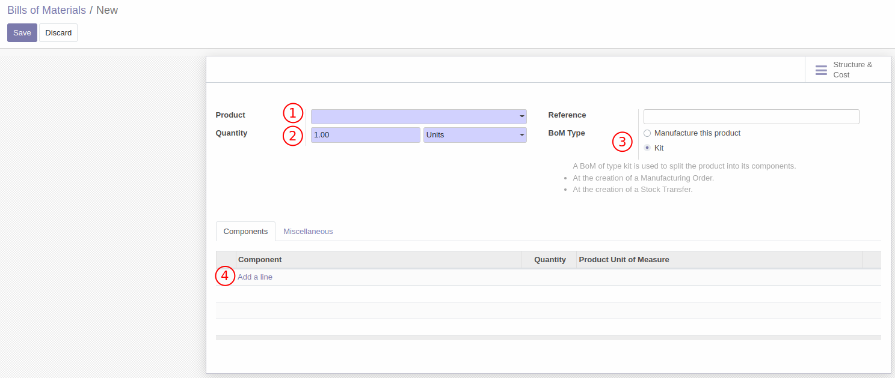
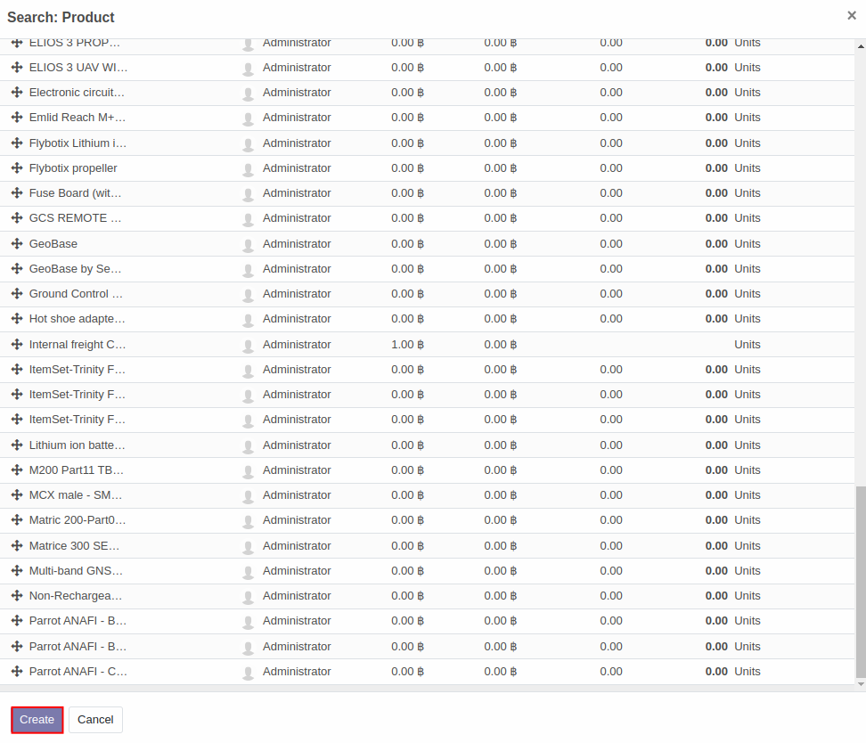
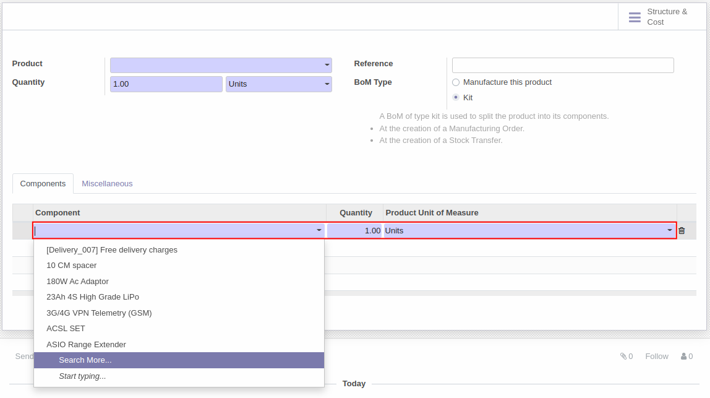
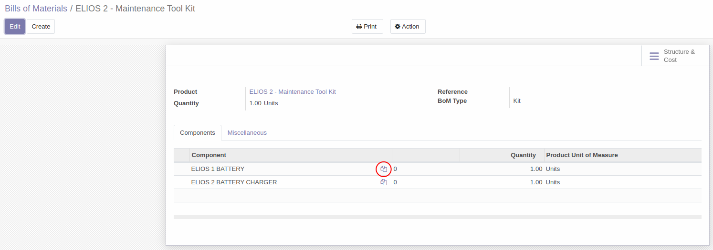
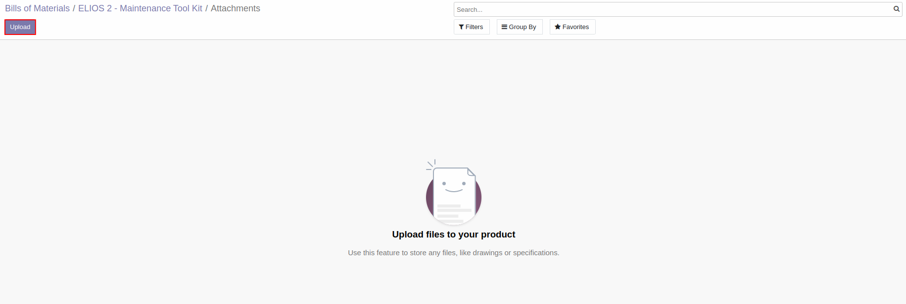

# การสร้างชุดของสินค้า (Set of products)

## วิธีการสร้างชุดของสินค้า 
เมื่อผู้ใช้งานต้องการขายสินค้าที่มีลักษณะเป็นชุด (Set/kit)
สามารถสร้างชุดสินค้าด้วย **Bills of Materials** ได้ตามวิธีด้านล่าง

**Menu ::** Manufacturing > Products > Bills of Materials

1. กดปุ่ม **Create** เพื่อสร้าง Bills of Materails ขึ้นมาใหม่

    

2. ระบบจะแสดงหน้าต่างด้านล่างขึ้นมา

    

    - 1) Product: กดปุ่ม drop down      เลือกชุดสินค้าที่ต้องการสร้างขึ้นมา              
        - โดยถ้ายังไม่มีชุดสินค้าสามารถกดปุ่ม Create ขึ้นมาได้
            

    - 2) Quantity: กำหนดจำนวนและหน่วยนับของชุดสินค้า 
    - 3) BoM Type: เลือกประเภทของ Bills of Materials ระหว่าง
        - ชุดของสินค้าเพื่อขาย (Kit)
        - สูตรที่นำไปใช้เพื่อการผลิตสินค้า (Manufacture this product)

    - 4) Component: กดปุ่ม **Add a line** เพื่อเพิ่มส่วนประกอบของชุดสินค้า ว่าชุดสินค้านี้ประกอบไปด้วยรายการสินค้าใด จำนวนเท่าไหร่บ้าง หรือสูตรการผลิตนั้นประกอบด้วยรายการวัตถุดิบใดบ้าง
            

   

3. เมื่อกรอกข้อมูลและตรวจสอบความถูกต้องเรียบร้อยแล้วกดปุ่ม **Save**

    
    

4. ระบบจะแสดงหน้าต่างของ Bills of Materials ที่สร้างเสร็จ
ถ้ากดเข้าไปที่ไอคอนรูปเอกสารในวงกลมด้านล่าง จะสามารถกดเข้าไปเพื่อแนบเอกสารที่เกี่ยวข้องของรายการสินค้าหรือรายการสูตรการผลิตได้

    

    