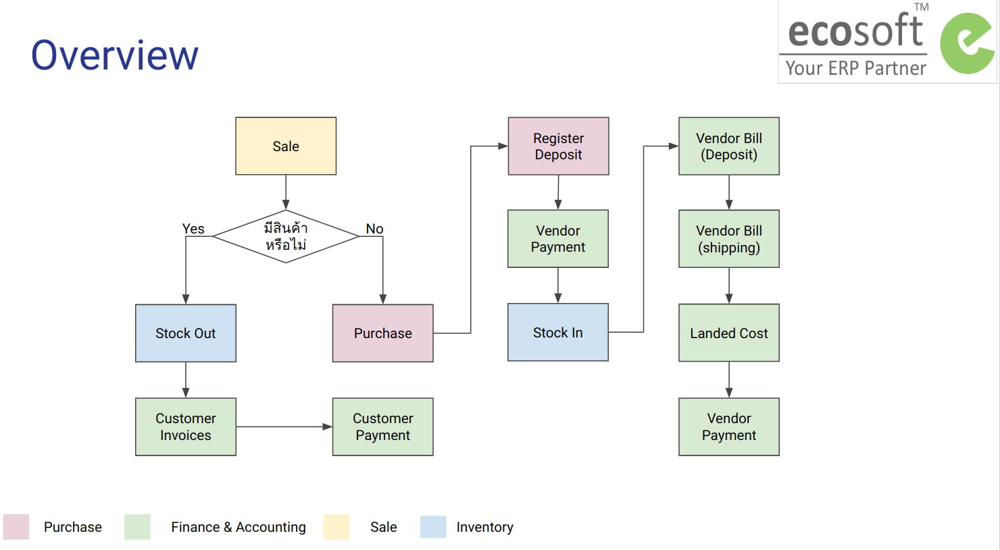

# Overview

## กระบวนการขาย

กระบวนการขายเริ่มต้นจากการสร้างใบเสนอราคา (Quotation) หลังจากที่ลูกค้าตกลงซื้อขาย ฝ่ายขายจะเข้ามากดยันยืน Order สถานะของเอกสารจะเปลี่ยนเป็น Sale Orders เมื่อมีการส่งสินค้า ระบบจะตัดสินค้าออกจากคลัง และส่งให้การเงินบัญชีบันทึกรายได้และตั้งหนี้ลูกหนี้ตามกระบวนทางบัญชีในลำดับถัดไป 

## กระบวนการจัดซื้อ

กระบวนการจัดซื้อเริ่มต้นจากการสร้างใบขอซื้อ (Requests for Quotation) เมื่อยืนยันราคาซื้อขายเรียบร้อยแล้ว ฝ่ายจัดซื้อจะกดยันยืน สถานะของเอกสารจะเปลี่ยนเป็น Purchase Order และส่งให้การเงินบัญชีบันทึกค่าใช้จ่ายและตั้งหนี้เจ้าหนี้ตามกระบวนทางบัญชีในลำดับถัดไป 

## กระบวนการการเงินบัญชี

การเงินบัญชีบันทึกบัญชีตามเอกสารที่ไหลเข้าสู่กระบวนการการเงินบัญชี บันทึกรับและจ่ายเงิน เมื่อสิ้นสุดกระบวนการบันทึกข้อมูลจะถูกส่งไปออกรายงานทางบัญชี

