# การใช้งานระบบ

## วิธีการเปลี่ยนรหัสผ่าน

เมื่อเข้าสู่ระบบครั้งแรกด้วยรหัสที่ทางทีมได้ตั้งค่าไว้ให้ สามารถเข้าไปเปลี่ยนรหัสผ่านเป็นตนเองได้ดังนี้

1. เข้าสู่เว็บไซต์ http://128.199.109.186/web/login
    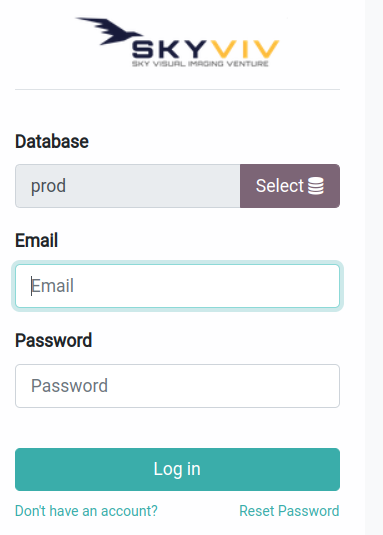
2. เลือก Database: prod
3. Username: Email
4. Password: password (รหัสเข้าระบบครั้งแรก)
5. คลิกที่ **Lon-in**
6. เมื่อเข้าสู่ระบบแล้ว ให้คลิกที่ ชื่อของตัวเอง มุมขวา
    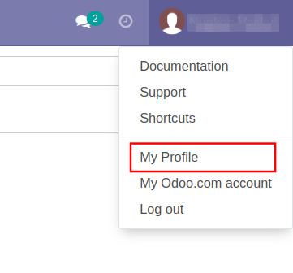
7. ระบบจะเปิดหน้าต่างข้อมูลส่วนตัวของผู้ใช้งาน คลิกที่ Tab **Account Security** จากนั้นคลิกที่ **Change password**
    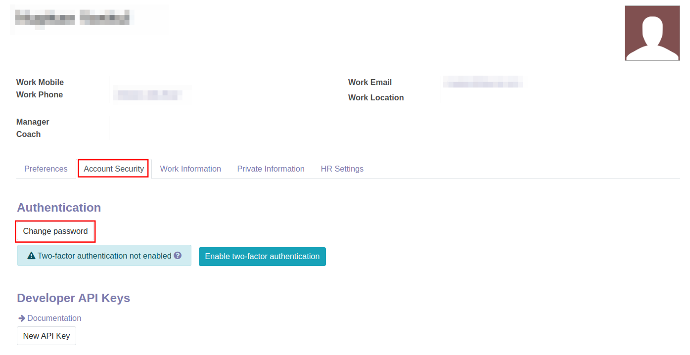
8. เมื่อคลิกที่ **Change password** เรียบร้อยแล้ว ระบบจะแสดงหน้าต่างขึ้นมาให้กรอกข้อมูลดังนี้
    * (1) Old Password: รหัสผ่านเก่า (password)
    * (2) New Password: รหัสผ่านใหม่
    * (3) Confirm New Password: ยืนยันรหัสผ่านใหม่
    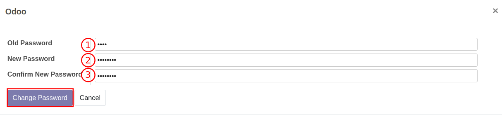    
    
## วิธีการตรวจสอบข้อมูลที่นำเข้า

### ผังบัญชี

**Menu ::** Invoicing > Configuration > Chart of Accounts

เมื่อเข้าสู่หน้าต่างของผังบัญชีแล้ว สามารถตรวจสอบข้อมูลของรหัสบัญชี ว่าถูกต้องหรือไม่

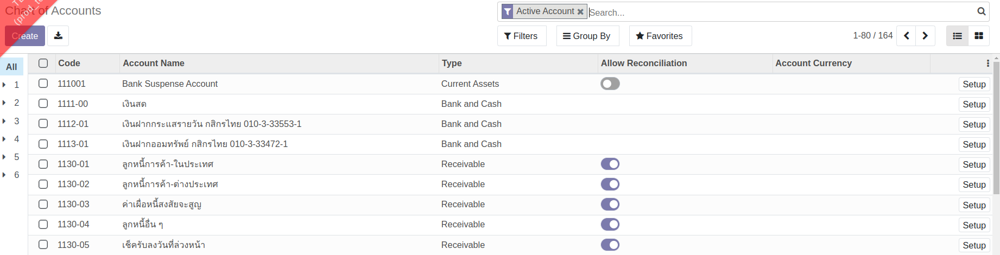  

### ข้อมูลคู่ค้า 

**Menu ::** Contacts > Contacts

เมื่อเข้าสู่หน้าต่างของคู่ค้าแล้ว สามารถตรวจสอบข้อมูล ว่าถูกต้องหรือไม่

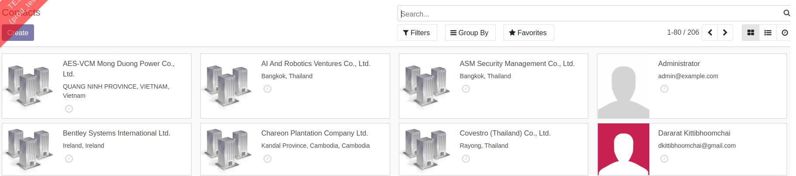  

### สินค้า

**Menu ::** Inventory > Product

เมื่อเข้าสู่หน้าต่างของสินค้าแล้ว สามารถตรวจสอบความถูกต้องได้ดังนี้

1. ระบบจะ Default Filters Product ตั้งต้นไว้ก่อน ให้กดกากบาทที่ช่อง Search ออก เพื่อดูข้อมูลทั้งหมด
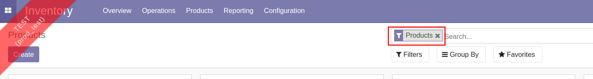 
2. เมื่อเอากากบาทออกแล้ว จะเห็นจำนวนของสินค้าทั้งหมดที่นำเข้า
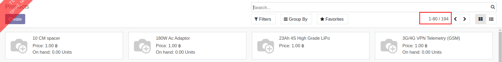  

### สินค้าคงเหลือ

**Menu ::** Inventory > Reporting > Inventory Valuation

เมื่อเข้าสู่หน้าต่างของสินค้าคงเหลือแล้ว สามารถตรวจสอบข้อมูลว่าถูกต้องหรือไม่

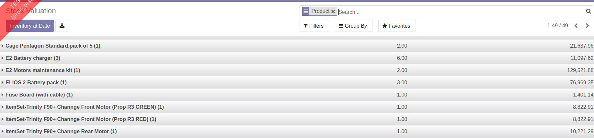  

### ทะเบียนสินทรัพย์

**Menu ::** Invoicing > Asset

เมื่อเข้าสู่หน้าต่างของสินทรัพย์แล้ว สามารถตรวจสอบข้อมูลว่าถูกต้องหรือไม่

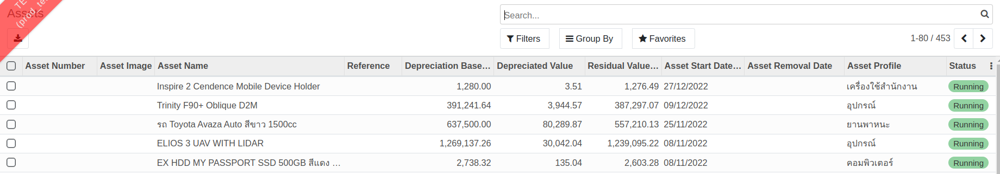  

### งบทดลอง ณ 31 ธันวาคม 2565

**Menu ::** Invoicing > Repeporting > Trial Balance

เมื่อเข้าสู่หน้าต่างของการเรียกรายงาน ระบุช่วงวันที่ที่ต้องการดูรายงาน จากนั้นให้ตรวจสอบข้อมูลว่าถูกต้องหรือไม่

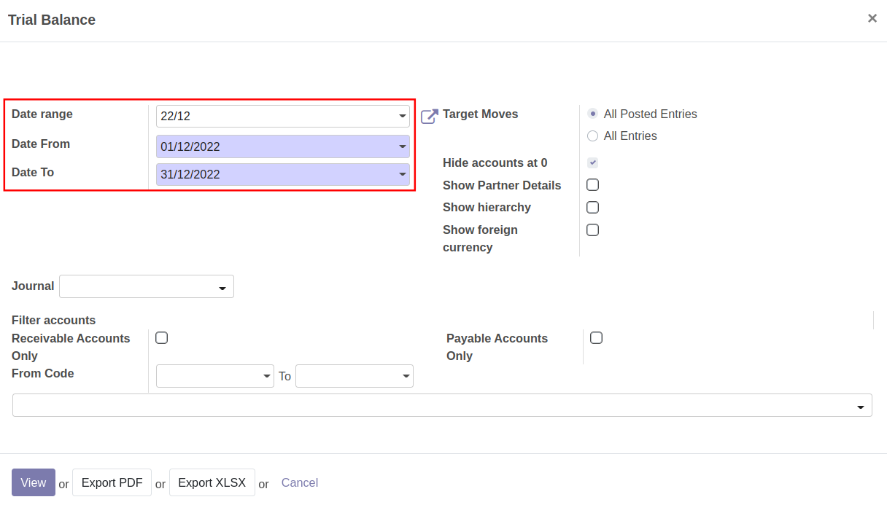 

## วิธีการส่งอีเมลซัพพอร์ต

1. เขียนอีเมลส่งถึง: support@ecosoft.co.th 
2. หัวข้ออีเมล: ให้ระบุชื่อบริษัทและตั้งหัวข้อ
3. เนื้อหา: อธิบายวิธีการเล่น หรือคำถามเพิ่มเติม

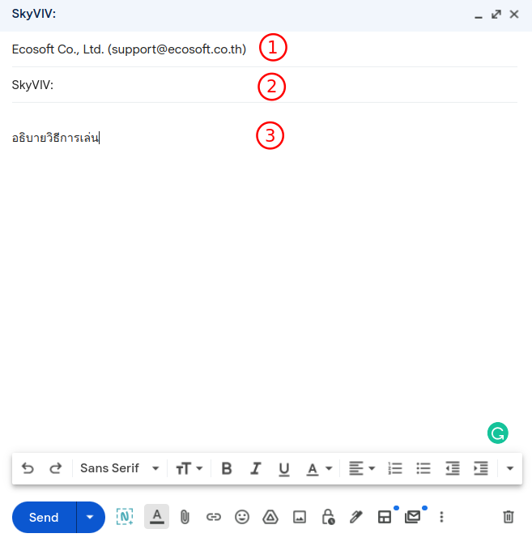